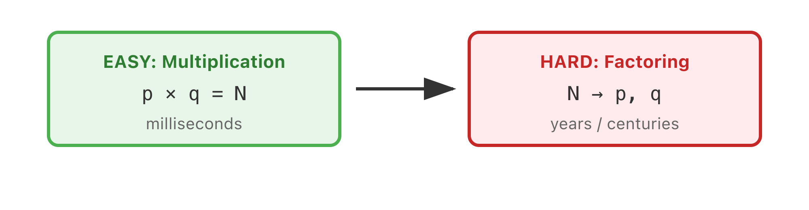

# Lecture 1: What is a Proof?

What is a proof? Before we can answer that for mathematics, it's worth stepping back to ask the broader question: how do humans decide what's true?

Science relies on observation and experiment. We drop a ball, it falls. We do it a thousand times, it always falls. We conclude there's gravity—not because we've proven it in some absolute sense, but because we've never observed otherwise. This is the bedrock of physics: truth through reproducible observation.

In other domains, truth works differently. Courts establish truth through judges and juries—twelve people deliberating over evidence, reaching a verdict that becomes legally binding truth. Religious traditions establish truth through scripture and interpretation. In business, truth flows from authority: the boss is right, the customer is always right.

Each of these domains has its own **epistemology**—its theory of what counts as knowledge and how knowledge is justified. (From Greek *epistēmē*, knowledge + *logos*, study.) Physics accepts reproducible observation; courts accept jury verdicts; religion accepts revelation. Computer science has its own informal epistemology, captured in the programmer's mantra: "there are no bugs in my program." Closely related is the rhetorical move "I don't see why not"—which cleverly transfers the burden of proof to whoever disagrees with you. You don't have to demonstrate your claim; they have to refute it.

Mathematics offers something different. In math, the youngest student can stand up against the oldest, most experienced professor—and win. Authority doesn't matter. Credentials don't matter. All that matters is whether your logical argument is correct. The professor who delights in being proven wrong by a student isn't being falsely modest; they're expressing something fundamental about how mathematical truth works.

## Mathematical Proof

A **mathematical proof** is a verification of a proposition by a chain of logical deductions from a set of axioms.

That definition has three components: propositions (statements that can be true or false), logical deductions (valid reasoning steps), and axioms (assumptions we accept without proof). We'll explore each, but let's start with propositions—because that's where things get interesting.

## When Forty Examples Aren't Enough

A **proposition** is a statement that's either true or false. "$2 + 3 = 5$" is a proposition (true). "$1 + 1 = 3$" is also a proposition (false). Simple enough.

Here's a more interesting one:

$$\forall n \in \mathbb{N},\; n^2 + n + 41 \text{ is prime}$$

The notation: $\forall$ means "for all," $\mathbb{N}$ is the natural numbers $\{0, 1, 2, 3, \ldots\}$, and $\in$ means "is a member of." The claim is that for every natural number $n$, the expression $n^2 + n + 41$ yields a prime.

Let's test it. When $n = 0$, we get 41—prime. When $n = 1$, we get 43—prime. Continuing: 47, 53, 61, 71, 83, 97, 113, 131... all prime. At $n = 20$, we get 461—still prime. At $n = 39$, we get 1601—prime.

Forty consecutive examples, all confirming the pattern. In physics or statistics, that's overwhelming evidence. You'd publish the paper.

But in mathematics, it means nothing. Because at $n = 40$, we get $40^2 + 40 + 41 = 1681 = 41 \times 41$. Not prime. The proposition is false.

Instead of checking forty cases by hand, we could ask a computer to search for a counterexample:

```python
<!-- include: code/mcs-lectures/01 - What is a Proof/01_python.py -->
```

Z3 is an SMT solver—it searches for values that satisfy constraints. We asked: "Find an $n \geq 0$ where $n^2 + n + 41$ has a divisor." Z3 found $n = 40$ instantly. The Greek notation $\forall n \in \mathbb{N}$ just means "for all integers $n \geq 0$"—and negating it means "find one where it fails."

This is the central tension that makes mathematics different from empirical science. No amount of examples can prove a universal statement. You can check a billion cases, a trillion cases, and still be wrong. Proof requires something more.

**Hypothesis** — a property-based testing library — automates the search for counterexamples. Instead of checking cases by hand, you declare what should be true, and the tool generates random test inputs. When it finds a failure, it *shrinks* the input to the smallest counterexample:

```python
# uv run --with hypothesis pytest test_prime_formula.py
from hypothesis import given, strategies as st

@given(st.integers(min_value=0, max_value=200))
def test_prime_formula(n):
    """Claim: n² + n + 41 is always prime."""
    val = n**2 + n + 41
    if val < 2:
        assert False
    for d in range(2, int(val**0.5) + 1):
        assert val % d != 0, f"n={n}: {val} is divisible by {d}"
```

The `@given` decorator says "test this for random integers in 0–200." Hypothesis tries random values, hits the failure, then automatically shrinks to the smallest $n$ that breaks the property: `n = 40`. The `strategies` module (`st`) controls what kind of values to generate — integers, text, lists, tuples, or custom composite types.

But here's the crucial point: if Hypothesis *doesn't* find a counterexample, that's not proof. It means a few hundred random attempts didn't break it. Passing tests are evidence, not proof — which is exactly why we need the techniques in this course. Z3 (the SMT solver above) goes further: it searches *all* values satisfying the constraints, not just random samples. When Z3 says `sat`, it has found a concrete counterexample. When it says `unsat`, no counterexample exists — that's a proof.

## Euler's Conjecture and the 218-Year Wait

The pattern repeats throughout mathematical history. In 1769, Leonhard Euler—one of the most prolific mathematicians who ever lived—conjectured that the equation

$$a^4 + b^4 + c^4 = d^4$$

has no positive integer solutions. This seemed like a natural extension of Fermat's Last Theorem to fourth powers. Mathematicians worked on it for over two centuries, testing countless values, finding no counterexamples.

Then in 1988, Noam Elkies at Harvard found one:

$$95800^4 + 217519^4 + 414560^4 = 422481^4$$

Two hundred eighteen years of searching, and the conjecture was false all along. We can verify:

```python
<!-- include: code/mcs-lectures/01 - What is a Proof/02_python.py -->
```

An even more dramatic example: the equation $313(x^3 + y^3) = z^3$ also has no positive integer solutions—or so mathematicians believed. It's false. But the smallest counterexample has over 1,000 digits. No computer could find it by brute-force search.

Why should anyone care about such obscure equations? Because equations like these are **elliptic curves**, and elliptic curves are the key to breaking modern cryptography.

## The Stakes: Cryptography and the Factoring Problem

Here's why abstract number theory matters in practice. The RSA cryptosystem—which secures your bank transactions, your passwords, your private messages—depends on a single assumption: that factoring large numbers is hard.

RSA works like this: Take two large prime numbers $p$ and $q$ and multiply them to get $N = p \times q$. Multiplication is easy—your computer can multiply thousand-digit primes in milliseconds. But given only $N$, finding $p$ and $q$ is believed to be computationally infeasible for large enough $N$. Your public key contains $N$; your private key depends on knowing $p$ and $q$.



```python
<!-- include: code/mcs-lectures/01 - What is a Proof/03_python.py -->
```

In 1977, the inventors of RSA issued a challenge in *Scientific American*: factor this 129-digit number. They estimated it would take 40 quadrillion years with contemporary technology.

It took 17 years. In 1994, a distributed team of researchers factored RSA-129 using about 1,600 computers coordinated over the internet. The secret message was: "THE MAGIC WORDS ARE SQUEAMISH OSSIFRAGE."

Today's RSA uses 2048-bit keys (about 617 digits) instead of 129 digits, but the race continues. If you could efficiently factor large integers, you could break the encryption protecting virtually all electronic commerce.

## The Four Color Theorem: A Century of Embarrassment

In 1852, Francis Guthrie was coloring a map of England's counties and noticed he could do it with just four colors, ensuring no adjacent counties shared a color. He conjectured this was true for any map.

It seemed obviously true. Cartographers had used four colors for centuries. Surely a proof would be straightforward.

It wasn't. For over a century, mathematicians struggled with this deceptively simple problem. In 1879, Alfred Kempe published a proof that was celebrated for eleven years—until Percy Heawood found a fatal flaw. Kempe had classified maps into types and argued each type was four-colorable. But his classification missed some cases.

The theorem was finally proved in 1976 by Kenneth Appel and Wolfgang Haken—but their proof required a computer to check 1,936 specific configurations. Mathematicians were unsettled. The proof was too long for any human to verify by hand. How could you trust it?

A simpler proof emerged in 1997, reducing the cases to 633 configurations. Still computer-verified. But today the Four Color Theorem is accepted as proven—a landmark example of computer-assisted proof, and a warning about trusting visual intuition. Proofs by picture are seductive and often wrong.

## Goldbach's Conjecture: Simple, Unproven, Maybe Unprovable

Now for a proposition whose truth we genuinely don't know. **Goldbach's Conjecture**, stated in a 1742 letter to Euler, claims:

> Every even integer greater than 2 is the sum of two primes.

Examples: $4 = 2 + 2$, $6 = 3 + 3$, $8 = 3 + 5$, $24 = 11 + 13$, $100 = 47 + 53$.

```python
<!-- include: code/mcs-lectures/01 - What is a Proof/04_python.py -->
```

It's been verified for all even numbers up to $4 \times 10^{18}$—that's 4 quintillion. Every example works. Mathematicians overwhelmingly believe it's true.

But no one can prove it.

The problem is the mismatch between addition and multiplication. Primes are defined multiplicatively (a prime has no divisors except 1 and itself). Goldbach makes an additive claim. Number theory has few tools for bridging that gap. The full conjecture remains open after nearly 300 years.

## The Millennium Problems

In May 2000, the Clay Mathematics Institute announced the **Millennium Prize Problems**: seven of the deepest unsolved problems in mathematics, each carrying a $1,000,000 reward.

1. **P vs NP** — Can every problem whose solution can be quickly verified also be quickly solved?
2. **Riemann Hypothesis** — Do all non-trivial zeros of the zeta function lie on a critical line?
3. **Yang-Mills Existence and Mass Gap** — Can quantum field theory be made mathematically rigorous?
4. **Navier-Stokes Existence and Smoothness** — Do smooth solutions to fluid dynamics equations always exist?
5. **Hodge Conjecture** — Can certain topological features be described algebraically?
6. **Poincaré Conjecture** — Is every simply-connected closed 3-manifold equivalent to a sphere?
7. **Birch and Swinnerton-Dyer Conjecture** — How does an elliptic curve's structure relate to its L-function?

In 25 years, only one has been solved.

## Perelman's Gift and Refusal

The Poincaré Conjecture—open since 1904—was proved by Grigori Perelman, a reclusive Russian mathematician, in a series of papers posted to arXiv in 2002-2003. His proof was dense and incomplete in places; teams of mathematicians spent years filling in details. By 2006, the consensus was clear: Perelman had solved it.

He was awarded the Fields Medal, the highest honor in mathematics. He refused it. "I'm not interested in money or fame," he told a journalist. "I don't want to be on display like an animal in a zoo."

In 2010, the Clay Institute awarded him the $1,000,000 Millennium Prize. He refused that too. He felt his work built on Richard Hamilton's foundational research on Ricci flow, and objected to how the mathematical community handled credit. He resigned from his institute, stopped publishing, and reportedly lives quietly with his mother in St. Petersburg.

The Riemann Hypothesis remains open, despite being verified computationally for over 10 trillion zeros.

## Implications and Truth Tables

After all these examples of propositions we can't prove, let's turn to something we can: the logic of implications.

An **implication** $P \Rightarrow Q$ ("P implies Q") is true if $P$ is false or $Q$ is true. This leads to a surprising consequence: false implies anything.

| $P$ | $Q$ | $P \Rightarrow Q$ |
|-----|-----|-------------------|
| T | T | T |
| T | F | F |
| F | T | T |
| F | F | T |

The statement "if pigs could fly, I would be king" is true. Pigs can't fly, so the implication holds regardless of my royal status. This feels strange, but it's essential: we want to reason hypothetically about false premises without generating contradictions.

Truth tables aren't mysterious—they're exhaustive enumeration:

```python
<!-- include: code/mcs-lectures/01 - What is a Proof/05_python.py -->
```

This makes it clear why "false implies anything" is true: when P is False, `not p` is True, so `not p or q` is True regardless of Q.

**If and only if** ($\Leftrightarrow$) means the implication goes both ways: $P \Leftrightarrow Q$ is true when $P$ and $Q$ have the same truth value. To prove an "iff," you must prove both directions.

## Direct Proofs

Enough about what proofs *can't* do — let's write one. The simplest proof technique is the **direct proof**: start from what you know, apply logical steps, arrive at what you want to prove. No tricks, no contradictions, no induction. Just forward reasoning.

### Example: The Square of an Even Number

**Theorem.** If $n$ is even, then $n^2$ is even.

Before we can prove anything about "even," we need a precise definition. A number $n$ is **even** if there exists an integer $k$ such that $n = 2k$. A number is **odd** if there exists an integer $k$ such that $n = 2k + 1$. These definitions are your only grip on the concepts — never skip them.

**Proof.** Assume $n$ is even. By definition, there exists an integer $k$ such that $n = 2k$.

Then $n^2 = (2k)^2 = 4k^2 = 2(2k^2)$.

Since $k$ is an integer, $2k^2$ is also an integer. Let $m = 2k^2$. Then $n^2 = 2m$, which means $n^2$ is even. $\square$

Notice the structure: unpack definitions ($n = 2k$), do algebra, repack into definitions ($n^2 = 2m$). Most direct proofs follow exactly this pattern.

```python
<!-- include: code/mcs-lectures/01 - What is a Proof/06_python.py -->
```

In Lean4, the proof mirrors the English version:

```lean
<!-- include: code/mcs-lectures/01 - What is a Proof/01_lean.lean -->
```

**Dafny** verifies the same theorem through *program verification*. You write a function with a specification — what the function requires (precondition) and what it guarantees (postcondition) — and Dafny's verifier checks that the code satisfies its spec for *all possible inputs*:

```dafny
// dafny verify even_squared.dfy
method SquareEven(n: int) returns (result: int)
  requires n % 2 == 0       // precondition: n is even
  ensures result % 2 == 0   // postcondition: n² is even
{
  result := n * n;
  // Dafny verifies automatically: if n = 2k, then n*n = 4k² = 2(2k²).
}
```

`requires` is the hypothesis ("$n$ is even") and `ensures` is the conclusion ("$n^2$ is even"). Dafny proves the postcondition holds for *every* input satisfying the precondition — the same logical structure as the pen-and-paper proof, but verified mechanically by an SMT solver. Where Hypothesis finds bugs by testing random inputs, and Z3 finds counterexamples by solving constraints, Dafny verifies that code *always* meets its spec — it's the closest thing to a machine-checked proof for programs.

### Example: Sum of Two Even Numbers

**Theorem.** If $a$ and $b$ are even, then $a + b$ is even.

**Proof.** Since $a$ is even, $a = 2k$ for some integer $k$. Since $b$ is even, $b = 2m$ for some integer $m$.

Then $a + b = 2k + 2m = 2(k + m)$.

$k + m$ is an integer, so $a + b = 2 \cdot (\text{integer})$, which means $a + b$ is even. $\square$

### The Pattern

Direct proofs follow a template:

1. **Write down the definitions.** "Even" means $n = 2k$. Don't skip this step — the definition is your only handle on the concept.
2. **Do algebra.** Manipulate expressions using what you assumed.
3. **Recognize the goal.** The result should match the definition of what you're trying to prove.

Most proofs in discrete math are direct. Indirect methods (contradiction, induction) are special tools for when direct reasoning hits a wall. We'll cover those in the next lecture.

## Quantifiers and Predicates

We've been using symbols like $\forall$ and $\exists$ freely. Let's make them explicit — confusing quantifiers is one of the most common proof errors for beginners.

### Predicates as Functions

A **predicate** is a statement with variables that becomes a proposition when you fill in values. If you're a programmer: a predicate is just a function `Nat → Bool`.

```python
<!-- include: code/mcs-lectures/01 - What is a Proof/07_python.py -->
```

In math notation, we write $P(n)$ or $Q(x, y)$ for predicates. When we say "Let $P(n)$ be the proposition that $n^2 + n + 41$ is prime," we're defining a predicate on natural numbers. The notation is different but the idea is identical.

### The Two Quantifiers

| Symbol | Name | Meaning | Python equivalent |
|--------|------|---------|-------------------|
| $\forall$ | Universal | "For all" | `all(...)` |
| $\exists$ | Existential | "There exists" | `any(...)` |

$\forall n \in \mathbb{N}.\ P(n)$ means "$P(n)$ is true for every natural number $n$."

$\exists n \in \mathbb{N}.\ P(n)$ means "there is at least one natural number $n$ for which $P(n)$ is true."

$\mathbb{N}$ denotes the **natural numbers** $\{0, 1, 2, 3, \ldots\}$. (Some authors start at 1; in this course we start at 0.)

### The Negation Rule (Critical for Proofs)

This single rule drives most proofs by contradiction:

| Negation | Equivalent to |
|----------|---------------|
| $\neg(\forall x.\ P(x))$ | $\exists x.\ \neg P(x)$ |
| $\neg(\exists x.\ P(x))$ | $\forall x.\ \neg P(x)$ |

To disprove "all swans are white," you don't check every swan — you find one black swan. To disprove "there exists a unicorn," you must show every animal is not a unicorn. The rule is just formalizing common sense.

```python
<!-- include: code/mcs-lectures/01 - What is a Proof/08_python.py -->
```

### Free vs. Bound Variables

In $\forall n.\ n + m > n$, the variable $n$ is **bound** by the quantifier, but $m$ is **free**. The truth depends on $m$. This is exactly variable scoping in programming — a quantified variable is local to the expression.

When we write an induction hypothesis $\forall n.\ P(n) \Rightarrow P(n+1)$, the $n$ is bound (it ranges over all naturals). When we say "assume $P(n)$ for some arbitrary $n$," the $n$ is free (it's a specific but arbitrary value). Confusing bound and free variables is a common source of induction errors.

## Axioms and the Limits of Proof

Where do proofs start? With **axioms**—propositions we assume true without proof.

The word comes from Greek, meaning "to think worthy." An axiom is something you consider worthy enough to accept as a starting point. You can't do mathematics without assumptions; the key is to make them explicit. Anyone who accepts your axioms must accept your conclusions.

Different mathematical fields use different axioms. Euclidean geometry assumes that through any point not on a line, there's exactly one parallel line. Spherical geometry assumes there are no such parallels—and on a sphere, that's true. Hyperbolic geometry assumes infinitely many parallels. These aren't contradictions; they're different mathematical universes, each internally consistent.

For axioms to be useful, they should be **consistent** (never proving both $P$ and $\neg P$) and ideally **complete** (able to prove every true statement).

## Further Reading

- [RSA Factoring Challenge Records](https://en.wikipedia.org/wiki/RSA_Factoring_Challenge)
- [Clay Millennium Prize Problems](https://www.claymath.org/millennium-problems)
- [Goldbach Conjecture Verification Project](http://sweet.ua.pt/tos/goldbach.html)
- [Lean4 Theorem Prover](https://lean-lang.org/)
