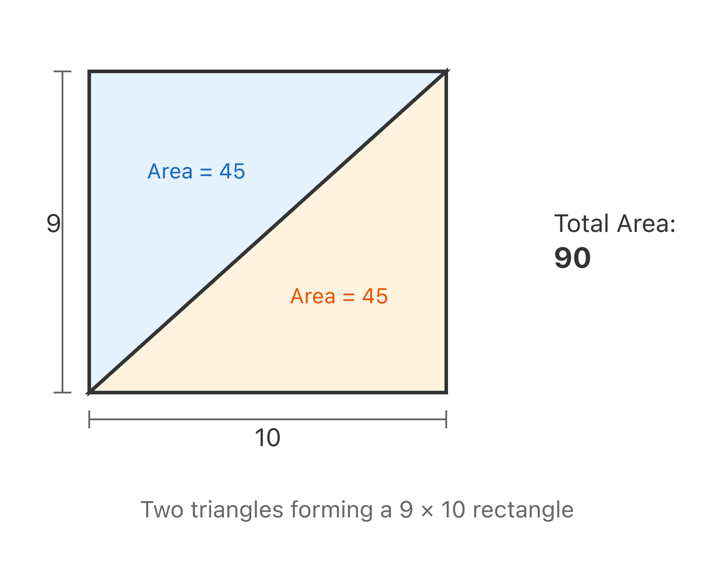
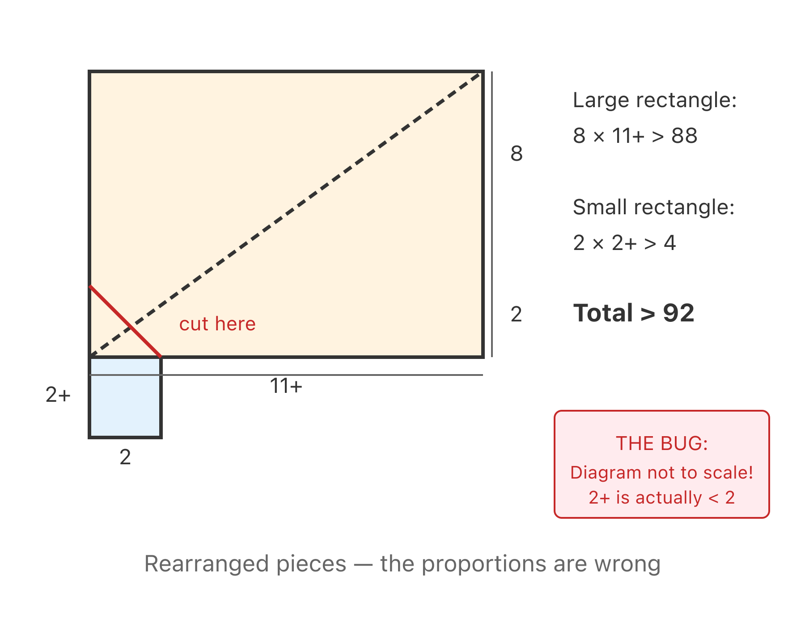
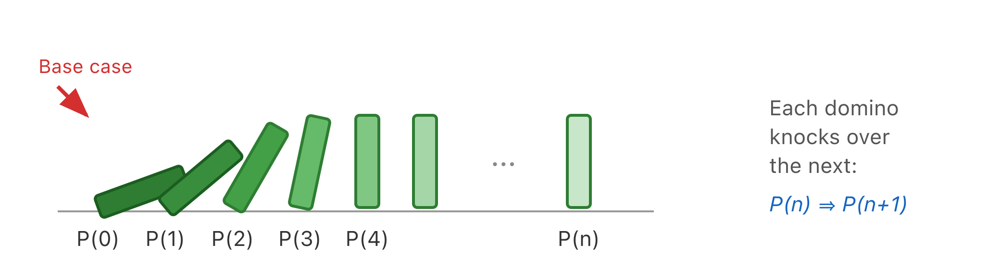
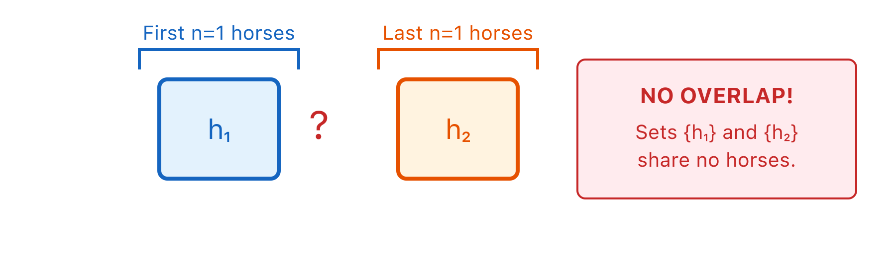
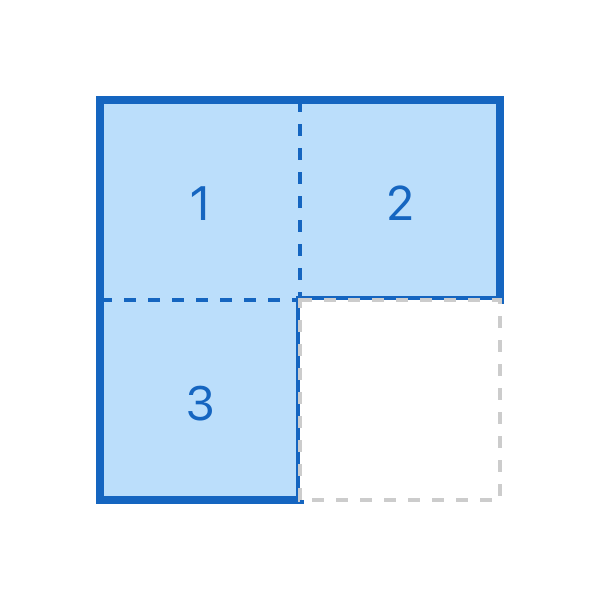
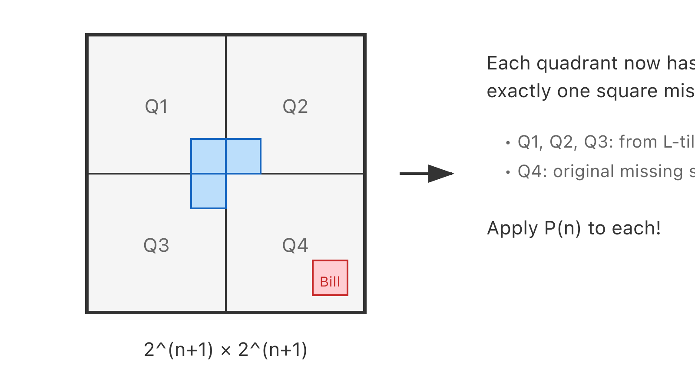

# Lecture 2: Proof by Contradiction and Induction

Last time we covered the components of proof: propositions, axioms, and logical deductions. Here's the practical takeaway: we're not going to be pedantic about which axioms or deduction rules you use. You don't need to label every step with "modus ponens" or cite Zermelo-Fraenkel. Anything reasonable is fine.

What to avoid: wild leaps of faith, and phrases like "it's obvious that..." unless it genuinely is obvious. Much better to explain each reasoning step, even when it feels tedious.

The proofs we've seen so far have been **direct proofs**: you start with axioms and known theorems, make logical deductions, and arrive at what you wanted to prove. Today we'll look at **indirect proofs**, starting with proof by contradiction—then the most important technique in computer science: induction.

If you've ever written a loop invariant, you've already done induction. If you've ever used a SAT solver, you've done proof by contradiction. The Greek notation is just different syntax for ideas you already understand as a programmer.

## Proof by Contradiction

In a proof by contradiction, you assume the opposite of what you're trying to prove, then follow that assumption to a logical impossibility. If assuming $\neg P$ leads to a contradiction, then $\neg P$ must be false—which means $P$ must be true.

The method:

1. Assume $P$ is false (i.e., assume $\neg P$)
2. Derive a contradiction
3. Conclude $P$ must be true

This works because a valid chain of reasoning from a true statement can never produce a false conclusion. If you reach a contradiction, something in your assumptions must be wrong—and the only thing you assumed was $\neg P$.

## The Irrationality of $\sqrt{2}$

Let's prove that $\sqrt{2}$ is irrational. A direct proof seems hopeless: how would you show there's *no way* to express $\sqrt{2}$ as a ratio of integers? You'd have to check infinitely many possibilities. Proof by contradiction makes it tractable.

**Theorem.** $\sqrt{2}$ is irrational.

**Proof.** By contradiction. Assume $\sqrt{2}$ is rational. Then we can write $\sqrt{2} = a/b$ where $a/b$ is in lowest terms—meaning $a$ and $b$ share no common factors.

Squaring both sides: $2 = a^2/b^2$, so $2b^2 = a^2$.

Since $a^2 = 2b^2$, we know $a^2$ is even. But the square of an odd number is odd, so $a$ itself must be even. Write $a = 2k$ for some integer $k$.

Substituting: $2b^2 = (2k)^2 = 4k^2$, so $b^2 = 2k^2$. This means $b^2$ is even, so $b$ is even.

But now both $a$ and $b$ are even—they share 2 as a common factor. This contradicts our assumption that $a/b$ is in lowest terms. Therefore $\sqrt{2}$ cannot be rational. $\square$

The proof's logic maps directly to constraint solving. We assumed $\sqrt{2} = a/b$ with $\gcd(a, b) = 1$, then derived that both $a$ and $b$ must be even. Let's encode the proof as a Z3 constraint:

```python
# uv run --with z3-solver python
from z3 import *

a, b = Ints('a b')
solver = Solver()

# Assume sqrt(2) = a/b in lowest terms
solver.add(a > 0, b > 0)
solver.add(a * a == 2 * b * b)
# In lowest terms, a and b can't both be even
solver.add(Or(a % 2 == 1, b % 2 == 1))

result = solver.check()
print(result)  # Output: unsat
```

Z3 returns `unsat` — the constraints are unsatisfiable. No reduced fraction can satisfy $a^2 = 2b^2$. The proof by contradiction is mechanically validated: if you assume $\sqrt{2}$ is rational, you necessarily derive a logical impossibility.

## The Pythagorean Murder

There's a dark legend behind this proof. The Pythagoreans in ancient Greece weren't just mathematicians—they were a religious cult. For them, mathematics was divine, governed by **Peras** (the god of the finite, good) and **Apeiron** (the god of infinity, evil).

The Pythagoreans believed irrational numbers simply didn't exist. One of their core axioms was that all lengths are rational.

But the Pythagorean theorem creates a problem. A right triangle with legs of length 1 has a hypotenuse of length $\sqrt{2}$. If all lengths are rational, then $\sqrt{2}$ must be rational.

Then someone discovered the proof above: $\sqrt{2}$ is irrational. Catastrophe. Their axioms were inconsistent. And the most fundamental length in geometry—the diagonal of the unit square—was aligned with the evil god.

According to legend, the Pythagoreans suppressed this result. But someone leaked the proof. The story goes, they killed him—drowned at sea.

Hard to imagine being murdered over the irrationality of $\sqrt{2}$. But mathematics touches something deep.

## False Proof: $90 > 92$

Now for one of my favorite pedagogical tools: the **false proof**. These teach you where proofs go wrong—often more instructive than seeing correct proofs.

I'm going to "prove" that $90 > 92$.

**"Proof."** By PowerPoint. (You should already be suspicious.)

Consider two right triangles, each with legs of length 9 and 10. Each has area $(1/2)(9)(10) = 45$. Together they form a $9 \times 10$ rectangle with area 90.



Now slide the triangles along the diagonal, rearranging so the vertical edge splits into portions of length 2 and 8. Cut along the line where they meet.



The cut creates a small piece that appears to be slightly more than 2 units tall—call it $2^+$. Rearrange into two rectangles: one with area $2 \times 2^+ > 4$, and one with area approximately $8 \times 11 > 88$.

Total area: greater than $4 + 88 = 92$.

But we started with area 90. Therefore $90 > 92$. $\square$

The "proof" is absurd, so where's the error?

The bug is in the diagram. When I drew the "9 by 10" triangles, the 9-unit side was actually *longer* than the 10-unit side on the page. The picture wasn't to scale. The "$2^+$" that looks larger than 2 is actually smaller when the proportions are correct.

This is why proofs by picture are dangerous. Your visual intuition accepts what the diagram shows. The Four Color Theorem stood "proved" for eleven years based on flawed diagrams before the flaw was found.

## Proof by Cases

Before we tackle induction, there's one more proof technique you'll use constantly: **proof by cases**. The idea is brutally simple: break the problem into a finite number of cases, prove each one separately, and you've proved the whole thing.

This is the programming equivalent of a `match` or `switch` statement. Each branch handles one case. If every branch is correct and exhaustive, the whole function is correct.

### Example: Absolute Value Identity

**Theorem.** For any real number $x$, $|x| \geq x$.

**Proof.** By cases on the sign of $x$.

*Case 1:* $x \geq 0$. Then $|x| = x$, so $|x| \geq x$ (they're equal).

*Case 2:* $x < 0$. Then $|x| = -x$, which is positive while $x$ is negative. So $|x| = -x > 0 > x$, giving $|x| > x$.

In both cases, $|x| \geq x$. Since every real number is either $\geq 0$ or $< 0$, the cases are exhaustive. $\square$

The two requirements for a valid case analysis:
1. **Exhaustive**: the cases must cover every possibility
2. **Correct**: each case's proof must be valid

### Example: Parity Cases

Many proofs about integers split into even and odd cases. This works because every integer is either even or odd — exhaustive and mutually exclusive.

**Theorem.** For any integer $n$, $n^2 + n$ is even.

**Proof.** By cases on the parity of $n$.

*Case 1: $n$ is even.* Then $n = 2k$ for some integer $k$.
$$n^2 + n = (2k)^2 + 2k = 4k^2 + 2k = 2(2k^2 + k)$$
which is even.

*Case 2: $n$ is odd.* Then $n = 2k + 1$ for some integer $k$.
$$n^2 + n = (2k+1)^2 + (2k+1) = 4k^2 + 4k + 1 + 2k + 1 = 4k^2 + 6k + 2 = 2(2k^2 + 3k + 1)$$
which is even.

All cases covered. $\square$

```python
# Property test: n² + n is always even
from hypothesis import given, strategies as st

@given(st.integers(min_value=-1000, max_value=1000))
def test_n2_plus_n_is_even(n):
    assert (n*n + n) % 2 == 0
```

Proof by cases also appears in induction proofs when the inductive step splits into subcases. Don't be afraid to use case analysis inside a larger proof — combining techniques is normal and expected.

## Induction: The Most Important Proof Technique in Computer Science

For the rest of this course, you'll use **induction** more than any other proof technique. It's the workhorse of discrete mathematics and computer science.

Here's the secret: **every loop invariant is an induction proof**. If you've written code like this:

```python
# Invariant: s == sum of numbers from 1 to i
s = 0
for i in range(1, n + 1):
    s += i
# Postcondition: s == sum of numbers from 1 to n
```

You've done induction. The invariant must hold before the loop (base case). If it holds at the start of an iteration, it must hold at the end (inductive step). When the loop terminates, the invariant plus the exit condition give you your conclusion.

The math notation is just a more explicit version of what you already do.

### The Induction Axiom

Let $P(n)$ be a predicate depending on natural number $n$. If:

1. $P(0)$ is true (the **base case**), and
2. For all $n \geq 0$, $P(n) \Rightarrow P(n+1)$ (the **inductive step**)

Then $P(n)$ is true for all $n \in \mathbb{N}$.

Think of dominoes. You have infinitely many dominoes, one for each natural number. If you knock over domino 0, and each domino knocks over the next one when it falls, then all dominoes fall.



The base case establishes that domino 0 falls. The inductive step establishes the chain reaction. Together they prove all dominoes fall—an infinite conclusion from two finite proofs.

## Example: Summing Natural Numbers

**Theorem.** For all $n \geq 0$:
$$1 + 2 + 3 + \cdots + n = \frac{n(n+1)}{2}$$

**Proof.** By induction on $n$.

Let $P(n)$ be the proposition that $\sum_{i=1}^{n} i = \frac{n(n+1)}{2}$.

**Base case:** $P(0)$. The left side is an empty sum, which equals 0. The right side is $\frac{0 \cdot 1}{2} = 0$. They match.

**Inductive step:** Assume $P(n)$ holds for some $n \geq 0$. We prove $P(n+1)$.

$$\sum_{i=1}^{n+1} i = \left(\sum_{i=1}^{n} i\right) + (n+1) = \frac{n(n+1)}{2} + (n+1)$$

by the inductive hypothesis. Simplifying:

$$= \frac{n(n+1) + 2(n+1)}{2} = \frac{(n+1)(n+2)}{2}$$

This is exactly the formula with $n+1$ substituted for $n$. Therefore $P(n+1)$ holds.

By induction, $P(n)$ holds for all $n \geq 0$. $\square$

Here's the same proof as a verified program in Dafny:

```dafny
method GaussSum(n: nat) returns (s: nat)
  ensures s == n * (n + 1) / 2
{
  s := 0;
  var i := 0;
  while i < n
    invariant i <= n
    invariant s == i * (i + 1) / 2  // This IS P(i)!
  {
    i := i + 1;
    s := s + i;
  }
}
```

Dafny's verifier checks exactly what we proved:
- **Base case:** When `i = 0`, we have `s = 0 = 0 * 1 / 2`. ✓
- **Inductive step:** If `s == i * (i + 1) / 2` at loop start, then after `i := i + 1; s := s + i`, we have `s == (i+1) * (i+2) / 2`. ✓
- **Conclusion:** When the loop exits, `i == n`, so `s == n * (n + 1) / 2`. ✓

The loop invariant *is* the inductive hypothesis. Dafny verifies it mechanically.

A natural question: did this proof give you any *understanding* of why the formula works? Not really. Induction establishes truth but often not insight. You need to *already know* the formula to prove it—induction doesn't help you discover it.

Gauss allegedly discovered this formula as a schoolboy when his teacher assigned the class to sum the numbers from 1 to 100. Instead of adding sequentially, Gauss noticed that $1 + 100 = 101$, and $2 + 99 = 101$, and $3 + 98 = 101$—fifty pairs each summing to 101. So the total is $50 \times 101 = 5050$. That's insight. Induction just verifies.

## Example: Divisibility by 3

**Theorem.** For all $n \in \mathbb{N}$, $3 \mid (n^3 - n)$. (The notation $3 \mid x$ means "3 divides $x$.")

**Proof.** By induction on $n$.

Let $P(n)$ be the proposition that $3 \mid (n^3 - n)$.

**Base case:** $P(0)$. We have $0^3 - 0 = 0$, and $3 \mid 0$. ✓

**Inductive step:** Assume $P(n)$: that is, $3 \mid (n^3 - n)$. We prove $P(n+1)$.

Compute $(n+1)^3 - (n+1)$:
$$= n^3 + 3n^2 + 3n + 1 - n - 1 = n^3 + 3n^2 + 2n$$

This doesn't obviously look divisible by 3. But we can rearrange:
$$= (n^3 - n) + 3n^2 + 3n$$

Now it's clear: $(n^3 - n)$ is divisible by 3 by the inductive hypothesis, $3n^2$ is divisible by 3, and $3n$ is divisible by 3. A sum of terms divisible by 3 is divisible by 3.

Therefore $P(n+1)$ holds, and by induction, the theorem is proved. $\square$

The key: if you're not using the inductive hypothesis somewhere, you're not doing induction. The rearrangement to isolate $(n^3 - n)$ was specifically designed to invoke $P(n)$.

We can test this property across many values with Hypothesis:

```python
# uv run --with hypothesis pytest -v
from hypothesis import given, strategies as st

@given(st.integers(min_value=0, max_value=100000))
def test_divisibility_by_3(n):
    assert (n**3 - n) % 3 == 0
```

Hypothesis generates thousands of random test cases. It's not a formal proof, but if there were a bug in our reasoning, it would likely find a counterexample.

For a machine-checked proof, here's Lean4:

```lean
-- Prove: 3 divides (n³ - n) for all natural numbers n
theorem div3_cube_minus_n (n : Nat) : 3 ∣ (n^3 - n) := by
  induction n with
  | zero =>
    -- Base case: 0³ - 0 = 0, and 3 ∣ 0
    simp
  | succ k ih =>
    -- Inductive step: ih says 3 ∣ (k³ - k)
    -- Goal: 3 ∣ ((k+1)³ - (k+1))
    -- Rewrite: (k+1)³ - (k+1) = (k³ - k) + 3k² + 3k
    have h : (k + 1)^3 - (k + 1) = (k^3 - k) + 3*k^2 + 3*k := by ring
    rw [h]
    -- Now show 3 divides the sum
    exact Nat.dvd_add (Nat.dvd_add ih (Nat.dvd_mul_right 3 _)) (Nat.dvd_mul_right 3 _)
```

The `induction` tactic generates two proof obligations: base case and inductive step. Lean won't accept the proof unless both are complete and valid.

For Python with contracts, we can verify implementation correctness:

```python
# uv run --with crosshair-tool crosshair check div3.py
import deal

@deal.pre(lambda n: n >= 0)
@deal.ensure(lambda n, result: result == n**3 - n)
def cube_minus_n(n: int) -> int:
    return n**3 - n
```

`@deal.ensure` verifies that the function correctly computes $n^3 - n$ for all valid inputs. The mathematical property — that the result is always divisible by 3 — is established by the Lean4 proof above. Combined, you have both implementation correctness (via deal/Crosshair) and mathematical truth (via Lean4).

## False Proof: All Horses Are the Same Color

Here's a famous false induction proof. Finding the bug is a rite of passage.

**"Theorem."** All horses are the same color.

**"Proof."** By induction on the size of a set of horses.

Let $P(n)$ be: "In any set of $n$ horses, all horses are the same color."

**Base case:** $P(1)$. A set containing one horse trivially has all horses the same color.

**Inductive step:** Assume $P(n)$. Consider any set of $n+1$ horses: $\{h_1, h_2, \ldots, h_{n+1}\}$.

The first $n$ horses $\{h_1, h_2, \ldots, h_n\}$ form a set of size $n$, so by $P(n)$ they're all the same color.

The last $n$ horses $\{h_2, h_3, \ldots, h_{n+1}\}$ also form a set of size $n$, so by $P(n)$ they're all the same color.

These sets overlap at $\{h_2, \ldots, h_n\}$. Since $h_1$ matches the overlap, and $h_{n+1}$ matches the overlap, all $n+1$ horses are the same color. $\square$

When I assigned this as homework, half the class responded: "This shows induction doesn't always work." A third wrote: "I always knew you can't trust mathematics."

Neither is correct. The proof has a bug. Where?

The inductive step claims $P(n) \Rightarrow P(n+1)$. Let's check the case $n = 1$.

When $n = 1$, the set of $n+1 = 2$ horses is $\{h_1, h_2\}$. The "first $n$" horses is $\{h_1\}$. The "last $n$" horses is $\{h_2\}$. These sets don't overlap. There's no shared horse to bridge the color equality.



The argument assumes the overlap $\{h_2, \ldots, h_n\}$ is non-empty. When $n = 1$, this set is empty. The inductive step fails for $n = 1$, so we never establish $P(1) \Rightarrow P(2)$. And indeed, $P(2)$ is false—there exist pairs of differently-colored horses.

The proof successfully shows $P(2) \Rightarrow P(3) \Rightarrow P(4) \Rightarrow \cdots$. But without $P(2)$, the chain never starts.

Lesson: always verify the inductive step works at the base case boundary. The "..." notation hides the edge case where there's nothing there.

## The Tiling Problem: When Harder Is Easier

This final example illustrates a profound induction strategy: sometimes the way to prove something is to prove something *stronger*.

The problem arose (allegedly) during construction of the Stata Center at MIT. Originally budgeted at \$100 million, costs spiraled past \$300 million. In desperation, the fundraising team proposed building a $2^n \times 2^n$ courtyard with a statue of a wealthy donor in the center. We'll call him Bill.

The courtyard must be tiled with **L-shaped tiles**: $2 \times 2$ squares with one corner removed. Each tile covers exactly 3 squares.



**Theorem.** For all $n \geq 0$, a $2^n \times 2^n$ courtyard with a center square missing can be tiled with L-shaped tiles.

**First attempt.** By induction on $n$.

Let $P(n)$ be: "A $2^n \times 2^n$ region with center square missing can be tiled."

**Base case:** $P(0)$. A $1 \times 1$ courtyard with its only square missing is empty—trivially tiled.

**Inductive step:** Assume $P(n)$. Consider a $2^{n+1} \times 2^{n+1}$ courtyard. Divide it into four quadrants, each $2^n \times 2^n$.

Problem: Bill is in the center, which touches all four quadrants. But each quadrant has its missing square at a corner, not the center. We can't apply $P(n)$—it only handles center-missing regions.

The inductive hypothesis is too weak. We need something stronger.

**Second attempt: Strengthen the hypothesis.**

Let $P(n)$ be: "A $2^n \times 2^n$ region with *any one* square missing can be tiled."

This seems harder—we're claiming more. But it gives us more power.

**Base case:** $P(0)$. A $1 \times 1$ region with one square missing is empty. ✓

**Inductive step:** Assume $P(n)$ (for any missing square). Consider a $2^{n+1} \times 2^{n+1}$ region with some square missing—say it's in the bottom-right quadrant.

Divide into four $2^n \times 2^n$ quadrants. Place one L-tile at the center, covering one corner square from each of the three quadrants that don't contain the original missing square.



Now each quadrant is a $2^n \times 2^n$ region with exactly one square missing. Apply $P(n)$ to each. Done. $\square$

The stronger hypothesis—allowing the missing square to be anywhere—gave us the flexibility to place the L-tile at the center and create sub-problems that match our hypothesis.

This maps to recursive programming. The stronger invariant lets you make recursive calls that match your preconditions:

```python
def tile_courtyard(n: int, grid: list, missing_row: int, missing_col: int, 
                   start_row: int, start_col: int) -> None:
    """
    Tile a 2^n × 2^n region starting at (start_row, start_col),
    with one square already missing at (missing_row, missing_col).
    
    Invariant (stronger hypothesis): works for ANY missing square location.
    """
    size = 2 ** n
    if n == 0:
        return  # Base case: 1×1 with missing square = nothing to tile
    
    half = size // 2
    mid_row, mid_col = start_row + half, start_col + half
    
    # Find which quadrant has the missing square
    # Place L-tile at center covering one square from each OTHER quadrant
    tile_id = get_next_tile_id()
    
    for (qr, qc) in [(0, 0), (0, 1), (1, 0), (1, 1)]:
        quad_start_row = start_row + qr * half
        quad_start_col = start_col + qc * half
        
        # Check if missing square is in this quadrant
        in_this_quad = (quad_start_row <= missing_row < quad_start_row + half and
                        quad_start_col <= missing_col < quad_start_col + half)
        
        if in_this_quad:
            # Recurse with the original missing square
            tile_courtyard(n - 1, grid, missing_row, missing_col, 
                          quad_start_row, quad_start_col)
        else:
            # Place part of L-tile here, then recurse
            new_missing_row = mid_row - 1 if qr == 0 else mid_row
            new_missing_col = mid_col - 1 if qc == 0 else mid_col
            grid[new_missing_row][new_missing_col] = tile_id
            tile_courtyard(n - 1, grid, new_missing_row, new_missing_col,
                          quad_start_row, quad_start_col)
```

The recursive invariant matches the strengthened $P(n)$: "works for *any* missing square." That's what lets the recursive calls succeed.

This is the central art of induction: choosing the right hypothesis. Too weak, and the inductive step fails. Too specific, and you can't apply it recursively. The sweet spot is often something that seems harder to prove but is actually easier because it gives you more to work with.

If at first you don't succeed, try something harder.

## Summary: Proof Techniques as Programming Patterns

| Proof Technique | Programming Pattern | Tool |
|-----------------|---------------------|------|
| Proof by contradiction | Constraint solving: find counterexample or prove none exists | Z3 |
| Base case | Initial state, boundary condition, `n == 0` | All |
| Inductive hypothesis | Loop invariant, recursive precondition | Dafny, Lean4 |
| Inductive step | Loop body, recursive case | Dafny, Lean4 |
| Testing the property | Property-based testing | Hypothesis |
| Symbolic verification | Contract checking via SMT | Crosshair |

When you write a loop invariant, you're doing induction. When you ask Z3 "is there a counterexample?", you're doing proof by contradiction. The Greek notation is just a different syntax for ideas you already understand as a programmer.

## Further Reading

- [The 90 > 92 Proof and Other Fallacies](https://math.stackexchange.com/questions/tagged/fake-proofs) — A collection of convincing false proofs
- [Dafny Tutorial](https://dafny.org/dafny/OnlineTutorial/guide) — Learn to write verified programs with loop invariants
- [Lean4 Theorem Proving](https://lean-lang.org/theorem_proving_in_lean4/) — Interactive theorem proving in Lean4
- [Hypothesis Documentation](https://hypothesis.readthedocs.io/) — Property-based testing in Python
- [Z3Py Guide](https://ericpony.github.io/z3py-tutorial/guide-examples.htm) — Constraint solving with Z3
- [The Tiling Problem on Wikipedia](https://en.wikipedia.org/wiki/Tromino) — Tromino tiling and more induction puzzles
