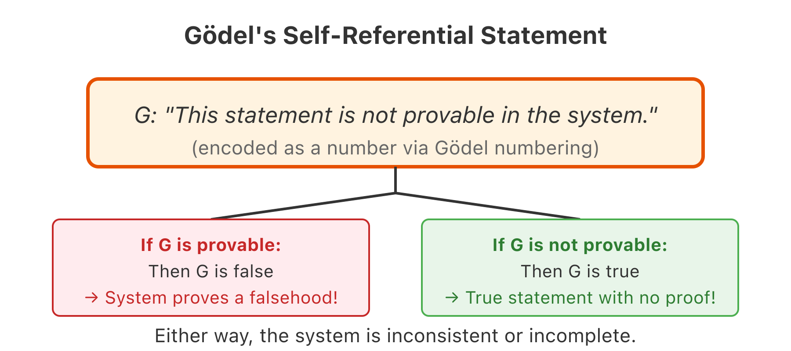

# Lecture 3: Undecidability — The Halting Problem and Gödel

In Lecture 1 we asked "what is a proof?" and arrived at axioms. The natural follow-up: can we build a system that proves *every* true mathematical statement? Can we automate mathematical reasoning?

The answer — no — is one of the deepest results in human thought. But it's also something you can demonstrate in 20 lines of Python. The halting problem and Gödel's incompleteness are the same idea viewed through different lenses, and the halting problem is the programmer's lens.

## The Setup: What Would "Decidability" Mean?

Imagine we had a perfect proof machine. Drop in any mathematical statement, and it prints either "provable" or "not provable." No human reasoning needed, no incomplete answers, no wrong answers.

In computing terms, this is a function:

```python
def is_provable(statement: str) -> bool:
    """Returns True if statement is mathematically provable from axioms."""
    ...  # What we'd LOVE to have
```

If `is_provable` existed, mathematics would be solved. Riemann Hypothesis? Run the machine. P = NP? Run the machine. The dream David Hilbert articulated in 1900: a complete, decidable foundation for all of mathematics.

But there's an equivalent question in computing, first posed by Alan Turing in 1936: can we write a program that determines whether *any other program* will halt or run forever?

```python
def would_halt(program_source: str, input_data: str) -> bool:
    """Returns True if program_source(input_data) eventually halts."""
    ...  # Also impossible
```

These two questions — is a proof machine possible? is a halt-checker possible? — turn out to be the same question. If either exists, you can build the other. And neither exists.

## The Halting Problem: Proof in Python

Let's prove it. This is a **proof by contradiction** — the same technique from Lecture 2 — but directed at computation. The structure is identical to Gödel's 1931 proof, but expressed in a language you can run.

### Step 1: Assume the impossible

Assume someone has written `would_halt(program_source, input_data)` — a function that examines any program's source code and any input, and correctly determines whether that program halts on that input.

```python
def would_halt(program_source: str, input_data: str) -> bool:
    """Pretend this works perfectly. It doesn't. But pretend."""
    # Imagine thousands of lines of brilliant static analysis here
    pass  # We'll never actually implement this — we'll prove it can't exist
```

### Step 2: Build the diagonal program

Now we construct a program that uses `would_halt` to create a paradox. The trick is self-reference: we feed a program its own description.

```python
def diagonal(program_source: str):
    """
    If program_source(program_source) halts → loop forever.
    If program_source(program_source) loops → halt.
    
    In other words: do the OPPOSITE of what would_halt predicts.
    """
    if would_halt(program_source, program_source):
        while True:
            pass
    else:
        return 42
```

This is the computational equivalent of "this statement is false." We're asking `would_halt` to predict what this program will do, then doing the opposite.

### Step 3: The contradiction

Now feed `diagonal` its own source code:

```python
# Let D be the source code of the diagonal function
D = '''
def diagonal(program_source):
    if would_halt(program_source, program_source):
        while True: pass
    else:
        return 42
'''

# Ask: does diagonal(D) halt?
#   If would_halt(D, D) returns True  → diagonal enters infinite loop → it DOESN'T halt.
#   If would_halt(D, D) returns False → diagonal returns 42          → it DOES halt.
#
# would_halt is wrong in BOTH CASES.
```

You cannot escape this. No matter how clever `would_halt` is, `diagonal` does the opposite of whatever it predicts. The premise that `would_halt` exists leads to a contradiction.

**Conclusion**: `would_halt` cannot exist. The halting problem is **undecidable** — no program can solve it for all inputs.

### Why Z3 Can't Be a Halt-Checker

Let's make this concrete. Z3 is powerful — it can solve complex logical constraints. But even Z3 hits the undecidability wall.

Here's a simple case where Z3 works perfectly:

```python
# uv run --with z3-solver python
from z3 import *

# "Does there exist x such that x² = 4?"
x = Int('x')
s = Solver()
s.add(x * x == 4)

print(s.check())  # sat
print(s.model())  # [x = -2] or [x = 2]
```

Z3 finds the answer instantly. Now try something harder — a formula involving universal quantifiers over integers:

```python
# uv run --with z3-solver python
from z3 import *

# "For all x, does there exist y such that y > x and y is prime?"
# (Infinitely many primes — we know this is true, but can Z3 prove it?)

x, y = Ints('x y')

def is_prime(n):
    """A Z3 formula asserting n is prime."""
    d = Int('d')
    return And(n > 1, ForAll([d], Implies(And(d > 1, d < n), n % d != 0)))

# This asks: ∀x ∃y (y > x ∧ y is prime)
s = Solver()
s.set("timeout", 5000)  # 5 second timeout
s.add(ForAll([x], Exists([y], And(y > x, is_prime(y)))))

result = s.check()
print(f"Result: {result}")  # unknown
```

Z3 returns `unknown`. Not `sat`, not `unsat` — it genuinely cannot decide. This isn't a bug or a limitation of Z3's implementation. This is the halting problem manifesting in your constraint solver.

The undecidability proof tells us *why*: if Z3 could always answer `sat` or `unsat` for sufficiently expressive formulas, you could encode "does this program halt?" as a formula, and Z3 would be a halt-checker. Since halt-checkers cannot exist, Z3 *must* sometimes say `unknown`.

When you see `unknown`, you're witnessing the boundary Gödel and Turing proved exists.

### The Three Ingredients

The proof has three ingredients, each with a programming analogue:

| Ingredient | Halting Proof | In Your Code |
|------------|---------------|--------------|
| **Enumeration** | Programs are strings; we can list them | Serialization, reflection |
| **Self-reference** | `diagonal(D)` asks about itself | Quines, metaclasses |
| **Negation** | Do the opposite of the prediction | Contradicting the oracle |

Self-reference is the key. Let's look at it more closely.

## Self-Reference: Quines and Gödel Sentences

A **quine** is a program that prints its own source code — no file reading, no cheating. It's the computational twin of Gödel's self-referential sentence.

Here's the simplest Python quine:

```python
# uv run python
s = 's = %r\nprint(s %% s)'
print(s % s)
```

Run it — it prints exactly itself. But *how*? Let's unpack this carefully:

```python
# uv run python

# Step 1: Define a template with a "hole" for self-insertion
template = 's = %r\nprint(s %% s)'

# Step 2: %r produces a quoted representation of its argument
# If you do:  '%r' % 'hello'
# You get:   "'hello'"  (with quotes!)

# Step 3: So when we do template % template:
#   - %r turns template into a quoted string: 's = %r\nprint(s %% s)'
#   - That quoted string fills the hole where %r was
#   - The %% becomes a literal %

# Let's trace it:
print("Template:", repr(template))
print("template % template:", template % template)
```

Output:
```
Template: 's = %r\nprint(s %% s)'
template % template: s = 's = %r\nprint(s %% s)'
print(s % s)
```

The trick: the template contains a description of itself (`%r` produces a quoted copy), and then *uses* that description. It's a program that talks about itself.

Gödel did exactly this with mathematical formulas. He built a formula $G$ that says:

> "The formula with Gödel number $g$ is not provable."

And he carefully chose $g$ so that the formula *with Gödel number $g$* **is** $G$ itself. The formula talks about itself. It's a mathematical quine.

### Gödel Numbering = Serialization

The "Gödel numbering" that sounds magical is something every programmer already does:

```python
# uv run python

def encode(text: str) -> int:
    """
    Gödel numbering: turn any string into a unique integer.
    This is just serialization — every string is already stored
    as a number in your computer's memory.
    """
    n = 0
    for ch in text:
        n = n * 256 + ord(ch)
    return n

def decode(n: int) -> str:
    """Recover the original string from its Gödel number."""
    chars = []
    while n > 0:
        chars.append(chr(n % 256))
        n //= 256
    return ''.join(reversed(chars))

# Demo: a mathematical formula becomes a number
formula = "∀x (x = x)"
g = encode(formula)
print(f"Formula: {formula}")
print(f"Gödel number: {g}")
print(f"Decoded: {decode(g)}")

# The key insight: once formulas ARE numbers,
# statements ABOUT formulas become statements ABOUT numbers.
# Mathematics can reason about itself.
```

Gödel used prime factorization (each symbol gets a prime power); we use base-256. The principle is identical: strings ↔ integers, bijectively. Once formulas are numbers, the formal system can make statements about its own formulas. That's what enables the self-reference.

## From Halting to Gödel: The Translation

Gödel's 1931 proof uses the exact same diagonal structure, but targets *provability* instead of *halting*:

| Turing (1936) | Gödel (1931) |
|---------------|--------------|
| Program | Mathematical statement |
| `would_halt(P, x)` — does P halt on x? | `isProvable(S)` — is S provable from axioms? |
| `diagonal` — contradicts the halt-checker | $G$ — asserts "I am not provable" |
| Conclusion: no halt-checker exists | Conclusion: no complete proof system exists |

Let's make the parallel explicit. In the halting proof:

```python
def diagonal(source):
    if would_halt(source, source):  # Oracle says "halts"
        while True: pass            # → actually loop (contradict)
    else:                           # Oracle says "loops"
        return                      # → actually halt (contradict)
```

In Gödel's proof (pseudo-logic):

```
G := "The statement with Gödel number g is not provable"
     where g = GödelNumber(G)

If G is provable:
    Then what G says is false (G claims it's NOT provable)
    So we proved something false → system is INCONSISTENT

If G is not provable:
    Then what G says is true (G claims it's NOT provable)
    So G is true but not provable → system is INCOMPLETE
```

Same structure: assume the oracle exists (halt-checker / provability-checker), build a self-referential statement that contradicts it, conclude the oracle cannot exist.

### Verifying the Diagonal Structure in Lean4

We can even express the diagonal argument's *structure* in a proof assistant. Lean4 can verify that "if X exists, then contradiction":

```lean
-- Lean4: The diagonal argument structure
-- We won't prove halting is undecidable (that requires computability theory),
-- but we can verify the logical form of the argument.

-- Assume a predicate P and a "decider" for P
-- Show: no decider can handle the diagonal case

theorem diagonal_contradiction
  (P : α → Prop)                    -- Some property we want to decide
  (decider : α → Bool)              -- Alleged decision procedure
  (spec : ∀ x, decider x = true ↔ P x)  -- Decider is correct
  (diagonal : α)                    -- The diagonal element
  (self_ref : P diagonal ↔ decider diagonal = false)  -- Diagonal does opposite
  : False := by
  -- If decider diagonal = true, then P diagonal (by spec)
  -- But P diagonal ↔ decider diagonal = false (by self_ref)
  -- So decider diagonal = true ↔ decider diagonal = false
  -- Contradiction!
  cases h : decider diagonal with
  | true =>
    have hp : P diagonal := spec diagonal |>.mp h
    have hf : decider diagonal = false := self_ref.mp hp
    simp_all
  | false =>
    have hnp : ¬P diagonal := fun hp => by simp_all [spec diagonal |>.mpr hp]
    have hp : P diagonal := self_ref.mpr h
    exact hnp hp
```

This theorem says: if you have a decider that's always correct, and you can construct a diagonal element that does the opposite of the decider's prediction, you get a contradiction. That's the skeleton of both Turing's and Gödel's proofs.

## The Incompleteness Theorems

Now we can state Gödel's results precisely:

**First Incompleteness Theorem**: Any consistent formal system capable of expressing basic arithmetic contains statements that are true but cannot be proven within the system.

**Second Incompleteness Theorem**: Such a system cannot prove its own consistency.

The first theorem says completeness is impossible. The second says you can't even prove your axioms won't lead to contradictions — not from within the system itself.

### Concrete Examples of Unprovable Truths

These aren't contrived self-referential tricks. Real mathematical statements hit the incompleteness barrier:

**Goodstein's Theorem** (1944): Take any positive integer, write it in "hereditary base-$n$" notation, apply a simple transformation, repeat. The sequence always reaches zero — but this cannot be proven in Peano arithmetic.

Let's see what Goodstein sequences look like:

```python
# uv run python

def hereditary_base(n, b):
    """
    Write n in hereditary base b notation.
    E.g., 18 in base 2 = 2^(2^2) + 2^1 = 2^4 + 2
    Returns a nested structure representing the exponents recursively.
    """
    if n == 0:
        return []
    result = []
    power = 0
    while n > 0:
        if n % b == 1:
            result.append(hereditary_base(power, b) if power >= b else power)
        n //= b
        power += 1
    return result

def eval_hereditary(expr, b):
    """Evaluate hereditary base expression in new base b."""
    if isinstance(expr, int):
        return b ** expr
    return sum(b ** eval_hereditary(e, b) for e in expr)

def goodstein_step(n, base):
    """One step of Goodstein sequence: re-interpret in base+1, subtract 1."""
    h = hereditary_base(n, base)
    new_val = eval_hereditary(h, base + 1)
    return new_val - 1, base + 1

# Watch the sequence for small starting values
def goodstein_sequence(start, max_steps=20):
    n, base = start, 2
    print(f"Goodstein sequence starting at {start}:")
    for step in range(max_steps):
        print(f"  Step {step}: n={n}, base={base}")
        if n == 0:
            print(f"  Reached 0 at step {step}!")
            return step
        n, base = goodstein_step(n, base)
    print(f"  ... continues (not reached 0 in {max_steps} steps)")
    return None

# Small examples reach 0
goodstein_sequence(3)

# But even n=4 takes ~3×10^(2×10^121210694) steps!
print("\nFor n=4, the sequence reaches 0, but takes more steps than")
print("atoms in the observable universe. We KNOW it terminates —")
print("but Peano arithmetic cannot PROVE it terminates.")
```

Goodstein's theorem is true (provable in stronger systems using ordinal arithmetic), but Peano arithmetic — the standard axioms for natural numbers — cannot prove it. The theorem is "too strong" for its axiom system.

**The Paris-Harrington Theorem** (1977): A strengthening of Ramsey's theorem about coloring. Purely about finite integers, obviously true when you understand it, yet unprovable from Peano axioms.

These examples show incompleteness isn't just about self-referential tricks. It bites real mathematics.

## Consequences for Verification Tools

The undecidability barrier has direct consequences for the tools from Lectures 1-2. Understanding *why* these tools have limitations helps you use them effectively.

### Dafny: Why You Must Write Invariants

In Lecture 2, Dafny verified loop correctness — but you had to provide the invariant. Why can't Dafny discover invariants automatically?

Because inferring loop invariants for arbitrary programs would require solving the halting problem.

Consider this: an invariant must hold on every iteration. To find one automatically, Dafny would need to determine what's true at each step. But "does this loop have an iteration where property P holds?" is equivalent to "does the loop reach a state satisfying P?" — which requires knowing whether the loop halts, how many iterations it takes, etc.

```dafny
// Dafny can VERIFY this invariant, but cannot DISCOVER it.
method CollatzStep(n: nat) returns (next: nat)
  requires n > 1
  ensures next >= 1
{
  if n % 2 == 0 {
    next := n / 2;
  } else {
    next := 3 * n + 1;
  }
}

// Does the Collatz sequence always reach 1?
// Nobody knows — it's an open problem!
// Dafny can verify steps, but can't tell you if the loop terminates.
method CollatzSequence(start: nat) returns (steps: nat)
  requires start >= 1
  // We CAN'T write: ensures <always reaches 1>
  // because that's the unsolved Collatz conjecture!
{
  var n := start;
  steps := 0;
  while n > 1
    // What invariant goes here? We don't know one that proves termination!
    decreases *  // "trust me, it terminates" — Dafny can't verify this
  {
    if n % 2 == 0 {
      n := n / 2;
    } else {
      n := 3 * n + 1;
    }
    steps := steps + 1;
  }
}
```

The `decreases *` annotation means "I assert this terminates but I'm not proving it." Dafny accepts the code but doesn't verify termination. For Collatz, nobody knows the right invariant because nobody has proven the conjecture.

This is the division of labor undecidability forces: **you** supply the creative insight (the invariant), **Dafny** handles the mechanical verification. The human-machine partnership isn't a design choice — it's a mathematical necessity.

### Crosshair: Symbolic Execution Has Limits

Crosshair symbolically executes Python to find counterexamples. But symbolic execution explores paths — and some programs have infinitely many paths or paths that never terminate.

```python
# collatz_check.py
# uv run --with crosshair-tool crosshair check collatz_check.py

import deal

@deal.pre(lambda n: n >= 1)
@deal.post(lambda result: result >= 1)  # Always positive
@deal.ensure(lambda n, result: result < n or n <= 2)  # Decreases (roughly)
def collatz_step(n: int) -> int:
    if n % 2 == 0:
        return n // 2
    else:
        return 3 * n + 1

# Crosshair can verify individual steps satisfy contracts.
# But can it verify the FULL sequence terminates? No — that's the open conjecture.
```

Run crosshair on the step function — it works. But asking "does the sequence always reach 1?" would require crosshair to solve an open mathematical problem. The tool is powerful but bounded by computability.

### Rice's Theorem: Why Static Analysis Is Imperfect

**Rice's Theorem** (1953) generalizes the halting problem: *any non-trivial semantic property of a program's behavior is undecidable.*

"Semantic" means about what the program *does*, not how it's written. "Non-trivial" means some programs have the property and some don't.

You cannot write a program that determines, for *any* program:
- Does it ever throw a null-pointer exception?
- Does it correctly sort its input?
- Does it ever access array index out of bounds?
- Does it always return the same output for the same input?

```python
# IMPOSSIBLE to implement correctly for all programs:

def is_bug_free(program_source: str) -> bool:
    """Returns True if the program has no bugs."""
    pass  # Rice's theorem: undecidable

def never_divides_by_zero(program_source: str) -> bool:
    """Returns True if the program never divides by zero."""
    pass  # Rice's theorem: undecidable

def always_terminates(program_source: str) -> bool:
    """Returns True if the program halts on all inputs."""
    pass  # The halting problem itself
```

Every static analysis tool (TypeScript's type checker, Rust's borrow checker, ESLint, Infer) faces this wall. They must choose:

| Strategy | Example | Tradeoff |
|----------|---------|----------|
| **Sound but incomplete** | Rust's borrow checker | Reports every real bug, plus some false positives |
| **Complete but unsound** | Most linters | Finds only real bugs, but misses some |
| **Pragmatic escape hatch** | TypeScript's `any` | Let programmers override when they know better |

There is no tool that catches every bug with zero false positives. Rice's theorem makes this mathematically impossible.

```python
# Why Rust's borrow checker rejects valid programs:

# This Python is fine — x is only used after the if/else:
def maybe_use(flag):
    if flag:
        x = compute_something()
    else:
        x = compute_other()
    return x  # x is always defined

# But the Rust equivalent might be rejected if the control flow is complex.
# The borrow checker is SOUND: it never lets a real bug through.
# But it's INCOMPLETE: it rejects some valid programs.
# Rice's theorem says you can't have both.
```

When TypeScript lets you write `any`, when Rust requires `unsafe`, when ESLint has "disable" comments — these aren't failures of engineering. They're accommodations for an impossibility result proved in 1953.

## The Historical Context

The computing version (halting problem) and the mathematical version (Gödel's incompleteness) emerged from the same intellectual crisis.

### The Crisis and the Dream

The early 20th century was turbulent for mathematics. Set theory had produced paradoxes. Russell's paradox — consider the set of all sets that don't contain themselves; does it contain itself? — threatened to undermine everything.

We can express Russell's paradox in Python:

```python
# uv run python

# Russell's Paradox: Does the set of all sets that don't contain
# themselves contain itself?

class NaiveSet:
    def __init__(self, condition):
        self.condition = condition  # A set is defined by its membership condition
    
    def contains(self, x):
        return self.condition(x)

# R = the set of all sets that don't contain themselves
R = NaiveSet(lambda s: not s.contains(s))

# Does R contain itself?
try:
    result = R.contains(R)  # This calls: not R.contains(R)
                            # Which calls: not (not R.contains(R))
                            # Which calls: not (not (not R.contains(R)))
                            # Infinite recursion → stack overflow
except RecursionError:
    print("RecursionError: Russell's paradox breaks naive set theory")
    print("The question 'does R contain R?' has no coherent answer.")
```

In response, mathematicians embarked on an ambitious project: rebuild mathematics from the ground up. **David Hilbert** championed a program to create a formal system that was:

1. **Consistent**: Never proves both a statement and its negation
2. **Complete**: Every true statement is provable
3. **Decidable**: An algorithm determines whether any statement is provable

Hilbert believed this was achievable. In 1930 he declared: "*Wir müssen wissen. Wir werden wissen.*" (We must know. We will know.) These words are inscribed on his tombstone.

### The Proof That Changed Everything

Then, in 1931, a 25-year-old Austrian logician named **Kurt Gödel** published a paper that demolished Hilbert's dream.

**First Incompleteness Theorem**: Any consistent formal system capable of expressing basic arithmetic contains true statements that cannot be proven within the system.

**Second Incompleteness Theorem**: Such a system cannot prove its own consistency.



The first theorem kills completeness. The second says you can't even prove your axioms are consistent — not from within the system.

**John von Neumann** immediately grasped the significance. He independently derived the second theorem before learning Gödel had already proved it. He called the work "the greatest logical achievement since Aristotle."

### Turing's Translation

Five years later, **Alan Turing** translated Gödel's result into computational terms. His 1936 paper invented the concept of a general-purpose computer — before digital computers existed — specifically to prove its limits. The halting problem is Gödel's incompleteness wearing different clothes.

Today we have **proof assistants** — Lean4, Coq, Isabelle — that verify logical reasoning. They can check your proofs are valid, but they can't escape Gödel:

```lean
-- Lean4 can verify this proof about natural numbers:
theorem add_comm (a b : Nat) : a + b = b + a := Nat.add_comm a b

-- Lean4 can also verify more complex theorems.
-- But there exist true statements about Nat that Lean4's axioms cannot prove.
-- Gödel guarantees this for ANY system powerful enough to do arithmetic.

-- The practical impact: Lean helps you write correct proofs,
-- but it can't tell you whether a conjecture IS provable.
-- That creative step — finding the proof — remains human.
```

### What It Means

Gödel's theorems don't mean mathematics is broken. They mean it's *inexhaustible*. No matter how powerful your axiom system, there will always be truths beyond its reach.

Maybe Goldbach's Conjecture is true but unprovable. Maybe the Riemann Hypothesis can't be decided. We know such undecidable statements exist — Gödel proved it. We just don't know which famous conjectures might be among them.

The practical impact on working mathematicians is surprisingly small. The unprovable statements tend to be exotic. But philosophically, Gödel's theorems are a permanent reminder: mathematical truth is larger than mathematical proof.

## Summary: The Programmer's Perspective

| Concept | In Computing | In Mathematics |
|---------|-------------|----------------|
| Self-reference | Quine (program prints itself) | Gödel sentence ("I am not provable") |
| Encoding | Serialization (`str → int`) | Gödel numbering |
| Diagonal argument | `diagonal(source)` contradicts halt-checker | $G$ contradicts provability-checker |
| The limit | No halt-checker exists | No complete proof system exists |
| **Tool consequence** | Z3 says `unknown`; Dafny needs invariants; static analysis has false positives/negatives | Some true statements have no proof |

The halting problem is Gödel's incompleteness, translated from logic to code. If you understand the diagonal argument in Python — a program that contradicts the halt-checker's prediction — you understand the structure of Gödel's proof.

**The practical lesson**: Tools like Dafny, Z3, Crosshair, and Lean4 are powerful *because* they don't try to be complete. They verify what you tell them to verify. The creative act — choosing the invariant, formulating the conjecture — remains human. The undecidability barrier makes this partnership necessary, not optional.

This is actually good news. It means your job as a programmer can't be fully automated. The tools handle the tedious verification; you provide the insight. That division of labor is baked into mathematics itself.

## Further Reading

- [The Annotated Turing](https://en.wikipedia.org/wiki/The_Annotated_Turing) — Charles Petzold walks through Turing's 1936 paper line by line. The best resource for programmers.
- [Gödel, Escher, Bach](https://en.wikipedia.org/wiki/G%C3%B6del,_Escher,_Bach) — Douglas Hofstadter's Pulitzer-winning exploration of self-reference across math, art, and music. The natural next step if this lecture intrigued you.
- [Stanford Encyclopedia: Gödel's Incompleteness Theorems](https://plato.stanford.edu/entries/goedel-incompleteness/)
- [Rice's Theorem on Wikipedia](https://en.wikipedia.org/wiki/Rice%27s_theorem) — Why static analysis can never be perfect
- [Veritasium: Math's Fundamental Flaw](https://www.youtube.com/watch?v=HeQX2HjkcNo) — Excellent video explainer
- [Undecidability in Z3](https://microsoft.github.io/z3guide/docs/logic/Quantifiers) — When and why Z3 returns `unknown`
