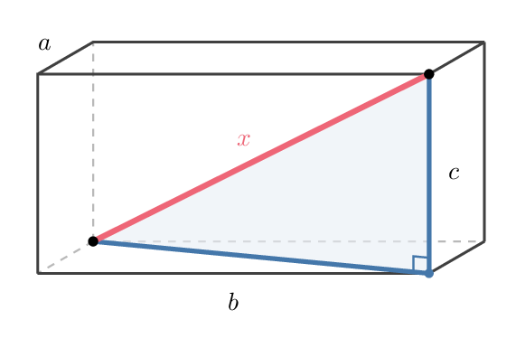

# Part I: The Four Phases (§6–14)

## 6. Four phases

Trying to find the solution, we may repeatedly change our point of view, our way of looking at the problem. We have to shift our position again and again. Our conception of the problem is likely to be rather incomplete when we start the work; our outlook is different when we have made some progress; it is again different when we have almost obtained the solution.

In order to group conveniently the questions and suggestions of our list, we shall distinguish four phases of the work.

1. First, we have to *understand* the problem; we have to see clearly what is required.
2. Second, we have to see how the various items are connected, how the unknown is linked to the data, in order to obtain the idea of the solution, to make a *plan*.
3. Third, we *carry out* our plan.
4. Fourth, we *look back* at the completed solution, we review and discuss it.

Each of these phases has its importance. It may happen that a student hits upon an exceptionally bright idea and jumping all preparations blurts out with the solution. Such lucky ideas, of course, are most desirable, but something very undesirable and unfortunate may result if the student leaves out any of the four phases without having a good idea. The worst may happen if the student embarks upon computations or constructions without having *understood* the problem.

It is generally useless to carry out details without having seen the main connection, or having made a sort of *plan*. Many mistakes can be avoided if, carrying out his plan, the student *checks each step*. Some of the best effects may be lost if the student fails to reexamine and to *reconsider* the completed solution.

## 7. Understanding the problem

It is foolish to answer a question that you do not understand. It is sad to work for an end that you do not desire. Such foolish and sad things often happen, in and out of school, but the teacher should try to prevent them from happening in his class. The student should understand the problem. But he should not only understand it, he should also desire its solution. If the student is lacking in understanding or in interest, it is not always his fault; the problem should be well chosen, not too difficult and not too easy, natural and interesting, and some time should be allowed for natural and interesting presentation.

First of all, the verbal statement of the problem must be understood. The teacher can check this, up to a certain extent; he asks the student to repeat the statement, and the student should be able to state the problem fluently. The student should also be able to point out the principal parts of the problem, the unknown, the data, the condition. Hence, the teacher can seldom afford to miss the questions: *What is the unknown? What are the data? What is the condition?*

The student should consider the principal parts of the problem attentively, repeatedly, and from various sides. If there is a figure connected with the problem he should *draw a figure* and point out on it the unknown and the data. If it is necessary to give names to these objects he should *introduce suitable notation;* devoting some attention to the appropriate choice of signs, he is obliged to consider the objects for which the signs have to be chosen.

There is another question which may be useful in this preparatory stage provided that we do not expect a definitive answer but just a provisional answer, a guess: *Is it possible to satisfy the condition?*

## 8. Example

Let us illustrate some of the points explained in the foregoing section. We take the following simple problem: *Find the diagonal of a rectangular parallelepiped of which the length, the width, and the height are known*.

In order to discuss this problem profitably, the students must be familiar with the theorem of Pythagoras, and with some of its applications in plane geometry, but they may have very little systematic knowledge in solid geometry. The teacher may rely here upon the student's unsophisticated familiarity with spatial relations.

The teacher can make the problem interesting by making it concrete. The classroom is a rectangular parallelepiped whose dimensions could be measured, and can be estimated; the students have to find, to "measure indirectly," the diagonal of the classroom. The teacher points out the length, the width, and the height of the classroom, indicates the diagonal with a gesture, and enlivens his figure, drawn on the blackboard, by referring repeatedly to the classroom.

The dialogue between the teacher and the students may start as follows:

*"What is the unknown?"*

"The length of the diagonal of a parallelepiped."

*"What are the data?"*

"The length, the width, and the height of the parallelepiped."

*"Introduce suitable notation. Which letter should denote the unknown?"*

"$x$."

"Which letters would you choose for the length, the width, and the height?"

"$a$, $b$, $c$."

*"What is the condition, linking $a$, $b$, $c$, and $x$?"*

"$x$ is the diagonal of the parallelepiped of which $a$, $b$, and $c$ are the length, the width, and the height."

"Is it a reasonable problem? I mean, *is the condition sufficient to determine the unknown?*"

"Yes, it is. If we know $a$, $b$, $c$, we know the parallelepiped. If the parallelepiped is determined, the diagonal is determined."

## 9. Devising a plan

We have a plan when we know, or know at least in outline, which calculations, computations, or constructions we have to perform in order to obtain the unknown. The way from understanding the problem to conceiving a plan may be long and tortuous.

In fact, the main achievement in the solution of a problem is to conceive the idea of a plan. This idea may emerge gradually. Or, after apparently unsuccessful trials and a period of hesitation, it may occur suddenly, in a flash, as a "bright idea." The best that the teacher can do for the student is to procure for him, by unobtrusive help, a bright idea. The questions and suggestions we are going to discuss tend to provoke such an idea.

In order to be able to see the student's position, the teacher should think of his own experience, of his difficulties and successes in solving problems.

We know, of course, that it is hard to have a good idea if we have little knowledge of the subject, and impossible to have it if we have no knowledge. Good ideas are based on past experience and formerly acquired knowledge. Mere remembering is not enough for a good idea, but we cannot have any good idea without recollecting some pertinent facts; materials alone are not enough for constructing a house but we cannot construct a house without collecting the necessary materials.

The materials necessary for solving a mathematical problem are certain relevant items of our formerly acquired mathematical knowledge, as formerly solved problems, or formerly proved theorems. Thus, it is often appropriate to start the work with the question: *Do you know a related problem?*

The difficulty is that there are usually too many problems which are somewhat related to our present problem, that is, have some point in common with it. How can we choose the one, or the few, which are really useful? There is a suggestion that puts our finger on an essential common point: *Look at the unknown! And try to think of a familiar problem having the same or a similar unknown*.

If we succeed in recalling a formerly solved problem which is closely related to our present problem, we are lucky. We should try to deserve such luck; we may deserve it by exploiting it. *Here is a problem related to yours and solved before. Could you use it?*

The foregoing questions, well understood and seriously considered, very often help to start the right train of ideas; but they cannot help always, they cannot work magic. If they do not work, we must look around for some other appropriate point of contact, and explore the various aspects of our problem; we have to vary, to transform, to modify the problem.

*Could you restate the problem?* Some of the questions of our list hint specific means to vary the problem, as generalization, specialization, use of analogy, dropping a part of the condition, and so on; the details are important but we cannot go into them now. Variation of the problem may lead to some appropriate auxiliary problem: *If you cannot solve the proposed problem try to solve first some related problem*.

Trying to apply various known problems or theorems, considering various modifications, experimenting with various auxiliary problems, we may stray so far from our original problem that we are in danger of losing it altogether. Yet there is a good question that may bring us back to it: *Did you use all the data? Did you use the whole condition?*

## 10. Example

We return to the example considered in the section *Understanding the problem*. As we left it, the students just succeeded in understanding the problem and showed some mild interest in it. They could now have some ideas of their own, some initiative. If the teacher, having watched sharply, cannot detect any sign of such initiative he has to resume carefully his dialogue with the students. He must be prepared to repeat with some modification the questions which the students do not answer.

*"Do you know a related problem?"*

*"Look at the unknown! Do you know a problem having the same unknown?"*

"Well, *what is the unknown?"*

"The diagonal of a parallelepiped."

"Do you know any *problem with the same unknown?"*

"No. We have not had any problem yet about the diagonal of a parallelepiped."

"Do you know any *problem with a similar unknown?"*

"You see, the diagonal is a segment, the segment of a straight line. Did you never solve a problem whose unknown was the length of a line?"

"Of course, we have solved such problems. For instance, to find a side of a right triangle."

"Good! *Here is a problem related to yours and solved before. Could you use it?"*

"You were lucky enough to remember a problem which is related to your present one and which you solved before. Would you like to use it? *Could you introduce some auxiliary element in order to make its use possible?"*

"Look here, the problem you remembered is about a triangle. Have you any triangle in your figure?"

Let us hope that the last hint was explicit enough to provoke the idea of the solution which is to introduce a right triangle, (emphasized in Fig. 1) of which the required diagonal is the hypotenuse. Yet the teacher should be prepared for the case that even this fairly explicit hint is insufficient to shake the torpor of the students; and so he should be prepared to use a whole gamut of more and more explicit hints.

"Would you like to have a triangle in the figure?"

"What sort of triangle would you like to have in the figure?"

"You cannot find yet the diagonal; but you said that you could find the side of a triangle. Now, what will you do?"

"Could you find the diagonal, if it were a side of a triangle?"

When, eventually, with more or less help, the students succeed in introducing the decisive auxiliary element, the right triangle emphasized in Fig. 1, the teacher should convince himself that the students see sufficiently far ahead before encouraging them to go into actual calculations.

"I think that it was a good idea to draw that triangle. You have now a triangle; but have you the unknown?"

"The unknown is the hypotenuse of the triangle; we can calculate it by the theorem of Pythagoras."

"You can, if both legs are known; but are they?"

"One leg is given, it is $c$. And the other, I think, is not difficult to find. Yes, the other leg is the hypotenuse of another right triangle."

"Very good! Now I see that you have a plan."

## 11. Carrying out the plan

To devise a plan, to conceive the idea of the solution is not easy. It takes so much to succeed; formerly acquired knowledge, good mental habits, concentration upon the purpose, and one more thing: good luck. To carry out the plan is much easier; what we need is mainly patience.

The plan gives a general outline; we have to convince ourselves that the details fit into the outline, and so we have to examine the details one after the other, patiently, till everything is perfectly clear, and no obscure corner remains in which an error could be hidden.

If the student has really conceived a plan, the teacher has now a relatively peaceful time. The main danger is that the student forgets his plan. This may easily happen if the student received his plan from outside, and accepted it on the authority of the teacher; but if he worked for it himself, even with some help, and conceived the final idea with satisfaction, he will not lose this idea easily. Yet the teacher must insist that the student should *check each step*.

We may convince ourselves of the correctness of a step in our reasoning either "intuitively" or "formally." We may concentrate upon the point in question till we see it so clearly and distinctly that we have no doubt that the step is correct; or we may derive the point in question according to formal rules. (The difference between "insight" and "formal proof" is clear enough in many important cases; we may leave further discussion to philosophers.)

The main point is that the student should be honestly convinced of the correctness of each step. In certain cases, the teacher may emphasize the difference between "seeing" and "proving": *Can you see clearly that the step is correct?* But can you also *prove that the step is correct?*

## 12. Example

Let us resume our work at the point where we left it at the end of the previous *Example* (on devising a plan). The student, at last, has got the idea of the solution. He sees the right triangle of which the unknown $x$ is the hypotenuse and the given height $c$ is one of the legs; the other leg is the diagonal of a face.

The student must, possibly, be urged to introduce suitable notation. He should choose $y$ to denote that other leg, the diagonal of the face whose sides are $a$ and $b$. Thus, he may see more clearly the idea of the solution which is to introduce an auxiliary problem whose unknown is $y$. Finally, working at one right triangle after the other, he may obtain (see Fig. 1)

$$x^2 = y^2 + c^2$$

$$y^2 = a^2 + b^2$$

and hence, eliminating the auxiliary unknown $y$,

$$x^2 = a^2 + b^2 + c^2$$

$$x = \sqrt{a^2 + b^2 + c^2}$$

The teacher has no reason to interrupt the student if he carries out these details correctly except, possibly, to warn him that he should *check each step*. Thus, the teacher may ask:

"Can you *see clearly* that the triangle with sides $x$, $y$, $c$ is a right triangle?"

To this question the student may answer honestly "Yes" but he could be much embarrassed if the teacher, not satisfied with the intuitive conviction of the student, should go on asking:

"But can you *prove* that this triangle is a right triangle?"

Thus, the teacher should rather suppress this question unless the class has had a good initiation in solid geometry. Even in the latter case, there is some danger that the answer to an incidental question may become the main difficulty for the majority of the students.

## 13. Looking back

Even fairly good students, when they have obtained the solution of the problem and written down neatly the argument, shut their books and look for something else. Doing so, they miss an important and instructive phase of the work.

By looking back at the completed solution, by reconsidering and reexamining the result and the path that led to it, they could consolidate their knowledge and develop their ability to solve problems.

A good teacher should understand and impress on his students the view that no problem whatever is completely exhausted. There remains always something to do; with sufficient study and penetration, we could improve any solution, and, in any case, we can always improve our understanding of the solution.

The student has now carried through his plan. He has written down the solution, checking each step. Thus, he should have good reasons to believe that his solution is correct.

Nevertheless, errors are always possible, especially if the argument is long and involved. Hence, verifications are desirable. Especially, if there is some rapid and intuitive procedure to test either the result or the argument, it should not be overlooked. *Can you check the result? Can you check the argument?*

In order to convince ourselves of the presence or of the quality of an object, we like to see and to touch it. And as we prefer perception through two different senses, so we prefer conviction by two different proofs: *Can you derive the result differently?*

We prefer, of course, a short and intuitive argument to a long and heavy one: *Can you see it at a glance?*

One of the first and foremost duties of the teacher is not to give his students the impression that mathematical problems have little connection with each other, and no connection at all with anything else. We have a natural opportunity to investigate the connections of a problem when looking back at its solution.

The students will find looking back at the solution really interesting if they have made an honest effort, and have the consciousness of having done well. Then they are eager to see what else they could accomplish with that effort, and how they could do equally well another time.

The teacher should encourage the students to imagine cases in which they could utilize again the procedure used, or apply the result obtained. *Can you use the result, or the method, for some other problem?*

## 14. Example

In the previous *Example* (on carrying out the plan), the students finally obtained the solution: If the three edges of a rectangular parallelogram, issued from the same corner, are $a$, $b$, $c$, the diagonal is

$$x = \sqrt{a^2 + b^2 + c^2}$$

*Can you check the result?* The teacher cannot expect a good answer to this question from inexperienced students. The students, however, should acquire fairly early the experience that problems "in letters" have a great advantage over purely numerical problems; if the problem is given "in letters" its result is accessible to several tests to which a problem "in numbers" is not susceptible at all. Our example, although fairly simple, is sufficient to show this. The teacher can ask several questions about the result which the students may readily answer with "Yes"; but an answer "No" would show a serious flaw in the result.

*"Did you use all the data? Do all the data $a$, $b$, $c$ appear in your formula for the diagonal?"*

"Length, width, and height play the same role in our question; our problem is symmetric with respect to $a$, $b$, $c$. Is the expression you obtained for the diagonal symmetric in $a$, $b$, $c$? Does it remain unchanged when $a$, $b$, $c$ are interchanged?"

"Our problem is a problem of solid geometry: to find the diagonal of a parallelepiped with given dimensions $a$, $b$, $c$. Our problem is analogous to a problem of plane geometry: to find the diagonal of a rectangle with given dimensions $a$, $b$. Is the result of our 'solid' problem analogous to the result of the 'plane' problem?"

"If the height $c$ decreases, and finally vanishes, the parallelepiped becomes a parallelogram. If you put $c = 0$ in your formula, do you obtain the correct formula for the diagonal of the rectangular parallelogram?"

"If the height $c$ increases, the diagonal increases. Does your formula show this?"

"If all three measures $a$, $b$, $c$ of the parallelepiped increase in the same proportion, the diagonal also increases in the same proportion. If, in your formula, you substitute $12a$, $12b$, $12c$ for $a$, $b$, $c$ respectively, the expression of the diagonal, owing to this substitution, should also be multiplied by $12$. Is that so?"

"If $a$, $b$, $c$ are measured in feet, your formula gives the diagonal measured in feet too; but if you change all measures into inches, the formula should remain correct. Is that so?"

(The two last questions are essentially equivalent; see *Test by dimension*.)

These questions have several good effects. First, an intelligent student cannot help being impressed by the fact that the formula passes so many tests. He was convinced before that the formula is correct because he derived it carefully. But now he is more convinced, and his gain in confidence comes from a different source; it is due to a sort of "experimental evidence." Then, thanks to the foregoing questions, the details of the formula acquire new significance, and are linked up with various facts. The formula has therefore a better chance of being remembered, the knowledge of the student is consolidated. Finally, these questions can be easily transferred to similar problems. After some experience with similar problems, an intelligent student may perceive the underlying general ideas: use of all relevant data, variation of the data, symmetry, analogy. If he gets into the habit of directing his attention to such points, his ability to solve problems may definitely profit.

*Can you check the argument?* To recheck the argument step by step may be necessary in difficult and important cases. Usually, it is enough to pick out "touchy" points for rechecking. In our case, it may be advisable to discuss retrospectively the question which was less advisable to discuss as the solution was not yet attained: Can you *prove* that the triangle with sides $x$, $y$, $c$ is a right triangle? (See the end of the previous *Example* on carrying out the plan.)

*Can you use the result or the method for some other problem?* With a little encouragement, and after one or two examples, the students easily find applications which consist essentially in giving some *concrete interpretation* to the abstract mathematical elements of the problem. The teacher himself used such a concrete interpretation as he took the room in which the discussion takes place for the parallelepiped of the problem. A dull student may propose, as application, to calculate the diagonal of the cafeteria instead of the diagonal of the classroom. If the students do not volunteer more imaginative remarks, the teacher himself may put a slightly different problem, for instance: "Being given the length, the width, and the height of a rectangular parallelepiped, find the distance of the center from one of the corners."

The students may use the *result* of the problem they just solved, observing that the distance required is one half of the diagonal they just calculated. Or they may use the *method*, introducing suitable right triangles (the latter alternative is less obvious and somewhat more clumsy in the present case).

After this application, the teacher may discuss the configuration of the four diagonals of the parallelepiped, and the six pyramids of which the six faces are the bases, the center the common vertex, and the semidiagonals the lateral edges. When the geometric imagination of the students is sufficiently enlivened, the teacher should come back to his question: *Can you use the result, or the method, for some other problem?* Now there is a better chance that the students may find some more interesting concrete interpretation, for instance, the following:

"In the center of the flat rectangular top of a building which is 21 yards long and 16 yards wide, a flagpole is to be erected, 8 yards high. To support the pole, we need four equal cables. The cables should start from the same point, 2 yards under the top of the pole, and end at the four corners of the top of the building. How long is each cable?"

The students may use the *method* of the problem they solved in detail introducing a right triangle in a vertical plane, and another one in a horizontal plane. Or they may use the *result*, imagining a rectangular parallelepiped of which the diagonal, $x$, is one of the four cables and the edges are

$$a = 10.5 \qquad b = 8 \qquad c = 6$$

By straightforward application of the formula, $x = 14.5$.

For more examples, see *Can you use the result?*
