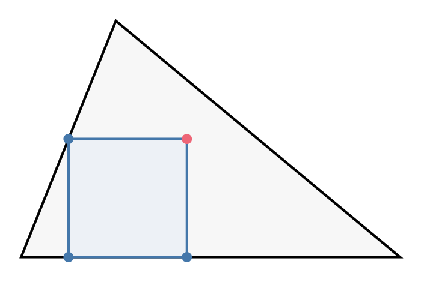
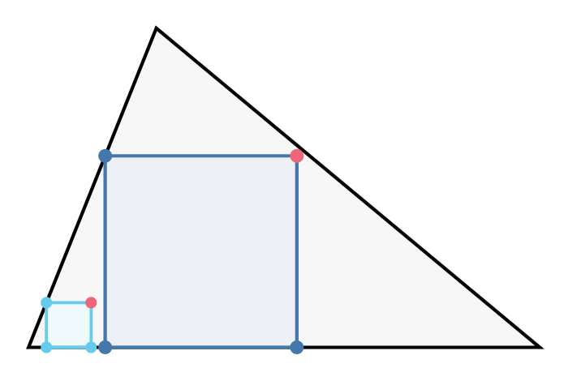
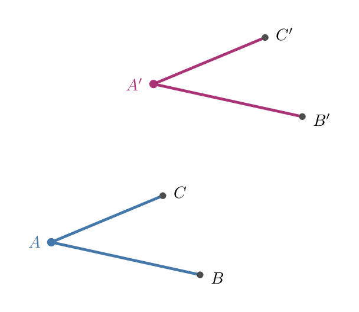
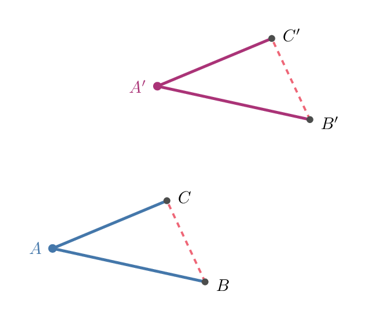
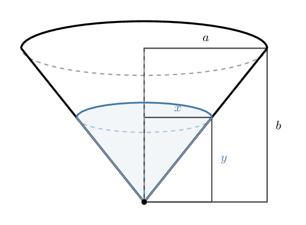

# Part I: Questions & More Examples (§15–20)

## 15. Various approaches

Let us still retain, for a while, the problem we considered in the foregoing sections 8, 10, 12, 14. The main work, the discovery of the plan, was described in section 10. Let us observe that the teacher could have proceeded differently. Starting from the same point as in section 10, he could have followed a somewhat different line, asking the following questions:

*"Do you know any related problem?"*

"Do you know an *analogous* problem?"

"You see, the proposed problem is a problem of solid geometry. Could you think of a simpler analogous problem of plane geometry?"

"You see, the proposed problem is about a figure in space, it is concerned with the diagonal of a rectangular parallelepiped. What might be an analogous problem about a figure in the plane? It should be concerned with — the diagonal — of — a rectangular — "

"Parallelogram."

The students, even if they are very slow and indifferent, and were not able to guess anything before, are obliged finally to contribute at least a minute part of the idea. Besides, if the students are so slow, the teacher should not take up the present problem about the parallelepiped without having discussed before, in order to prepare the students, the analogous problem about the parallelogram. Then, he can go on now as follows:

*"Here is a problem related to yours and solved before. Can you use it?"*

*"Should you introduce some auxiliary element in order to make its use possible?"*

Eventually, the teacher may succeed in suggesting to the students the desirable idea. It consists in conceiving the diagonal of the given parallelepiped as the diagonal of a suitable parallelogram which must be introduced into the figure (as intersection of the parallelepiped with a plane passing through two opposite edges). The idea is essentially the same as before (section 10) but the approach is different. In section 10, the contact with the available knowledge of the students was established through the unknown; a formerly solved problem was recollected because its unknown was the same as that of the proposed problem. In the present section analogy provides the contact with the idea of the solution.

## 16. The teacher's method of questioning

The teacher's method of questioning shown in the foregoing sections 8, 10, 12, 14, 15 is essentially this: Begin with a general question or suggestion of our list, and, if necessary, come down gradually to more specific and concrete questions or suggestions till you reach one which elicits a response in the student's mind. If you have to help the student exploit his idea, start again, if possible, from a general question or suggestion contained in the list, and return again to some more special one if necessary; and so on.

Of course, our list is just a first list of this kind; it seems to be sufficient for the majority of simple cases, but there is no doubt that it could be perfected. It is important, however, that the suggestions from which we start should be simple, natural, and general, and that their list should be short.

The suggestions must be simple and natural because otherwise they cannot be *unobtrusive*.

The suggestions must be general, applicable not only to the present problem but to problems of all sorts, if they are to help develop the *ability* of the student and not just a special technique.

The list must be short in order that the questions may be often repeated, unartificially, and under varying circumstances; thus, there is a chance that they will be eventually assimilated by the student and will contribute to the development of a *mental habit*.

It is necessary to come down gradually to specific suggestions, in order that the student may have as great a *share of the work* as possible.

This method of questioning is not a rigid one; fortunately so, because, in these matters, any rigid, mechanical, pedantical procedure is necessarily bad. Our method admits a certain elasticity and variation, it admits various approaches (section 15), it can be and should be so applied that questions asked by the teacher *could have occurred to the student himself*.

If a reader wishes to try the method here proposed in his class he should, of course, proceed with caution. He should study carefully the example introduced in section 8, and the following examples in sections 18, 19, 20. He should prepare carefully the examples which he intends to discuss, considering also various approaches. He should start with a few trials and find out gradually how he can manage the method, how the students take it, and how much time it takes.

## 17. Good questions and bad questions

If the method of questioning formulated in the foregoing section is well understood it helps to judge, by comparison, the quality of certain suggestions which may be offered with the intention of helping the students.

Let us go back to the situation as it presented itself at the beginning of section 10 when the question was asked: *Do you know a related problem?* Instead of this, with the best intention to help the students, the question may be offered: *Could you apply the theorem of Pythagoras?*

The intention may be the best, but the question is about the worst. We must realize in what situation it was offered; then we shall see that there is a long sequence of objections against that sort of "help."

1. If the student is near to the solution, he may understand the suggestion implied by the question; but if he is not, he quite possibly will not see at all the point at which the question is driving. Thus the question fails to help where help is most needed.

2. If the suggestion is understood, it gives the whole secret away, very little remains for the student to do.

3. The suggestion is of too special a nature. Even if the student can make use of it in solving the present problem, nothing is learned for future problems. The question is not instructive.

4. Even if he understands the suggestion, the student can scarcely understand how the teacher came to the idea of putting such a question. And how could he, the student, find such a question by himself? It appears as an unnatural surprise, as a rabbit pulled out of a hat; it is really not instructive.

None of these objections can be raised against the procedure described in section 10, or against that in section 15.

## 18. A problem of construction

*Inscribe a square in a given triangle. Two vertices of the square should be on the base of the triangle, the two other vertices of the square on the two other sides of the triangle, one on each*.

**"What is the unknown?"**

"A square."

**"What are the data?"**

"A triangle is given, nothing else."

**"What is the condition?"**

"The four corners of the square should be on the perimeter of the triangle, two corners on the base, one corner on each of the other two sides."

**"Is it possible to satisfy the condition?"**

"I think so. I am not so sure."

"You do not seem to find the problem too easy. **If you cannot solve the proposed problem, try to solve first some related problem**. Could you satisfy a **part of the condition?"**

"What do you mean by a part of the condition?"

"You see, the condition is concerned with all the vertices of the square. How many vertices are there?"

"Four."

"A part of the condition would be concerned with less than four vertices. **Keep only a part of the condition, drop the other part**. What part of the condition is easy to satisfy?"

"It is easy to draw a square with two vertices on the perimeter of the triangle — or even one with three vertices on the perimeter!"

**"Draw a figure!"**

The student draws Fig. 2.

"You **kept only a part of the condition**, and you **dropped the other part. How far is the unknown now determined?"**

"The square is not determined if it has only three vertices on the perimeter of the triangle."

"Good! **Draw a figure."**

The student draws Fig. 3.

"The square, as you said, is not determined by the **part of the condition you kept. How can it vary?"**

. . . . .

"Three corners of your square are on the perimeter of the triangle but the fourth corner is not yet there where it should be. Your square, as you said, is undetermined, it can vary; the same is true of its fourth corner. **How can it vary?"**

. . . . .

"Try it experimentally, if you wish. Draw more squares with three corners on the perimeter in the same way as the two squares already in the figure. Draw small squares and large squares. What seems to be the locus of the fourth corner? **How can it vary?"**

The teacher brought the student very near to the idea of the solution. If the student is able to guess that the locus of the fourth corner is a straight line, he has got it.

## 19. A problem to prove

*Two angles are in different planes but each side of one is parallel to the corresponding side of the other, and has also the same direction. Prove that such angles are equal*.

What we have to prove is a fundamental theorem of solid geometry. The problem may be proposed to students who are familiar with plane geometry and acquainted with those few facts of solid geometry which prepare the present theorem in Euclid's Elements. (The theorem that we have stated and are going to prove is the proposition 10 of Book XI of Euclid.) Not only questions and suggestions quoted from our list are printed in italics but also others which correspond to them as "problems to prove" correspond to "problems to find." (The correspondence is worked out systematically in the entry *Problems to Find, Problems to Prove*, 5, 6.)

*"What is the hypothesis?"*

"Two angles are in different planes. Each side of one is parallel to the corresponding side of the other, and has also the same direction."

*"What is the conclusion?"*

"The angles are equal."

*"Draw a figure. Introduce suitable notation."*

The student draws the lines of Fig. 4 and chooses, helped more or less by the teacher, the letters as in Fig. 4.

*"What is the hypothesis? Say it, please, using your notation."*

"$A$, $B$, $C$ are not in the same plane as $A'$, $B'$, $C'$. And $AB \parallel A'B'$, $AC \parallel A'C'$. Also $AB$ has the same direction as $A'B'$, and $AC$ the same as $A'C'$."

*"What is the conclusion?"*

"$\angle BAC = \angle B'A'C'$."

*"Look at the conclusion! And try to think of a familiar theorem having the same or a similar conclusion."*

"If two triangles are congruent, the corresponding angles are equal."

"Very good! Now *here is a theorem related to yours and proved before. Could you use it?"*

"I think so but I do not see yet quite how."

*"Should you introduce some auxiliary element in order to make its use possible?"*

. . . . .

"Well, the theorem which you quoted so well is about triangles, about a pair of congruent triangles. Have you any triangles in your figure?"

"No. But I could introduce some. Let me join $B$ to $C$, and $B'$ to $C'$. Then there are two triangles, $\triangle ABC$, $\triangle A'B'C'$."

"Well done. But what are these triangles good for?"

"To prove the conclusion, $\angle BAC = \angle B'A'C'$."

"Good! If you wish to prove this, what kind of triangles do you need?"

"Congruent triangles. Yes, of course, I may choose $B$, $C$, $B'$, $C'$ so that $AB = A'B'$, $AC = A'C'$."

"Very good! Now, what do you wish to prove?"

"I wish to prove that the triangles are congruent, $\triangle ABC \cong \triangle A'B'C'$. If I could prove this, the conclusion $\angle BAC = \angle B'A'C'$ would follow immediately."

"Fine! You have a new aim, you aim at a new conclusion. *Look at the conclusion! And try to think of a familiar theorem having the same or a similar conclusion."*

"Two triangles are congruent if — if the three sides of the one are equal respectively to the three sides of the other."

"Well done. You could have chosen a worse one. Now *here is a theorem related to yours and proved before. Could you use it?"*

"I could use it if I knew that $BC = B'C'$."

"That is right! Thus, what is your aim?"

"To prove that $BC = B'C'$."

*"Try to think of a familiar theorem having the same or a similar conclusion."*

"Yes, I know a theorem finishing: '. . . then the two lines are equal.' But it does not fit in."

*"Should you introduce some auxiliary element in order to make its use possible?"*

. . . . .

"You see, how could you prove $BC = B'C'$ when there is no connection in the figure between $BC$ and $B'C'$?"

*"Did you use the hypothesis? What is the hypothesis?"*

"We suppose that $AB \parallel A'B'$, $AC \parallel A'C'$. Yes, of course, I must use that."

*"Did you use the whole hypothesis? You say that $AB \parallel A'B'$. Is that all that you know about these lines?"*

"No; $AB$ is also equal to $A'B'$, by construction. They are parallel and equal to each other. And so are $AC$ and $A'C'$."

"Two parallel lines of equal length — it is an interesting configuration. *Have you seen it before?"*

"Of course! Yes! Parallelogram! Let me join $A$ to $A'$, $B$ to $B'$, and $C$ to $C'$."

"The idea is not so bad. How many parallelograms have you now in your figure?"

"Two. No, three. No, two. I mean, there are two of which you can prove immediately that they are parallelograms. There is a third which seems to be a parallelogram; I hope I can prove that it is one. And then the proof will be finished!"

We could have gathered from his foregoing answers that the student is intelligent. But after this last remark of his, there is no doubt.

This student is able to guess a mathematical result and to distinguish clearly between proof and guess. He knows also that guesses can be more or less plausible. Really, he did profit something from his mathematics classes; he has some real experience in solving problems, he can conceive and exploit a good idea.

## 20. A rate problem

Water is flowing into a conical vessel at the rate $r$. The vessel has the shape of a right circular cone, with horizontal base, the vertex pointing downwards; the radius of the base is $a$, the altitude of the cone $b$. Find the rate at which the surface is rising when the depth of the water is $y$. Finally, obtain the numerical value of the unknown supposing that $a = 4$ ft., $b = 3$ ft., $r = 2$ cu. ft. per minute, and $y = 1$ ft.

The students are supposed to know the simplest rules of differentiation and the notion of "rate of change."

*"What are the data?"*

"The radius of the base of the cone $a = 4$ ft., the altitude of the cone $b = 3$ ft., the rate at which the water is flowing into the vessel $r = 2$ cu. ft. per minute, and the depth of the water at a certain moment, $y = 1$ ft."

"Correct. The statement of the problem seems to suggest that you should disregard, provisionally, the numerical values, work with the letters, express the unknown in terms of $a$, $b$, $r$, $y$ and only finally, after having obtained the expression of the unknown in letters, substitute the numerical values. I would follow this suggestion. Now, *what is the unknown?*"

"The rate at which the surface is rising when the depth of the water is $y$."

"What is that? Could you say it in other terms?"

"The rate at which the depth of the water is increasing."

"What is that? *Could you restate it still differently?*"

"The rate of change of the depth of the water."

"That is right, the rate of change of $y$. But what is the rate of change? *Go back to the definition.*"

"The derivative is the rate of change of a function."

"Correct. Now, is $y$ a function? As we said before, we disregard the numerical value of $y$. Can you imagine that $y$ changes?"

"Yes, $y$, the depth of the water, increases as the time goes by."

"Thus, $y$ is a function of what?"

"Of the time $t$."

"Good. *Introduce suitable notation*. How would you write the 'rate of change of $y$' in mathematical symbols?"

$$\frac{dy}{dt}$$

"Good. Thus, this is your unknown. You have to express it in terms of $a$, $b$, $r$, $y$. By the way, one of these data is a 'rate.' Which one?"

"$r$ is the rate at which water is flowing into the vessel."

"What is that? Could you say it in other terms?"

"$r$ is the rate of change of the volume of the water in the vessel."

"What is that? *Could you restate it still differently?* How would you write it in *suitable notation?*"

$$r = \frac{dV}{dt}$$

"What is $V$?"

"The volume of the water in the vessel at the time $t$."

"Good. Thus, you have to express $\frac{dy}{dt}$ in terms of $a$, $b$, $\frac{dV}{dt}$, $y$. How will you do it?"

. . . . .

*"If you cannot solve the proposed problem try to solve first some related problem*. If you do not see yet the connection between $\frac{dy}{dt}$ and the data, try to bring in some simpler connection that could serve as a stepping stone."

. . . . .

"Do you not see that there are other connections? For instance, are $y$ and $V$ independent of each other?"

"No. When $y$ increases, $V$ must increase too."

"Thus, there is a connection. What is the connection?"

"Well, $V$ is the volume of a cone of which the altitude is $y$. But I do not know yet the radius of the base."

"You may consider it, nevertheless. Call it something, say $x$."

$$V = \frac{\pi x^2 y}{3}$$

"Correct. Now, what about $x$? Is it independent of $y$?"

"No. When the depth of the water, $y$, increases the radius of the free surface, $x$, increases too."

"Thus, there is a connection. What is the connection?"

"Of course, similar triangles.

$$x : y = a : b.$$

"One more connection, you see. I would not miss profiting from it. Do not forget, you wished to know the connection between $V$ and $y$."

"I have

$$x = \frac{ay}{b}, \qquad V = \frac{\pi a^2 y^3}{3b^2}.$$

"Very good. This looks like a stepping stone, does it not? But you should not forget your goal. *What is the unknown?*"

"Well, $\frac{dy}{dt}$."

"You have to find a connection between $\frac{dy}{dt}$, $\frac{dV}{dt}$, and other quantities. And here you have one between $y$, $V$, and other quantities. What to do?"

"Differentiate! Of course!

$$\frac{dV}{dt} = \frac{\pi a^2 y^2}{b^2} \frac{dy}{dt}.$$

Here it is."

"Fine! And what about the numerical values?"

"If $a = 4$, $b = 3$, $\frac{dV}{dt} = r = 2$, $y = 1$, then

$$2 = \frac{\pi \times 16 \times 1}{9} \frac{dy}{dt}$$

and so

$$\frac{dy}{dt} = \frac{9}{8\pi} \text{ ft. per minute.}"$$
