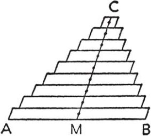
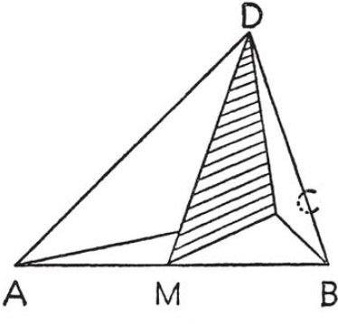
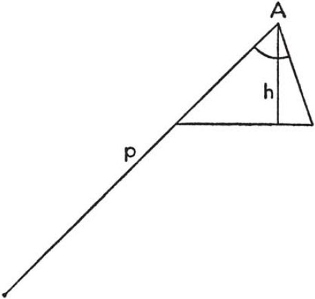
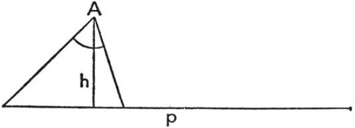
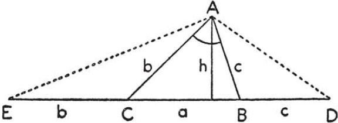
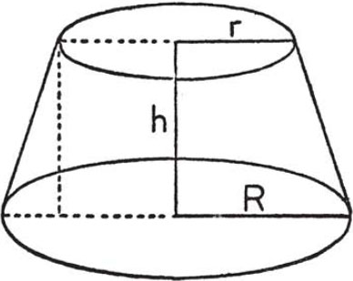
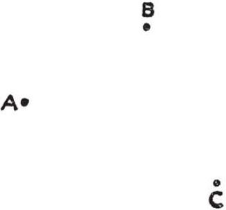
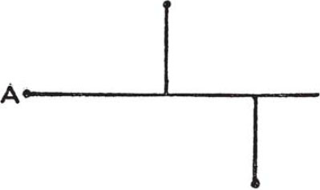
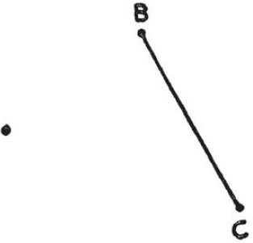

# Part III — Dictionary of Heuristic: A–C

This is the start of Pólya's *Short Dictionary of Heuristic* (Part III). The
entries are alphabetical; cross-references to other entries are set in small
caps in the original and rendered here as emphasized entry names.

## Analogy

**Analogy** is a sort of similarity. Similar objects agree with each other in
some respect, analogous objects *agree in certain relations* of their
respective parts.

1. A rectangular parallelogram is analogous to a rectangular parallelepiped. In
fact, the relations between the sides of the parallelogram are similar to those
between the faces of the parallelepiped:

Each side of the parallelogram is parallel to just one other side, and is
perpendicular to the remaining sides.

Each face of the parallelepiped is parallel to just one other face, and is
perpendicular to the remaining faces.

Let us agree to call a side a "bounding element" of the parallelogram and a face
a "bounding element" of the parallelepiped. Then, we may contract the two
foregoing statements into one that applies equally to both figures:

Each bounding element is parallel to just one other bounding element and is
perpendicular to the remaining bounding elements.

Thus, we have expressed certain relations which are common to the two systems of
objects we compared, sides of the rectangle and faces of the rectangular
parallelepiped. The analogy of these systems consists in this community of
relations.

2. Analogy pervades all our thinking, our everyday speech and our trivial
conclusions as well as artistic ways of expression and the highest scientific
achievements. Analogy is used on very different levels. People often use vague,
ambiguous, incomplete, or incompletely clarified analogies, but analogy may
reach the level of mathematical precision. All sorts of analogy may play a role
in the discovery of the solution and so we should not neglect any sort.

3. We may consider ourselves lucky when, trying to solve a problem, we succeed
in discovering a *simpler analogous problem*. In an earlier section, our
original problem was concerned with the diagonal of a rectangular
parallelepiped; the consideration of a simpler analogous problem, concerned with
the diagonal of a rectangle, led us to the solution of the original problem. We
are going to discuss one more case of the same sort. We have to solve the
following problem:

*Find the center of gravity of a homogeneous tetrahedron*.

Without knowledge of the integral calculus, and with little knowledge of
physics, this problem is not easy at all; it was a serious scientific problem in
the days of Archimedes or Galileo. Thus, if we wish to solve it with as little
preliminary knowledge as possible, we should look around for a simpler analogous
problem. The corresponding problem in the plane occurs here naturally:

*Find the center of gravity of a homogeneous triangle*.

Now, we have two questions instead of one. But two questions may be easier to
answer than just one question—provided that the two questions are intelligently
connected.

4. Laying aside, for the moment, our original problem concerning the
tetrahedron, we concentrate upon the simpler analogous problem concerning the
triangle. To solve this problem, we have to know something about centers of
gravity. The following principle is plausible and presents itself naturally.

*If a system of masses* $S$ *consists of parts, each of which has its center of
gravity in the same plane, then this plane contains also the center of gravity
of the whole system* $S$.

This principle yields all that we need in the case of the triangle. First, it
implies that the center of gravity of the triangle lies in the plane of the
triangle. Then, we may consider the triangle as consisting of fibers (thin
strips, "infinitely narrow" parallelograms) parallel to a certain side of the
triangle (the side $AB$ in Fig. 7). The center of gravity of each fiber (of any
parallelogram) is, obviously, its midpoint, and all these midpoints lie on the
line joining the vertex $C$ opposite to the side $AB$ to the midpoint $M$ of
$AB$ (see Fig. 7).

Any plane passing through the median $CM$ of the triangle contains the centers
of gravity of all parallel fibers which constitute the triangle. Thus, we are
led to the conclusion that the center of gravity of the whole triangle lies on
the same median. Yet it must lie on the other two medians just as well, it must
be the *common point of intersection of all three medians*.

It is desirable to verify now by pure geometry, independently of any mechanical
assumption, that the three medians meet in the same point.

5. After the case of the triangle, the case of the tetrahedron is fairly easy.
We have now solved a problem analogous to our proposed problem and, having
solved it, we have a *model to follow*.

In solving the analogous problem which we use now as a model, we conceived the
triangle $ABC$ as consisting of fibers parallel to one of its sides, $AB$. Now,
we conceive the tetrahedron $ABCD$ as consisting of fibers parallel to one of
its edges, $AB$.

The midpoints of the fibers which constitute the triangle lie all on the same
straight line, a median of the triangle, joining the midpoint $M$ of the side
$AB$ to the opposite vertex $C$. The midpoints of the fibers which constitute
the tetrahedron lie all in the same plane, joining the midpoint $M$ of the edge
$AB$ to the opposite edge $CD$ (see Fig. 8); we may call this plane $MCD$ a
*median plane* of the tetrahedron.

In the case of the triangle, we had three medians like $MC$, each of which has
to contain the center of gravity of the triangle. Therefore, these three medians
must meet in one point which is precisely the center of gravity. In the case of
the tetrahedron we have six median planes like $MCD$, joining the midpoint of
some edge to the opposite edge, each of which has to contain the center of
gravity of the tetrahedron. Therefore, these six median planes must meet in one
point which is precisely the center of gravity.

6. Thus, we have solved the problem of the center of gravity of the homogeneous
tetrahedron. To complete our solution, it is desirable to verify now by pure
geometry, independently of mechanical considerations, that the six median planes
mentioned pass through the same point.

When we had solved the problem of the center of gravity of the homogeneous
triangle, we found it desirable to verify, in order to complete our solution,
that the three medians of the triangle pass through the same point. This problem
is analogous to the foregoing but visibly simpler.

Again we may use, in solving the problem concerning the tetrahedron, the simpler
analogous problem concerning the triangle (which we may suppose here as solved).
In fact, consider the three median planes, passing through the three edges $DA$,
$DB$, $DC$ issued from the vertex $D$; each passes also through the midpoint of
the opposite edge (the median plane through $DC$ passes through $M$, see Fig. 8).
Now, these three median planes intersect the plane of $\triangle ABC$ in the
three medians of this triangle. These three medians pass through the same point
(this is the result of the simpler analogous problem) and this point, just as
$D$, is a common point of the three median planes. The straight line, joining
the two common points, is common to all three median planes.

We proved that those 3 among the 6 median planes which pass through the vertex
$D$ have a common straight line. The same must be true of those 3 median planes
which pass through $A$; and also of the 3 median planes through $B$; and also of
the 3 through $C$. Connecting these facts suitably, we may prove that the 6
median planes have a common point. (The 3 median planes passing through the
sides of $\triangle ABC$ determine a common point, and 3 lines of intersection
which meet in the common point. Now, by what we have just proved, through each
line of intersection one more median plane must pass.)

7. Both under 5 and under 6 we used a simpler analogous problem, concerning the
triangle, to solve a problem about the tetrahedron. Yet the two cases are
different in an important respect. Under 5, we used the *method* of the simpler
analogous problem whose solution we imitated point by point. Under 6, we used
the *result* of the simpler analogous problem, and we did not care how this
result had been obtained. Sometimes, we may be able to use *both the method and
the result* of the simpler analogous problem. Even our foregoing example shows
this if we regard the considerations under 5 and 6 as different parts of the
solution of the same problem.

Our example is typical. In solving a proposed problem, we can often use the
solution of a simpler analogous problem; we may be able to use its method, or
its result, or both. Of course, in more difficult cases, complications may arise
which are not yet shown by our example. Especially, it can happen that the
solution of the analogous problem cannot be immediately used for our original
problem. Then, it may be worth while to reconsider the solution, to vary and to
modify it till, after having tried various forms of the solution, we find
eventually one that can be extended to our original problem.

8. It is desirable to foresee the result, or, at least, some features of the
result, with some degree of plausibility. Such plausible forecasts are often
based on analogy.

Thus, we may know that the center of gravity of a homogeneous triangle coincides
with the center of gravity of its three vertices (that is, of three material
points with equal masses, placed in the vertices of the triangle). Knowing this,
we may conjecture that the center of gravity of a homogeneous tetrahedron
coincides with the center of gravity of its four vertices.

This conjecture is an "inference by analogy." Knowing that the triangle and the
tetrahedron are alike in many respects, we conjecture that they are alike in one
more respect. It would be foolish to regard the plausibility of such conjectures
as certainty, but it would be just as foolish, or even more foolish, to
disregard such plausible conjectures.

Inference by analogy appears to be the most common kind of conclusion, and it is
possibly the most essential kind. It yields more or less plausible conjectures
which may or may not be confirmed by experience and stricter reasoning. The
chemist, experimenting on animals in order to foresee the influence of his drugs
on humans, draws conclusions by analogy. But so did a small boy I knew. His pet
dog had to be taken to the veterinary, and he inquired:

"Who is the veterinary?"

"The animal doctor."

"Which animal is the animal doctor?"

9. An analogical conclusion from many parallel cases is stronger than one from
fewer cases. Yet quality is still more important here than quantity. Clear-cut
analogies weigh more heavily than vague similarities, systematically arranged
instances count for more than random collections of cases.

In the foregoing (under 8) we put forward a conjecture about the center of
gravity of the tetrahedron. This conjecture was supported by analogy; the case
of the tetrahedron is analogous to that of the triangle. We may strengthen the
conjecture by examining one more analogous case, the case of a homogeneous rod
(that is, a straight line-segment of uniform density).

The analogy between

$$\text{segment} \qquad \text{triangle} \qquad \text{tetrahedron}$$

has many aspects. A segment is contained in a straight line, a triangle in a
plane, a tetrahedron in space. Straight line-segments are the simplest
one-dimensional bounded figures, triangles the simplest polygons, tetrahedrons
the simplest polyhedrons.

The segment has 2 zero-dimensional bounding elements (2 end-points) and its
interior is one-dimensional.

The triangle has 3 zero-dimensional and 3 one-dimensional bounding elements (3
vertices, 3 sides) and its interior is two-dimensional.

The tetrahedron has 4 zero-dimensional, 6 one-dimensional, and 4 two-dimensional
bounding elements (4 vertices, 6 edges, 4 faces), and its interior is
three-dimensional.

These numbers can be assembled into a table. The successive columns contain the
numbers for the zero-, one-, two-, and three-dimensional elements, the
successive rows the numbers for the segment, triangle, and tetrahedron:

|             | 0-dim | 1-dim | 2-dim | 3-dim |
|-------------|:-----:|:-----:|:-----:|:-----:|
| segment     |   2   |   1   |       |       |
| triangle    |   3   |   3   |   1   |       |
| tetrahedron |   4   |   6   |   4   |   1   |

Very little familiarity with the powers of a binomial is needed to recognize in
these numbers a section of Pascal's triangle. We found a remarkable regularity
in segment, triangle, and tetrahedron.

10. If we have experienced that the objects we compare are closely connected,
"inferences by analogy," as the following, may have a certain weight with us.

The center of gravity of a homogeneous rod coincides with the center of gravity
of its 2 end-points. The center of gravity of a homogeneous triangle coincides
with the center of gravity of its 3 vertices. Should we not suspect that the
center of gravity of a homogeneous tetrahedron coincides with the center of
gravity of its 4 vertices?

Again, the center of gravity of a homogeneous rod divides the distance between
its end-points in the proportion $1:1$. The center of gravity of a triangle
divides the distance between any vertex and the midpoint of the opposite side in
the proportion $2:1$. Should we not suspect that the center of gravity of a
homogeneous tetrahedron divides the distance between any vertex and the center
of gravity of the opposite face in the proportion $3:1$?

It appears extremely unlikely that the conjectures suggested by these questions
should be wrong, that such a beautiful regularity should be spoiled. The feeling
that harmonious simple order cannot be deceitful guides the discoverer both in
the mathematical and in the other sciences, and is expressed by the Latin
saying: *simplex sigillum veri* (simplicity is the seal of truth).

*The preceding suggests an extension to $n$ dimensions. It appears unlikely that
what is true in the first three dimensions, for $n = 1, 2, 3$, should cease to
be true for higher values of $n$. This conjecture is an "inference by
induction"; it illustrates that induction is naturally based on analogy. See*
INDUCTION AND MATHEMATICAL INDUCTION.

11. We finish the present section by considering briefly the most important
cases in which analogy attains the precision of mathematical ideas.

(I) Two systems of mathematical objects, say $S$ and $S'$, are so connected that
certain relations between the objects of $S$ are governed by the same laws as
those between the objects of $S'$.

This kind of analogy between $S$ and $S'$ is exemplified by what we have
discussed under 1; take as $S$ the sides of a rectangle, as $S'$ the faces of a
rectangular parallelepiped.

(II) There is a one-one correspondence between the objects of the two systems
$S$ and $S'$, preserving certain relations. That is, if such a relation holds
between the objects of one system, the same relation holds between the
corresponding objects of the other system. Such a connection between two systems
is a very precise sort of analogy; it is called isomorphism (or holohedral
isomorphism).

(III) There is a one-many correspondence between the objects of the two systems
$S$ and $S'$ preserving certain relations. Such a connection (which is important
in various branches of advanced mathematical study, especially in the Theory of
Groups, and need not be discussed here in detail) is called merohedral
isomorphism (or homomorphism; homoiomorphism would be, perhaps, a better term).
Merohedral isomorphism may be considered as another very precise sort of
analogy.

## Auxiliary elements

**Auxiliary elements.** There is much more in our conception of the problem at
the end of our work than was in it as we started working (*progress and
achievement*, 1). As our work progresses, we add new elements to those
originally considered. An element that we introduce in the hope that it will
further the solution is called an *auxiliary element*.

1. There are various kinds of auxiliary elements. Solving a geometric problem,
we may introduce new lines into our figure, *auxiliary lines*. Solving an
algebraic problem, we may introduce an *auxiliary unknown* (*auxiliary
problems*, 1). An *auxiliary theorem* is a theorem whose proof we undertake in
the hope of promoting the solution of our original problem.

2. There are various reasons for introducing auxiliary elements. We are glad
when we have succeeded in recollecting a *problem related to ours and solved
before*. It is probable that we can use such a problem but we do not know yet how
to use it. For instance, the problem which we are trying to solve is a geometric
problem, and the related problem which we have solved before and have now
succeeded in recollecting is a problem about triangles. Yet there is no triangle
in our figure; in order to make any use of the problem recollected we must have
a triangle; therefore, we have to introduce one, by adding suitable auxiliary
lines to our figure. In general, having recollected a formerly solved related
problem and wishing to use it for our present one, we must often ask: *Should we
introduce some auxiliary element in order to make its use possible?*

*Going back to definitions*, we have another opportunity to introduce auxiliary
elements. For instance, explicating the definition of a circle we should not
only mention its center and its radius, but we should also introduce these
geometric elements into our figure. Without introducing them, we could not make
any concrete use of the definition; stating the definition without drawing
something is mere lip-service.

Trying to use known results and going back to definitions are among the best
reasons for introducing auxiliary elements; but they are not the only ones. We
may add auxiliary elements to the conception of our problem in order to make it
fuller, more suggestive, more familiar although we scarcely know yet explicitly
how we shall be able to use the elements added. We may just feel that it is a
"bright idea" to conceive the problem that way with such and such elements added.

We may have this or that reason for introducing an auxiliary element, but we
should have some reason. We should not introduce auxiliary elements wantonly.

3. *Example*. Construct a triangle, being given one angle, the altitude drawn
from the vertex of the given angle, and the perimeter of the triangle.

We *introduce suitable notation*. Let $\alpha$ denote the given angle, $h$ the
given altitude drawn from the vertex $A$ of $\alpha$ and $p$ the given perimeter.
We *draw a figure* in which we easily place $\alpha$ and $h$. *Have we used all
the data?* No, our figure does not contain the given length $p$, equal to the
perimeter of the triangle. Therefore we must introduce $p$. But how?

We may attempt to introduce $p$ in various ways. The attempts exhibited in
Figs. 9, 10 appear clumsy. If we try to make clear to ourselves why they appear
so unsatisfactory, we may perceive that it is for lack of symmetry.

<!-- carousel -->

<!-- endcarousel -->

In fact, the triangle has three unknown sides $a$, $b$, $c$. We call $a$, as
usual, the side opposite to $A$; we know that

$$a + b + c = p.$$

Now, the sides $b$ and $c$ play the same role; they are interchangeable; our
problem is symmetric with respect to $b$ and $c$. But $b$ and $c$ do not play
the same role in our figures 9, 10; placing the length $p$ we treated $b$ and
$c$ differently; the figures 9 and 10 spoil the natural symmetry of the problem
with respect to $b$ and $c$. We should place $p$ so that it has the same
relation to $b$ as to $c$.

This consideration may be helpful in suggesting to place the length $p$ as in
Fig. 11. We add to the side $a$ of the triangle the segment $CE$ of length $b$ on
one side and the segment $BD$ of the length $c$ on the other side so that $p$
appears in Fig. 11 as the line $ED$ of length

$$b + a + c = p.$$

If we have some little experience in solving problems of construction, we shall
not fail to introduce into the figure, along with $ED$, the auxiliary lines $AD$
and $AE$, each of which is the base of an isosceles triangle. In fact, it is not
unreasonable to introduce elements into the problem which are particularly
simple and familiar, as isosceles triangle.

We have been quite lucky in introducing our auxiliary lines. Examining the new
figure we may discover that $\angle EAD$ has a simple relation to the given
angle $\alpha$. In fact, we find using the isosceles triangles $\triangle ABD$
and $\triangle ACE$ that $\angle DAE = \frac{\alpha}{2} + 90^\circ$. After this
remark, it is natural to try the construction of $\triangle DAE$. Trying this
construction, we introduce an auxiliary problem which is much easier than the
original problem.

4. Teachers and authors of textbooks should not forget that the intelligent
student and *the intelligent reader* are not satisfied by verifying that the
steps of a reasoning are correct but also want to know the motive and the
purpose of the various steps. The introduction of an auxiliary element is a
conspicuous step. If a tricky auxiliary line appears abruptly in the figure,
without any motivation, and solves the problem surprisingly, intelligent
students and readers are disappointed; they feel that they are cheated.
Mathematics is interesting in so far as it occupies our reasoning and inventive
powers. But there is nothing to learn about reasoning and invention if the
motive and purpose of the most conspicuous step remain incomprehensible. To make
such steps comprehensible by suitable remarks (as in the foregoing, under 3) or
by carefully chosen questions and suggestions takes a lot of time and effort;
but it may be worth while.

## Auxiliary problem

**Auxiliary problem** is a problem which we consider, not for its own sake, but
because we hope that its consideration may help us to solve another problem, our
original problem. The original problem is the end we wish to attain, the
auxiliary problem a means by which we try to attain our end.

An insect tries to escape through the windowpane, tries the same again and again,
and does not try the next window which is open and through which it came into the
room. A man is able, or at least should be able, to act more intelligently. Human
superiority consists in going around an obstacle that cannot be overcome
directly, in devising a suitable auxiliary problem when the original problem
appears insoluble. To devise an auxiliary problem is an important operation of
the mind. To raise a clear-cut new problem subservient to another problem, to
conceive distinctly as an end what is means to another end, is a refined
achievement of the intelligence. It is an important task to learn (or to teach)
how to handle auxiliary problems intelligently.

1. *Example*. Find $x$, satisfying the equation

$$x^4 - 13x^2 + 36 = 0.$$

If we observe that $x^4 = (x^2)^2$ we may see the advantage of introducing

$$y = x^2.$$

We obtain now a new problem: Find $y$, satisfying the equation

$$y^2 - 13y + 36 = 0.$$

The new problem is an auxiliary problem; we intend to use it as a means of
solving our original problem. The unknown of our auxiliary problem, $y$, is
appropriately called *auxiliary unknown*.

2. *Example*. Find the diagonal of a rectangular parallelepiped being given the
lengths of three edges drawn from the same corner.

Trying to solve this problem we may be led, by analogy, to another problem: Find
the diagonal of a rectangular parallelogram being given the lengths of two sides
drawn from the same vertex.

The new problem is an auxiliary problem; we consider it because we hope to derive
some profit for the original problem from its consideration.

3. *Profit*. The profit that we derive from the consideration of an auxiliary
problem may be of various kinds. We may use the *result* of the auxiliary
problem. Thus, in example 1, having found by solving the quadratic equation for
$y$ that $y$ is equal to $4$ or to $9$, we infer that $x^2 = 4$ or $x^2 = 9$ and
derive hence all possible values of $x$. In other cases, we may use the *method*
of the auxiliary problem. Thus, in example 2, the auxiliary problem is a problem
of plane geometry; it is analogous to, but simpler than, the original problem
which is a problem of solid geometry. It is reasonable to introduce an auxiliary
problem of this kind in the hope that it will be instructive, that it will give
us opportunity to familiarize ourselves with certain methods, operations, or
tools, which we may use afterwards for our original problem. In example 2, the
choice of the auxiliary problem is rather lucky; examining it closely we find
that we can use both its method and its result. (See *did you use all the
data?*)

4. *Risk*. We take away from the original problem the time and the effort that we
devote to the auxiliary problem. If our investigation of the auxiliary problem
fails, the time and effort we devoted to it may be lost. Therefore, we should
exercise our judgment in choosing an auxiliary problem. We may have various good
reasons for our choice. The auxiliary problem may appear more accessible than the
original problem; or it may appear instructive; or it may have some sort of
aesthetic appeal. Sometimes the only advantage of the auxiliary problem is that
it is new and offers unexplored possibilities; we choose it because we are tired
of the original problem all approaches to which seem to be exhausted.

5. *How to find one*. The discovery of the solution of the proposed problem often
depends on the discovery of a suitable auxiliary problem. Unhappily, there is no
infallible method of discovering suitable auxiliary problems as there is no
infallible method of discovering the solution. There are, however, questions and
suggestions which are frequently helpful, as *look at the unknown*. We are often
led to useful auxiliary problems by *variation of the problem*.

6. *Equivalent problems*. Two problems are *equivalent* if the solution of each
involves the solution of the other. Thus, in our example 1, the original problem
and the auxiliary problem are equivalent.

Consider the following theorems:

A. In any equilateral triangle, each angle is equal to $60^\circ$.

B. In any equiangular triangle, each angle is equal to $60^\circ$.

These two theorems are not identical. They contain different notions; one is
concerned with equality of the sides, the other with equality of the angles of a
triangle. But each theorem follows from the other. Therefore, the problem to
prove A is equivalent to the problem to prove B.

If we are required to prove A, there is a certain advantage in introducing, as an
auxiliary problem, the problem to prove B. The theorem B is a little easier to
prove than A and, what is more important, we may *foresee* that B is easier than
A, we may judge so, we may find plausible from the outset that B is easier than
A. In fact, the theorem B, concerned only with angles, is more "homogeneous"
than the theorem A which is concerned with both angles and sides.

The passage from the original problem to the auxiliary problem is called
*convertible* reduction, or *bilateral* reduction, or *equivalent* reduction if
these two problems, the original and the auxiliary, are equivalent. Thus, the
reduction of A to B (see above) is convertible and so is the reduction in example
1. Convertible reductions are, in a certain respect, more important and more
desirable than other ways to introduce auxiliary problems, but auxiliary
problems which are not equivalent to the original problem may also be very
useful; take example 2.

7. *Chains of equivalent auxiliary problems* are frequent in mathematical
reasoning. We are required to solve a problem A; we cannot see the solution, but
we may find that A is equivalent to another problem B. Considering B we may run
into a third problem C equivalent to B. Proceeding in the same way, we reduce C
to D, and so on, until we come upon a last problem L whose solution is known or
immediate. Each problem being equivalent to the preceding, the last problem L
must be equivalent to our original problem A. Thus we are able to infer the
solution of the original problem A from the problem L which we attained as the
last link in a chain of auxiliary problems.

Chains of problems of this kind were noticed by the Greek mathematicians as we
may see from an important passage of *pappus*. For an illustration, let us
reconsider our example 1. Let us call (A) the condition imposed upon the unknown
$x$:

$$(\text{A}) \qquad x^4 - 13x^2 + 36 = 0.$$

One way of solving the problem is to transform the proposed condition into
another condition which we shall call (B):

$$(\text{B}) \qquad (2x^2)^2 - 2(2x^2)\cdot 13 + 144 = 0.$$

Observe that the conditions (A) and (B) are different. They are only slightly
different if you wish to say so, they are certainly equivalent as you may easily
convince yourself, but they are definitely not identical. The passage from (A) to
(B) is not only correct but has a clear-cut purpose, obvious to anybody who is
familiar with the solution of quadratic equations. Working further in the same
direction we transform the condition (B) into still another condition (C):

$$(\text{C}) \qquad (2x^2)^2 - 2(2x^2)\cdot 13 + 169 = 25.$$

Proceeding in the same way, we obtain

$$(\text{D}) \qquad (2x^2 - 13)^2 = 25.$$

$$(\text{E}) \qquad 2x^2 - 13 = \pm 5.$$

$$(\text{F}) \qquad x^2 = \frac{13 \pm 5}{2}.$$

$$(\text{G}) \qquad x = \pm\sqrt{\frac{13 \pm 5}{2}}.$$

$$(\text{H}) \qquad x = 3, \text{ or } -3, \text{ or } 2, \text{ or } -2.$$

Each reduction that we made was convertible. Thus, the last condition (H) is
equivalent to the first condition (A) so that $3$, $-3$, $2$, $-2$ are all
possible solutions of our original equation.

In the foregoing we derived from an original condition (A) a sequence of
conditions (B), (C), (D), $\ldots$ each of which was equivalent to the foregoing.
This point deserves the greatest care. Equivalent conditions are satisfied by the
same objects. Therefore, if we pass from a proposed condition to a new condition
equivalent to it, we have the same solutions. But if we pass from a proposed
condition to a narrower one, we lose solutions, and if we pass to a wider one we
admit improper, adventitious solutions which have nothing to do with the proposed
problem. If, in a series of successive reductions, we pass to a narrower and then
again to a wider condition we may lose track of the original problem completely.
In order to avoid this danger, we must check carefully the nature of each newly
introduced condition: Is it equivalent to the original condition? This question
is still more important when we do not deal with a single equation as here but
with a system of equations, or when the condition is not expressed by equations
as, for instance, in problems of geometric construction.

(Compare *pappus*, especially comments 2, 3, 4, 8. The description there of a
chain of "problems to find," each of which has a different unknown, is
unnecessarily restricted. The example considered here has just the opposite
speciality: all problems of the chain have the same unknown and differ only in
the form of the condition. Of course, no such restriction is necessary.)

8. *Unilateral reduction*. We have two problems, A and B, both unsolved. If we
could solve A we could hence derive the full solution of B. But not conversely;
if we could solve B, we would obtain, possibly, some information about A, but we
would not know how to derive the full solution of A from that of B. In such a
case, more is achieved by the solution of A than by the solution of B. Let us
call A the *more ambitious*, and B the *less ambitious* of the two problems.

If, from a proposed problem, we pass either to a more ambitious or to a less
ambitious auxiliary problem we call the step a *unilateral reduction*. There are
two kinds of unilateral reduction, and both are, in some way or other, more risky
than a bilateral or convertible reduction.

Our example 2 shows a unilateral reduction to a less ambitious problem. In fact,
if we could solve the original problem, concerned with a parallelepiped whose
length, width, and height are $a$, $b$, $c$ respectively, we could move on to the
auxiliary problem putting $c = 0$ and obtaining a parallelogram with length $a$
and width $b$. For another example of a unilateral reduction to a less ambitious
problem see *specialization*, 3, 4, 5. These examples show that, with some luck,
we may be able to use a less ambitious auxiliary problem as a *stepping stone*,
combining the solution of the auxiliary problem with some appropriate
supplementary remark to obtain the solution of the original problem.

Unilateral reduction to a more ambitious problem may also be successful. (See
*generalization*, 2, and the reduction of the first to the second problem
considered in *induction and mathematical induction*, 1, 2.) In fact, the more
ambitious problem may be more accessible; this is the *inventor's paradox*.

## Bolzano, Bernard

**Bolzano, Bernard** (1781–1848), logician and mathematician, devoted an
extensive part of his comprehensive presentation of logic, *Wissenschaftslehre*,
to the subject of heuristic (vol. 3, pp. 293–575). He writes about this part of
his work: "I do not think at all that I am able to present here any procedure of
investigation that was not perceived long ago by all men of talent; and I do not
promise at all that you can find here anything quite new of this kind. But I
shall take pains to state in clear words the rules and ways of investigation
which are followed by all able men, who in most cases are not even conscious of
following them. Although I am free from the illusion that I shall fully succeed
even in doing this, I still hope that the little that is presented here may
please some people and have some application afterwards."

## Bright idea

**Bright idea,** or "good idea," or "seeing the light," is a colloquial
expression describing a sudden advance toward the solution; see *progress and
achievement*, 6. The coming of a bright idea is an experience familiar to
everybody but difficult to describe and so it may be interesting to notice that a
very suggestive description of it has been incidentally given by an authority as
old as Aristotle.

Most people will agree that conceiving a bright idea is an "act of sagacity."
Aristotle defines "sagacity" as follows: "Sagacity is a hitting by guess upon the
essential connection in an inappreciable time. As for example, if you see a
person talking with a rich man in a certain way, you may instantly guess that
that person is trying to borrow money. Or observing that the bright side of the
moon is always toward the sun, you may suddenly perceive why this is; namely,
because the moon shines by the light of the sun."

The first example is not bad but rather trivial; not much sagacity is needed to
guess things of this sort about rich men and money, and the idea is not very
bright. The second example, however, is quite impressive if we make a little
effort of imagination to see it in its proper setting.

We should realize that a contemporary of Aristotle had to watch the sun and the
stars if he wished to know the time since there were no wristwatches, and had to
observe the phases of the moon if he planned traveling by night since there were
no street lights. He was much better acquainted with the sky than the modern
city-dweller, and his natural intelligence was not dimmed by undigested fragments
of journalistic presentations of astronomical theories. He saw the full moon as a
flat disc, similar to the disc of the sun but much less bright. He must have
wondered at the incessant changes in the shape and position of the moon. He
observed the moon occasionally also at daytime, about sunrise or sunset, and
found out "that the bright side of the moon is always toward the sun" which was
in itself a respectable achievement. And now he perceives that the varying
aspects of the moon are like the various aspects of a ball which is illuminated
from one side so that one half of it is shiny and the other half dark. He
conceives the sun and the moon not as flat discs but as round bodies, one giving
and the other receiving the light. He understands the essential connection, he
rearranges his former conceptions instantly, "in an inappreciable time": there is
a sudden leap of the imagination, a bright idea, a flash of genius.

## Can you check the result?

**Can you check the result?** *Can you check the argument?* A good answer to
these questions strengthens our trust in the solution and contributes to the
solidity of our knowledge.

1. Numerical results of mathematical problems can be tested by comparing them to
observed numbers, or to a commonsense estimate of observable numbers. As problems
arising from practical needs or natural curiosity almost always aim at facts it
could be expected that such comparisons with observable facts are seldom omitted.
Yet every teacher knows that students achieve incredible things in this respect.
Some students are not disturbed at all when they find 16,130 ft. for the length
of the boat and 8 years, 2 months for the age of the captain who is, by the way,
known to be a grandfather. Such neglect of the obvious does not show necessarily
stupidity but rather indifference toward artificial problems.

2. Problems "in letters" are susceptible of more, and more interesting, tests
than "problems in numbers." For another example, let us consider the frustum of a
pyramid with square base. If the side of the lower base is $a$, the side of the
upper base $b$, and the altitude of the frustum $h$, we find for the volume

$$\frac{a^2 + ab + b^2}{3}\, h.$$

We may test this result by *specialization*. In fact, if $b = a$ the frustum
becomes a prism and the formula yields $a^2 h$; and if $b = 0$ the frustum
becomes a pyramid and the formula yields $\frac{a^2 h}{3}$. We may apply the
*test by dimension*. In fact, the expression has as dimension the cube of a
length. Again, we may test the formula by *variation of the data*. In fact, if
any one of the positive quantities $a$, $b$ or $h$ increases the value of the
expression increases.

Tests of this sort can be applied not only to the final result but also to
intermediate results. They are so useful that it is worth while preparing for
them; see *variation of the problem*, 4. In order to be able to use such tests,
we may find advantage in generalizing a "problem in numbers" and changing it into
a "problem in letters"; see *generalization*, 3.

3. *Can you check the argument?* Checking the argument step by step, we should
avoid mere repetition. First, mere repetition is apt to become boring,
uninstructive, a strain on the attention. Second, where we stumbled once, there
we are likely to stumble again if the circumstances are the same as before. If we
feel that it is necessary to go again through the whole argument step by step, we
should at least change the order of the steps, or their grouping, to introduce
some variation.

4. It requires less exertion and is more interesting to pick out the weakest
point of the argument and examine it first. A question very useful in picking out
points of the argument that are worth while examining is: *did you use all the
data?*

5. It is clear that our nonmathematical knowledge cannot be based entirely on
formal proofs. The more solid part of our everyday knowledge is continually
tested and strengthened by our everyday experience. Tests by observation are more
systematically conducted in the natural sciences. Such tests take the form of
careful experiments and measurements, and are combined with mathematical
reasoning in the physical sciences. Can our knowledge in mathematics be based on
formal proofs alone?

This is a philosophical question which we cannot debate here. It is certain that
your knowledge, or my knowledge, or your students' knowledge in mathematics is
not based on formal proofs alone. If there is any solid knowledge at all, it has
a broad experimental basis, and this basis is broadened by each problem whose
result is successfully tested.

## Can you derive the result differently?

**Can you derive the result differently?** When the solution that we have finally
obtained is long and involved, we naturally suspect that there is some clearer
and less roundabout solution: *Can you derive the result differently? Can you see
it at a glance?* Yet even if we have succeeded in finding a satisfactory solution
we may still be interested in finding another solution. We desire to convince
ourselves of the validity of a theoretical result by two different derivations as
we desire to perceive a material object through two different senses. Having found
a proof, we wish to find another proof as we wish to touch an object after having
seen it.

Two proofs are better than one. "It is safe riding at two anchors."

1. *Example*. Find the area $S$ of the lateral surface of the frustum of a right
circular cone, being given the radius of the lower base $R$, the radius of the
upper base $r$, and the altitude $h$.

This problem can be solved by various procedures. For instance, we may know the
formula for the lateral surface of a full cone. As the frustum is generated by
cutting off from a cone a smaller cone, so its lateral surface is the difference
of two full conical surfaces; it remains to express these in terms of $R$, $r$,
$h$. Carrying through this idea, we obtain finally the formula

$$S = \pi(R + r)\sqrt{(R - r)^2 + h^2}.$$

Having found this result in some way or other, after longer calculation, we may
desire a clearer and less roundabout argument. *Can you derive the result
differently? Can you see it at a glance?*

Desiring to see intuitively the whole result, we may begin with trying to see the
geometric meaning of its parts. Thus, we may observe that

$$\sqrt{(R - r)^2 + h^2}$$

is the length of the *slant height*. (The slant height is one of the nonparallel
sides of the isosceles trapezoid that, revolving about the line joining the
midpoints of its parallel sides, generates the frustum; see Fig. 12.) Again, we
may discover that

$$\pi(R + r)$$

is the arithmetic mean of the perimeters of the two bases of the frustum. Looking
at the same part of the formula, we may be moved to write it also in the form

$$2\pi\cdot \frac{R + r}{2}$$

that is the *perimeter of the mid-section* of the frustum. (We call here
mid-section the intersection of the frustum with a plane which is parallel both
to the lower base and to the upper base of the frustum and bisects the altitude.)

Having found new interpretations of various parts, we may see now the whole
formula in a different light. We may read it thus:

Area = Perimeter of mid-section $\times$ Slant height.

We may recall here the rule for the trapezoid:

Area = Middle-line $\times$ Altitude.

(The middle-line is parallel to the two parallel sides of the trapezoid and
bisects the altitude.) Seeing intuitively the analogy of both statements, that
about the frustum and that about the trapezoid, we see the whole result about the
frustum "almost at a glance." That is, we feel that we are very near now to a
short and direct proof of the result found by a long calculation.

2. The foregoing example is typical. Not entirely satisfied with our derivation
of the result, we wish to improve it, to change it. Therefore, we study the
result, trying to understand it better, to see some new aspect of it. We may
succeed first in observing a new interpretation of a certain small part of the
result. Then, we may be lucky enough to discover some new mode of conceiving some
other part.

Examining the various parts, one after the other, and trying various ways of
considering them, we may be led finally to see the whole result in a different
light, and our new conception of the result may suggest a new proof.

It may be confessed that all this is more likely to happen to an experienced
mathematician dealing with some advanced problem than to a beginner struggling
with some elementary problem. The mathematician who has a great deal of knowledge
is more exposed than the beginner to the danger of mobilizing too much knowledge
and framing an unnecessarily involved argument. But, as a compensation, the
experienced mathematician is in a better position than the beginner to appreciate
the reinterpretation of a small part of the result and to proceed, accumulating
such small advantages, to recasting ultimately the whole result.

Nevertheless, it can happen even in very elementary classes that the students
present an unnecessarily complicated solution. Then, the teacher should show
them, at least once or twice, not only how to solve the problem more shortly but
also how to find, in the result itself, indications of a shorter solution.

See also *reductio ad absurdum and indirect proof*.

## Can you use the result?

**Can you use the result?** To find the solution of a problem by our own means is
a discovery. If the problem is not difficult, the discovery is not so momentous,
but it is a discovery nevertheless. Having made some discovery, however modest,
we should not fail to inquire whether there is something more behind it, we
should not miss the possibilities opened up by the new result, we should try to
use again the procedure used. Exploit your success! *Can you use the result, or
the method, for some other problem?*

1. We can easily imagine new problems if we are somewhat familiar with the
principal means of varying a problem, as *generalization*, *specialization*,
*analogy*, *decomposing and recombining*. We start from a proposed problem, we
derive from it others by the means we just mentioned, from the problems we
obtained we derive still others, and so on. The process is unlimited in theory
but, in practice, we seldom carry it very far, because the problems that we
obtain so are apt to be inaccessible.

On the other hand we can construct new problems which we can easily solve using
the solution of a problem previously solved; but these easy new problems are apt
to be uninteresting.

To find a new problem which is both interesting and accessible, is not so easy;
we need experience, taste, and good luck. Yet we should not fail to look around
for more good problems when we have succeeded in solving one. Good problems and
mushrooms of certain kinds have something in common; they grow in clusters.
Having found one, you should look around; there is a good chance that there are
some more quite near.

2. We are going to illustrate some of the foregoing points by the same example
that we discussed in several earlier sections. Thus we start from the following
problem:

Given the three dimensions (length, breadth, and height) of a rectangular
parallelepiped, find the diagonal.

If we know the solution of this problem, we can easily solve any of the following
problems.

Given the three dimensions of a rectangular parallelepiped, find the radius of
the circumscribed sphere.

The base of a pyramid is a rectangle of which the center is the foot of the
altitude of the pyramid. Given the altitude of the pyramid and the sides of its
base, find the lateral edges.

Given the rectangular coordinates $(x_1, y_1, z_1)$, $(x_2, y_2, z_2)$ of two
points in space, find the distance of these points.

We solve these problems easily because they are scarcely different from the
original problem whose solution we know. In each case, we add some new notion to
our original problem, as circumscribed sphere, pyramid, rectangular coordinates.
These notions are easily added and easily eliminated, and, having got rid of
them, we fall back upon our original problem.

The foregoing problems have a certain interest because the notions that we
introduced into the original problem are interesting. The last problem, that
about the distance of two points given by their coordinates, is even an important
problem because rectangular coordinates are important.

3. Here is another problem which we can easily solve if we know the solution of
our original problem: Given the length, the breadth, and the diagonal of a
rectangular parallelepiped, find the height.

In fact, the solution of our original problem consists essentially in
establishing a relation among four quantities, the three dimensions of the
parallelepiped and its diagonal. If any three of these four quantities are given,
we can calculate the fourth from the relation. Thus, we can solve the new
problem.

We have here a pattern to derive easily solvable new problems from a problem we
have solved: we regard the original unknown as given and one of the original data
as unknown. The relation connecting the unknown and the data is the same in both
problems, the old and the new. Having found this relation in one, we can use it
also in the other.

This pattern of deriving new problems by interchanging the roles is very
different from the pattern followed under 2.

4. Let us now derive some new problems by other means.

A natural *generalization* of our original problem is the following: Find the
diagonal of a parallelepiped, being given the three edges issued from an
end-point of the diagonal, and the three angles between these three edges.

By *specialization* we obtain the following problem: Find the diagonal of a cube
with given edge.

We may be led to an inexhaustible variety of problems by *analogy*. Here are a
few derived from those considered under 2: Find the diagonal of a regular
octahedron with given edge. Find the radius of the circumscribed sphere of a
regular tetrahedron with given edge. Given the geographical coordinates, latitude
and longitude, of two points on the earth's surface (which we regard as a sphere)
find their spherical distance.

All these problems are interesting but only the one obtained by specialization
can be solved immediately on the basis of the solution of the original problem.

5. We may derive new problems from a proposed one by considering certain of its
elements as variable.

A special case of a problem mentioned under 2 is to find the radius of a sphere
circumscribed about a cube whose edge is given. Let us regard the cube, and the
common center of cube and sphere as fixed, but let us vary the radius of the
sphere. If this radius is small, the sphere is contained in the cube. As the
radius increases, the sphere expands (as a rubber balloon in the process of being
inflated). At a certain moment, the sphere touches the faces of the cube; a
little later, its edges; still later the sphere passes through the vertices.
Which values does the radius assume at these three critical moments?

6. The mathematical experience of the student is incomplete if he never had an
opportunity to solve a *problem invented by himself*. The teacher may show the
derivation of new problems from one just solved and, doing so, provoke the
curiosity of the students. The teacher may also leave some part of the invention
to the students. For instance, he may tell about the expanding sphere we just
discussed (under 5) and ask: "What would you try to calculate? Which value of the
radius is particularly interesting?"

## Carrying out

**Carrying out.** To conceive a plan and to carry it through are two different
things. This is true also of mathematical problems in a certain sense; between
carrying out the plan of the solution, and conceiving it, there are certain
differences in the character of the work.

1. We may use provisional and merely plausible arguments when devising the final
and rigorous argument as we use scaffolding to support a bridge during
construction. When, however, the work is sufficiently advanced we take off the
scaffolding, and the bridge should be able to stand by itself. In the same way,
when the solution is sufficiently advanced, we brush aside all kinds of
provisional and merely plausible arguments, and the result should be supported by
rigorous argument alone.

Devising the plan of the solution, we should not be too afraid of merely
plausible, heuristic reasoning. Anything is right that leads to the right idea.
But we have to change this standpoint when we start carrying out the plan and
then we should accept only conclusive, strict arguments. *Carrying out your plan
of the solution check each step. Can you see clearly that the step is correct?*

The more painstakingly we check our steps when carrying out the plan, the more
freely we may use heuristic reasoning when devising it.

2. We should give some consideration to the order in which we work out the
details of our plan, especially if our problem is complex. We should not omit any
detail, we should understand the relation of the detail before us to the whole
problem, we should not lose sight of the connection of the major steps.
Therefore, we should proceed in proper order.

In particular, it is not reasonable to check minor details before we have good
reasons to believe that the major steps of the argument are sound. If there is a
break in the main line of the argument, checking this or that secondary detail
would be useless anyhow.

The order in which we work out the details of the argument may be very different
from the order in which we invented them; and the order in which we write down
the details in a definitive exposition may be still different. Euclid's *Elements*
present the details of the argument in a rigid systematic order which was often
imitated and often criticized.

3. In Euclid's exposition all arguments proceed in the same direction: from the
data toward the unknown in "problems to find," and from the hypothesis toward the
conclusion in "problems to prove." Any new element, point, line, etc., has to be
correctly derived from the data or from elements correctly derived in foregoing
steps. Any new assertion has to be correctly proved from the hypothesis or from
assertions correctly proved in foregoing steps. Each new element, each new
assertion is examined when it is encountered first, and so it has to be examined
just once; we may concentrate all our attention upon the present step, we need
not look behind us, or look ahead. The very last new element whose derivation we
have to check, is the unknown. The very last assertion whose proof we have to
examine, is the conclusion. If each step is correct, also the last one, the whole
argument is correct.

The Euclidean way of exposition can be highly recommended, without reservation,
if the purpose is to examine the argument in detail. Especially, if it is our own
argument, and it is long and complicated, and we have not only found it but have
also surveyed it on large lines so that nothing is left but to examine each
particular point in itself, then nothing is better than to write out the whole
argument in the Euclidean way.

The Euclidean way of exposition, however, cannot be recommended without
reservation if the purpose is to convey an argument to a reader or to a listener
who never heard of it before. The Euclidean exposition is excellent to show each
particular point but not so good to show the main line of the argument. *The
intelligent reader* can easily see that each step is correct but has great
difficulty in perceiving the source, the purpose, the connection of the whole
argument. The reason for this difficulty is that the Euclidean exposition fairly
often proceeds in an order exactly opposite to the natural order of invention.
(Euclid's exposition follows rigidly the order of "synthesis"; see *pappus*,
especially comments 3, 4, 5.)

4. Let us sum up. Euclid's manner of exposition, progressing relentlessly from
the data to the unknown and from the hypothesis to the conclusion, is perfect for
checking the argument in detail but far from being perfect for making
understandable the main line of the argument.

It is highly desirable that the students should examine their own arguments in
the Euclidean manner, proceeding from the data to the unknown, and checking each
step although nothing of this kind should be too rigidly enforced. It is not so
desirable that the teacher should present many proofs in the pure Euclidean
manner, although the Euclidean presentation may be very useful after a discussion
in which, as is recommended by the present book, the students guided by the
teacher discover the main idea of the solution as independently as possible. Also
desirable seems to be the manner adopted by some textbooks in which an intuitive
sketch of the main idea is presented first and the details in the Euclidean order
of exposition afterwards.

5. Wishing to satisfy himself that his proposition is true, the conscientious
mathematician tries to see it intuitively and to give a formal proof. *Can you
see clearly that it is correct? Can you prove that it is correct?* The
conscientious mathematician acts in this respect like the lady who is a
conscientious shopper. Wishing to satisfy herself of the quality of a fabric, she
wants to see it and to touch it. Intuitive insight and formal proof are two
different ways of perceiving the truth, comparable to the perception of a
material object through two different senses, sight and touch.

Intuitive insight may rush far ahead of formal proof. Any intelligent student,
without any systematic knowledge of solid geometry, can see as soon as he has
clearly understood the terms that two straight lines parallel to the same
straight line are parallel to each other (the three lines may or may not be in
the same plane). Yet the proof of this statement, as given in proposition 9 of
the 11th book of Euclid's *Elements*, needs a long, careful, and ingenious
preparation.

Formal manipulation of logical rules and algebraic formulas may get far ahead of
intuition. Almost everybody can see at once that 3 straight lines, taken at
random, divide the plane into 7 parts (look at the only finite part, the triangle
included by the 3 lines). Scarcely anybody is able to see, even straining his
attention to the utmost, that 5 planes, taken at random, divide space into 26
parts. Yet it can be rigidly proved that the right number is actually 26, and the
proof is not even long or difficult.

Carrying out our plan, we check each step. Checking our step, we may rely on
intuitive insight or on formal rules. Sometimes the intuition is ahead, sometimes
the formal reasoning. It is an interesting and useful exercise to do it both
ways. *Can you see clearly that the step is correct?* Yes, I can see it clearly
and distinctly. Intuition is ahead; but could formal reasoning overtake it? *Can
you also* prove *that it is correct?*

Trying to prove formally what is seen intuitively and to see intuitively what is
proved formally is an invigorating mental exercise. Unfortunately, in the
classroom there is not always enough time for it.

## Condition

**Condition** is a principal part of a "problem to find." See *problems to find,
problems to prove*, 3. See also *terms, new and old*, 2.

A condition is called *redundant* if it contains superfluous parts. It is called
*contradictory* if its parts are mutually opposed and inconsistent so that there
is no object satisfying the condition.

Thus, if a condition is expressed by more linear equations than there are
unknowns, it is either redundant or contradictory; if the condition is expressed
by fewer equations than there are unknowns, it is insufficient to determine the
unknowns; if the condition is expressed by just as many equations as there are
unknowns it is usually just sufficient to determine the unknowns but may be, in
exceptional cases, contradictory or insufficient.

## Contradictory

**Contradictory.** See *condition*.

## Corollary

**Corollary** is a theorem which we find easily in examining another theorem just
found. The word is of Latin origin; a more literal translation would be
"gratuity" or "tip."

## Could you derive something useful from the data?

**Could you derive something useful from the data?** We have before us an
unsolved problem, an open question. We have to *find the connection between the
data and the unknown*. We may represent our unsolved problem as open space
between the data and the unknown, as a gap across which we have to construct a
bridge. We can start constructing our bridge from either side, from the unknown
or from the data.

*Look at the unknown! And try to think of a familiar problem having the same or a
similar unknown*. This suggests starting the work from the unknown.

Look at the data! *Could you derive something useful from the data?* This
suggests starting the work from the data.

It appears that starting the reasoning from the unknown is usually preferable
(see *pappus* and *working backwards*). Yet the alternative start, from the data,
also has chances of success, must often be tried, and deserves illustration.

*Example*. We are given three points $A$, $B$, and $C$. Draw a line through $A$
which passes between $B$ and $C$ and is at equal distances from $B$ and $C$.

*What are the data?* Three points, $A$, $B$, and $C$, are given in position. We
*draw a figure*, exhibiting the data (Fig. 13).

*What is the unknown?* A straight line.

*What is the condition?* The required line passes through $A$, and passes between
$B$ and $C$, at the same distance from each. We assemble the unknown and the data

in a figure exhibiting the required relations (Fig. 14). Our figure, suggested by
the *definition* of the distance of a point from a straight line, shows the right
angles involved by this definition.

The figure, as it is plotted, is still "too empty." The unknown straight line is
still unsatisfactorily connected with the data $A$, $B$, and $C$. The figure
needs some auxiliary line, some addition—but what? A fairly good student can get
stranded here. There are, of course, various things to try, but the best question
to refloat him is: *Could you derive something useful from the data?*

In fact, what are the data? The three points exhibited in Fig. 13, nothing else.
We have not yet used sufficiently the points $B$ and $C$; we have to derive
something useful from them. But what can you do with just two points? Join them
by a straight line. So, we draw Fig. 15.

If we superpose Fig. 14 and Fig. 15, the solution may appear in a flash: There
are two right triangles, they are congruent, there is an all-important new point
of intersection.

## Could you restate the problem?

**Could you restate the problem?** *Could you restate it still differently?*
These questions aim at suitable *variation of the problem*.

*Go back to definitions*. See *definition*.
