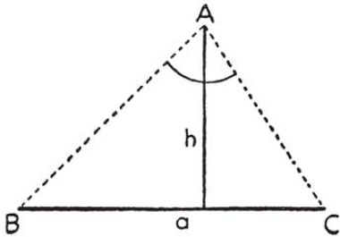
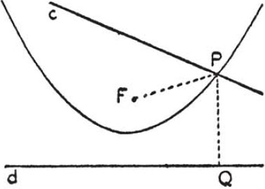

# Part III — Dictionary of Heuristic: D–H

## Decomposing and recombining

**Decomposing and recombining** are important operations of the mind.

You examine an object that touches your interest or challenges your curiosity: a house you intend to rent, an important but cryptic telegram, any object whose purpose and origin puzzle you, or any problem you intend to solve. You have an impression of the object as a whole but this impression, possibly, is not definite enough. A detail strikes you, and you focus your attention upon it. Then, you concentrate upon another detail; then, again, upon another. Various combinations of details may present themselves and after a while you again consider the object as a whole but you see it now differently. You decompose the whole into its parts, and you recombine the parts into a more or less different whole.

1. If you go into detail you may lose yourself in details. Too many or too minute particulars are a burden on the mind. They may prevent you from giving sufficient attention to the main point, or even from seeing the main point at all. Think of the man who cannot see the forest for the trees.

Of course, we do not wish to waste our time with unnecessary detail and we should reserve our effort for the essential. The difficulty is that we cannot say beforehand which details will turn out ultimately as necessary and which will not.

Therefore, let us, first of all, understand the problem as a whole. Having understood the problem, we shall be in a better position to judge which particular points may be the most essential. Having examined one or two essential points we shall be in a better position to judge which further details might deserve closer examination. Let us go into detail and decompose the problem gradually, but not further than we need to.

Of course, the teacher cannot expect that all students should act wisely in this respect. On the contrary, it is a very foolish and bad habit with some students to start working at details before having understood the problem as a whole.

2. We are going to consider mathematical problems, "problems to find."

Having understood the problem as a whole, its aim, its main point, we wish to go into detail. Where should we start? In almost all cases, it is reasonable to begin with the consideration of the principal parts of the problem which are the unknown, the data, and the condition. In almost all cases it is advisable to start the detailed examination of the problem with the questions: *What is the unknown? What are the data? What is the condition?*

If we wish to examine further details, what should we do? Fairly often, it is advisable to examine each datum by itself, to *separate the various parts of the condition*, and to examine each part by itself.

We may find it necessary, especially if our problem is more difficult, to decompose the problem still further, and to examine still more remote details. Thus, it may be necessary to *go back to the definition* of a certain term, to introduce new elements involved by the definition, and to examine the elements so introduced.

3. After having decomposed the problem, we try to recombine its elements in some new manner. Especially, we may try to recombine the elements of the problem into some new, more accessible problem which we could possibly use as an auxiliary problem.

There are, of course, unlimited possibilities of recombination. Difficult problems demand hidden, exceptional, original combinations, and the ingenuity of the problem-solver shows itself in the originality of the combination. There are, however, certain usual and relatively simple sorts of combinations, sufficient for simpler problems, which we should know thoroughly and try first, even if we may be obliged eventually to resort to less obvious means.

There is a formal classification in which the most usual and useful combinations are neatly placed. In constructing a new problem from the proposed problem, we may

(1) keep the unknown and change the rest (the data and the condition); or

(2) keep the data and change the rest (the unknown and the condition); or

(3) change both the unknown and the data.

We are going to examine these cases.

[The cases (1) and (2) overlap. In fact, it is possible to keep both the unknown and the data, and transform the problem by changing the form of the condition alone. For instance, the two following problems, although visibly equivalent, are not exactly the same:

Construct an equilateral triangle, being given a side.

Construct an equiangular triangle, being given a side.

The difference of the two statements which is slight in the present example may be momentous in other cases. Such cases are even important in certain respects but it would take up too much space to discuss them here. Compare *Auxiliary problems*, 7, last remark.]

4. *Keeping the unknown* and changing the data and the condition in order to transform the proposed problem is often useful. The suggestion *Look at the unknown* aims at problems with the same unknown. We may try to recollect a formerly solved problem of this kind: *And try to think of a familiar problem having the same or a similar unknown*. Failing to remember such a problem we may try to invent one: *Could you think of other data appropriate to determine the unknown?*

A new problem which is more closely related to the proposed problem has a better chance of being useful. Therefore, keeping the unknown, we try to keep also some data and some part of the condition, and to change, as little as feasible, only one or two data and a small part of the condition. A good method is one in which we omit something without adding anything; we keep the unknown, *keep only a part of the condition, drop the other part*, but do not introduce any new clause or datum. Examples and comments on this case follow under 7, 8.

5. *Keeping the data*, we may try to introduce some useful and more accessible new unknown. Such an unknown must be obtained from the original data and we have such an unknown in mind when we ask: *Could you derive something useful from the data?*

Let us observe that two things are here desirable. First, the new unknown should be more accessible, that is, more easily obtainable from the data than the original unknown. Second, the new unknown should be useful, that is, it should be, when found, capable of rendering some definite service in the search of the original unknown. In short, the new unknown should be a sort of *stepping stone*. A stone in the middle of the creek is nearer to me than the other bank which I wish to arrive at and, when the stone is reached, it helps me on toward the other bank.

The new unknown should be both accessible and useful but, in practice, we must often content ourselves with less. If nothing better presents itself, it is not unreasonable to derive something from the data that has some chance of being useful; and it is also reasonable to try a new unknown which is closely connected with the original one, even if it does not seem particularly accessible from the outset.

For instance, if our problem is to find the diagonal of a parallelepiped we may introduce the diagonal of a face as new unknown. We may do so either because we *know* that if we have the diagonal of the face we can also obtain the diagonal of the solid; or we may do so because we see that the diagonal of the face is easy to obtain and we *suspect* that it might be useful in finding the diagonal of the solid. (Compare *Did you use all the data?* 1.)

If our problem is to construct a circle, we have to find two things, its center and its radius; our problem has two parts, we may say. In certain cases, one part is more accessible than the other and therefore, in any case, we may reasonably give a moment's consideration to this possibility: *Could you solve a part of the problem?* Asking this, we weigh the chances: Would it pay to concentrate just upon the center, or just upon the radius, and to choose one or the other as our new unknown? Questions of this sort are very often useful. In more complex or in more advanced problems, the decisive idea often consists in carving out some more accessible but essential part from the problem.

6. *Changing both the unknown and the data* we deviate more from our original course than in the foregoing cases. This, naturally, we do not like; we sense the danger of losing the original problem altogether. Yet we may be compelled to such an extensive change if less radical changes have failed to produce something accessible and useful, and we may be tempted to recede so far from our original problem if the new problem has a good chance of success. *Could you change the unknown, or the data, or both if necessary, so that the new unknown and the new data are nearer to each other?*

An interesting way of changing both the unknown and the data is interchanging the unknown with one of the data. (See *Can you use the result?* 3.)

7. *Example*. Construct a triangle, being given a side $a$, the altitude $h$ perpendicular to $a$, and the angle $\alpha$ opposite to $a$.

*What is the unknown?* A triangle.

*What are the data?* Two lines, $a$ and $h$, and an angle $\alpha$.

Now, if we are somewhat familiar with problems of geometric construction, we try to reduce such a problem to the construction of a point. We draw a line $BC$ equal to the given side $a$; then all that we have to find is the vertex of the triangle $A$, opposite to $a$, see Fig. 16. We have, in fact, a new problem.

*What is the unknown?* The point $A$.

*What are the data?* A line $h$, an angle $\alpha$, and two points $B$ and $C$ given in position.

*What is the condition?* The perpendicular distance of the point $A$ from the line $BC$ should be $h$ and $\angle BAC = \alpha$.

In fact, we have transformed our problem, changing both the unknown and the data. The new unknown is a point, the old unknown was a triangle. Some of the data are the same in both problems, the line $h$ and the angle $\alpha$; but in the old problem we were given a length $a$ and now we are given two points, $B$ and $C$, instead.

The new problem is not difficult. The following suggestion brings us quite near to the solution.

*Separate the various parts of the condition*. The condition has two parts, one concerned with the datum $h$, the other with the datum $\alpha$. The unknown point is required to be

(I) at distance $h$ from the line $BC$; and

(II) the vertex of an angle of given magnitude $\alpha$, whose sides pass through the given points $B$ and $C$.

If we *keep only one part of the condition and drop the other part*, the unknown point is not completely determined. There are many points satisfying part (I) of the condition, namely all points of a parallel to the line $BC$ at the distance $h$ from $BC$. This parallel is the locus of the points satisfying part (I) of the condition. The locus of the points satisfying part (II) is a certain circular arc whose end-points are $B$ and $C$. We can describe both loci; their intersection is the point that we desired to construct.

The procedure that we have just applied has a certain interest; solving problems of geometric construction, we can often follow successfully its pattern: Reduce the problem to the construction of a point, and construct the point as an intersection of two loci.

But a certain step of this procedure has a still more general interest; solving "problems to find" of any kind, we can follow its pattern: *Keep only a part of the condition, drop the other part*. Doing so, we weaken the condition of the proposed problem, we restrict less the unknown. *How far is the unknown then determined, how can it vary?* By asking this, we set, in fact, a new problem. If the unknown is a point in the plane (as it was in our example) the solution of this new problem consists in determining a locus described by the point. If the unknown is a mathematical object of some other kind it may be useful to consider, to characterize, to describe, or to list those objects which satisfy a certain part of the condition imposed upon the unknown by the proposed problem.

8. *Example*. In a crossword puzzle that allows puns and anagrams we find the following clue:

"Forward and backward part of a machine (5 letters)."

*What is the unknown?* A word.

*What is the condition?* The word has 5 letters. It has something to do with some part of some machine. It should be, of course, an English word, and not a too unusual one, let us hope.

*Is the condition sufficient to determine the unknown?* No. Or, rather, the condition may be sufficient but that part of the condition which is clear by now is certainly insufficient. There are too many words satisfying it, as "lever," or "screw," or what not.

The condition is ambiguously expressed—on purpose, of course. If nothing can be found that could be plausibly described as a "forward part" of a machine and would be a "backward part" too, we may suspect that forward and backward *reading* might be meant. It may be a good idea to examine this interpretation of the clue.

*Separate the various parts of the condition*. The condition has two parts, one concerned with the meaning of the word, the other with its spelling. The unknown word is required to be

(I) a short word meaning some part of some machine;

(II) a word with 5 letters which spelled backward give again a word meaning some part of some machine.

If we *keep only one part of the condition and drop the other part*, the unknown is not completely determined. There are many words satisfying part (I) of the condition, we have a sort of locus. We may "describe" this locus (I), "follow" it to its "intersection" with locus (II). The natural procedure is to concentrate upon part (I) of the condition, to recollect words having the prescribed meaning and, when we have succeeded in recollecting some such word, to examine whether it has or has not the prescribed length and can or cannot be read backward. We may have to recollect several words before we run into the right one: lever, screw, wheel, shaft, hinge, motor.

Of course, "rotor"!

9. Under 3, we classified the possibilities of obtaining a new "problem to find" by recombining certain elements of a proposed "problem to find." If we do not introduce just one new problem, but two or more new problems, there are more possibilities which we have to mention but do not attempt to classify.

Still other possibilities may arise. Especially, the solution of a "problem to find" may depend on the solution of a "problem to prove." We just mention this important possibility; considerations of space prevent us from discussing it.

10. Only few and short remarks can be added concerning "problems to prove"; they are analogous to the foregoing more extensive comments on "problems to find" (2 to 9).

Having understood such a problem as a whole, we should, in general, examine its principal parts. The principal parts are the hypothesis and the conclusion of the theorem that we are required to prove or to disprove. We should understand these parts thoroughly: *What is the hypothesis? What is the conclusion?* If there is need to get down to more particular points, we may *separate the various parts of the hypothesis*, and consider each part by itself. Then we may proceed to other details, decomposing the problem further and further.

After having decomposed the problem, we may try to recombine its elements in some new manner. Especially, we may try to recombine the elements into another theorem. In this respect, there are three possibilities.

(1) We *keep the conclusion* and change the hypothesis. We first try to recollect such a theorem: *Look at the conclusion! And try to think of a familiar theorem having the same or a similar conclusion*. If we do not succeed in recollecting such a theorem we try to invent one: *Could you think of another hypothesis from which you could easily derive the conclusion?* We may change the hypothesis by omitting something without adding anything: *Keep only a part of the hypothesis, drop the other part; is the conclusion still valid?*

(2) We *keep the hypothesis* and change the conclusion: *Could you derive something useful from the hypothesis?*

(3) We *change both the hypothesis and the conclusion*. We may be more inclined to change both if we have had no success in changing just one. *Could you change the hypothesis, or the conclusion, or both if necessary, so that the new hypothesis and the new conclusion are nearer to each other?*

We do not attempt to classify here the various possibilities which arise when, in order to solve the proposed "problem to prove," we introduce two or more new "problems to prove," or when we link it up with an appropriate "problem to find."

## Definition

**Definition** of a term is a statement of its meaning in other terms which are supposed to be well known.

1. *Technical terms* in mathematics are of two kinds. Some are accepted as primitive terms and are not defined. Others are considered as derived terms and are defined in due form; that is, their meaning is stated in primitive terms and in formerly defined derived terms. Thus, we do not give a formal definition of such primitive notions as point, straight line, and plane. Yet we give formal definitions of such notions as "bisector of an angle" or "circle" or "parabola."

The definition of the last quoted term may be stated as follows. We call *parabola* the locus of points which are at equal distance from a fixed point and a fixed straight line. The fixed point is called the *focus* of the parabola, the fixed line its *directrix*. It is understood that all elements considered are in a fixed plane, and that the fixed point (the focus) is not on the fixed line (the directrix).

The reader is not supposed to know the meaning of the terms defined: parabola, focus of the parabola, directrix of the parabola. But he is supposed to know the meaning of all the other terms as point, straight line, plane, distance of a point from another point, fixed, locus, etc.

2. *Definitions in dictionaries* are not very much different from mathematical definitions in the outward form but they are written in a different spirit.

The writer of a dictionary is concerned with the current meaning of the words. He *accepts*, of course, the current meaning and states it as neatly as he can in form of a definition.

The mathematician is not concerned with the current meaning of his technical terms, at least not primarily concerned with that. What "circle" or "parabola" or other technical terms of this kind may or may not denote in ordinary speech matters little to him. The mathematical definition *creates* the mathematical meaning.

3. *Example*. Construct the point of intersection of a given straight line and a parabola of which the focus and the directrix are given.

Our approach to any problem must depend on the state of our knowledge. Our approach to the present problem depends mainly on the extent of our acquaintance with the properties of the parabola. If we know much about the parabola we try to make use of our knowledge and to extract something helpful from it: *Do you know a theorem that could be useful? Do you know a related problem?* If we know little about parabola, focus, and directrix, these terms are rather embarrassing and we naturally wish to get rid of them. How can we get rid of them? Let us listen to the dialogue of the teacher and the student discussing the proposed problem. They have chosen already a *suitable notation*: $P$ for any of the unknown points of intersection, $F$ for the focus, $d$ for the directrix, $c$ for the straight line intersecting the parabola.

"And *what is the unknown?*"

"The point $P$."

*"What are the data?*"

"The straight lines $c$ and $d$, and the point $F$."

*"What is the condition?*"

"$P$ is a point of intersection of the straight line $c$ and of the parabola whose directrix is $d$ and focus $F$."

"Correct. You had little opportunity, I know, to study the parabola but you can say, I think, what a parabola is."

"The parabola is the locus of points equidistant from the focus and the directrix."

"Correct. You remember the definition correctly. That is right, but we must also use it; *go back to definitions*. By virtue of the definition of the parabola, what can you say about your point $P$?"

"$P$ is on the parabola. Therefore, $P$ is equidistant from $d$ and $F$."

"Good! *Draw a figure*."

The student introduces into Fig. 17 the lines $PF$ and $PQ$, this latter being the perpendicular to $d$ from $P$.

"Now, *could you restate the problem?*"

. . . . .

"Could you restate the condition of the problem, using the lines you have just introduced?"

"$P$ is a point on the line $c$ such that $PF = PQ$."

"Good. But please, say it in words: What is $PQ$?"

"The perpendicular distance of $P$ from $d$."

"Good. Could you restate the problem now? But please, state it neatly, in a round sentence."

"Construct a point $P$ on the given straight line $c$ at equal distances from the given point $F$ and the given straight line $d$."

"Observe the progress from the original statement to your restatement. The original statement of the problem was full of unfamiliar technical terms, parabola, focus, directrix; it sounded just a little pompous and inflated. And now, nothing remains of those unfamiliar technical terms; you have *deflated* the problem. Well done!"

4. *Elimination of technical terms* is the result of the work in the foregoing example. We started from a statement of the problem containing certain technical terms (parabola, focus, directrix) and we arrived finally at a restatement free of those terms.

In order to eliminate a technical term we must know its definition; but it is not enough to know the definition, we must use it. In the foregoing example, it was not enough to remember the definition of the parabola. The decisive step was to introduce into the figure the lines $PF$ and $PQ$ whose equality was granted by the definition of the parabola. This is the typical procedure. We introduce suitable elements into the conception of the problem. On the basis of the definition, we establish relations between the elements we introduced. If these relations express completely the meaning, we have used the definition. Having used its definition, we have eliminated the technical term.

The procedure just described may be called *going back to definitions*.

By going back to the definition of a technical term, we get rid of the term but introduce new elements and new relations instead. The resulting change in our conception of the problem may be important. At any rate, some restatement, some *variation of the problem* is bound to result.

5. *Definitions and known theorems*. If we know the name "parabola" and have some vague idea of the shape of the curve but do not know anything else about it, our knowledge is obviously insufficient to solve the problem proposed as example, or any other serious geometric problem about the parabola. What kind of knowledge is needed for such a purpose?

The science of geometry may be considered as consisting of axioms, definitions, and theorems. The parabola is not mentioned in the axioms which deal only with such primitive terms as point, straight line, and so on. Any geometric argumentation concerned with the parabola, the solution of any problem involving it, must use either its definition or theorems about it. To solve such a problem, we must know, at least, the definition but it is better to know some theorems too.

What we said about the parabola is true, of course, of any derived notion. As we start solving a problem that involves such a notion, we cannot know yet what will be preferable to use, the definition of the notion, or some theorem about it; but it is certain that we have to use one or the other.

There are cases, however, in which we have no choice. If we know just the definition of the notion, and nothing else, then we are obliged to use the definition. If we do not know much more than the definition, our best chance may be to go back to the definition. But if we know many theorems about the notion, and have much experience in its use, there is some chance that we may get hold of a suitable theorem involving it.

6. *Several definitions*. The sphere is usually defined as the locus of points at a given distance from a given point. (The points are now in space, not restricted to a plane.) Yet the sphere could also be defined as the surface described by a circle revolving about a diameter. Still other definitions of the sphere are known, and many others possible.

When we have to solve a proposed problem involving some derived notion, as "sphere" or "parabola," and we wish to go back to its definition, we may have a choice among various definitions. Much may depend in such a case on choosing the definition that fits the case.

To find the area of the surface of the sphere was, at the time Archimedes solved it, a great and difficult problem. Archimedes had the choice between the definitions of the sphere we just quoted. He preferred to conceive the sphere as the surface generated by a circle revolving about a fixed diameter. He inscribes in the circle a regular polygon, with an even number of sides, of which the fixed diameter joins opposite vertices. The regular polygon approximates the circle and, revolving with the circle, generates a convex surface composed of two cones with vertices at the extremities of the fixed diameter and of several frustums of cones in between. This composite surface approximates the sphere and is used by Archimedes in computing the area of the surface of the sphere. If we conceive the sphere as the locus of points equally distant from the center, no such simple approximation to its surface is suggested.

7. Going back to definitions is important in inventing an argument but it is also important in checking it.

Somebody presents an alleged new solution of Archimedes' problem of finding the area of the surface of the sphere. If he has only a vague idea of the sphere, his solution will not be any good. He may have a clear idea of the sphere but if he fails to use this idea in his argument I cannot know that he had any idea at all, and his argument is no good. Therefore, listening to the argument, I am waiting for the moment when he is going to say something substantial about the sphere, to use its definition or some theorem about it. If such a moment never comes, the solution is no good.

We should check not only the arguments of others but, of course, also our own arguments, in the same way. *Have you taken into account all essential notions involved in the problem?* How did you use this notion? Did you use its meaning, its definition? Did you use essential facts, known theorems about it?

That going back to definitions is important in examining the validity of an argument was emphasized by Pascal who stated the rule: "Substituer mentalement les définitions à la place des définis." The meaning is: "Substitute mentally the defining facts for the defined terms." That going back to definitions is also important in devising an argument was emphasized by Hadamard.

8. Going back to definitions is an important operation of the mind. If we wish to understand why the definitions of words are so important, we should realize first that words are important. We can hardly use our mind without using words, or signs, or symbols of some sort. Thus, words and signs have power. Primitive peoples believe that words and symbols have magic power. We may understand such belief but we should not share it. We should know that the power of a word does not reside in its sound, in the "vocis flatus," in the "hot air" produced by the speaker, but in the ideas of which the word reminds us and, ultimately, in the facts on which the ideas are based.

Therefore, it is a sound tendency to seek meaning and facts behind the words. Going back to definitions, the mathematician seeks to get hold of the actual relations of mathematical objects behind the technical terms, as the physicist seeks definite experiments behind his technical terms, and the common man with some common sense wants to get down to hard facts and not to be fooled by mere words.

## Descartes, René

**Descartes, René** (1596–1650), great mathematician and philosopher, planned to give a universal method to solve problems but he left unfinished his *Rules for the Direction of the Mind*. The fragments of this treatise, found in his manuscripts and printed after his death, contain more—and more interesting—materials concerning the solution of problems than his better known work *Discours de la Méthode* although the "Discours" was very likely written after the "Rules." The following lines of Descartes seem to describe the origin of the "Rules": "As a young man, when I heard about ingenious inventions, I tried to invent them by myself, even without reading the author. In doing so, I perceived, by degrees, that I was making use of certain rules."

## Determination, hope, success

**Determination, hope, success.** It would be a mistake to think that solving problems is a purely "intellectual affair"; determination and emotions play an important role. Lukewarm determination and sleepy consent to do a little something may be enough for a routine problem in the classroom. But, to solve a serious scientific problem, will power is needed that can outlast years of toil and bitter disappointments.

1. Determination fluctuates with hope and hopelessness, with satisfaction and disappointment. It is easy to keep on going when we think that the solution is just around the corner; but it is hard to persevere when we do not see any way out of the difficulty. We are elated when our forecast comes true. We are depressed when the way we have followed with some confidence is suddenly blocked, and our determination wavers.

"Il n'est point besoin espérer pour entreprendre ni réussir pour persévérer." "You can undertake without hope and persevere without success." Thus may speak an inflexible will, or honor and duty, or a nobleman with a noble cause. This sort of determination, however, would not do for the scientist, who should have some hope to start with, and some success to go on. In scientific work, it is necessary to apportion wisely determination to outlook. You do not take up a problem, unless it has some interest; you settle down to work seriously if the problem seems instructive; you throw in your whole personality if there is a great promise. If your purpose is set, you stick to it, but you do not make it unnecessarily difficult for yourself. You do not despise little successes, on the contrary, you seek them: *If you cannot solve the proposed problem try to solve first some related problem*.

2. When a student makes really silly blunders or is exasperatingly slow, the trouble is almost always the same; he has no desire at all to solve the problem, even no desire to understand it properly, and so he has not understood it. Therefore, a teacher wishing seriously to help the student should, first of all, stir up his curiosity, give him some desire to solve the problem. The teacher should also allow some time to the student to make up his mind, to settle down to his task.

Teaching to solve problems is education of the will. Solving problems which are not too easy for him, the student learns to persevere through unsuccess, to appreciate small advances, to wait for the essential idea, to concentrate with all his might when it appears. If the student had no opportunity in school to familiarize himself with the varying emotions of the struggle for the solution his mathematical education failed in the most vital point.

## Diagnosis

**Diagnosis** is used here as a technical term in education meaning "closer characterization of the student's work." A grade characterizes the student's work but somewhat crudely. The teacher, wishing to improve the student's work, needs a closer characterization of good and bad points as the physician, wishing to improve the patient's health, needs a diagnosis.

We are here particularly concerned with the student's efficiency in solving problems. How can we characterize it? We may derive some profit from the distinction of the four phases of the solution. In fact, the behavior of the students in the various phases is quite characteristic.

Incomplete *understanding of the problem*, owing to lack of concentration, is perhaps the most widespread deficiency in solving problems. With respect to *devising a plan* and obtaining a general idea of the solution two opposite faults are frequent. Some students rush into calculations and constructions without any plan or general idea; others wait clumsily for some idea to come and cannot do anything that would accelerate its coming. In *carrying out the plan*, the most frequent fault is carelessness, lack of patience in checking each step. Failure to *check the result* at all is very frequent; the student is glad to get an answer, throws down his pencil, and is not shocked by the most unlikely results.

The teacher, having made a careful diagnosis of a fault of this kind, has some chance to cure it by insisting on certain questions of the list.

## Did you use all the data?

**Did you use all the data?** Owing to the progressive mobilization of our knowledge, there will be much more in our conception of the problem at the end than was in it at the outset (*Progress and achievement*, 1). But how is it now? Have we got what we need? Is our conception adequate? *Did you use all the data? Did you use the whole condition?* The corresponding question concerning "problems to prove" is: *Did you use the whole hypothesis?*

1. For an illustration, let us go back to the "parallelepiped problem" (to find the diagonal of a rectangular parallelepiped given its three edges $a$, $b$, $c$). It may happen that a student runs into the idea of calculating the diagonal of a face, $\sqrt{a^2 + b^2}$, but then he gets stuck. The teacher may help him by asking: *Did you use all the data?* The student can scarcely fail to observe that the expression $\sqrt{a^2 + b^2}$ does not contain the third datum $c$. Therefore, he should try to bring $c$ into play. Thus, he has a good chance to observe the decisive right triangle whose legs are $\sqrt{a^2 + b^2}$ and $c$, and whose hypotenuse is the desired diagonal of the parallelepiped. (For another illustration see *Auxiliary elements*, 3.)

The questions we discuss here are very important. Their use in constructing the solution is clearly shown by the foregoing example. They may help us to find the weak spot in our conception of the problem. They may point out a missing element. When we know that a certain element is still missing, we naturally try to bring it into play. Thus, we have a clue, we have a definite line of inquiry to follow, and have a good chance to meet with the decisive idea.

2. The questions we discussed are helpful not only in constructing an argument but also in checking it. In order to be more concrete, let us assume that we have to check the proof of a theorem whose hypothesis consists of three parts, all three essential to the truth of the theorem. That is, if we discard any part of the hypothesis, the theorem ceases to be true. Therefore, if the proof neglects to use any part of the hypothesis, the proof must be wrong. Does the proof *use the whole hypothesis?* Does it use the first part of the hypothesis? Where does it use the first part of the hypothesis? Where does it use the second part? Where the third? Answering to all these questions we check the proof.

This sort of checking is effective, instructive, and almost necessary for thorough understanding if the argument is long and heavy—as *The intelligent reader* should know.

3. The questions we discussed aim at examining the completeness of our conception of the problem. Our conception is certainly incomplete if we fail to take into account any essential datum or condition or hypothesis. But it is also incomplete if we fail to realize the meaning of some essential term. Therefore, in order to examine our conception, we should also ask: *Have you taken into account all essential notions involved in the problem?* See *Definition*, 7.

4. The foregoing remarks, however, are subject to caution and certain limitations. In fact, their straightforward application is restricted to problems which are "perfectly stated" and "reasonable."

A perfectly stated and reasonable "problem to find" must have all necessary data and not a single superfluous datum; also its condition must be just sufficient, neither contradictory nor redundant. In solving such a problem, we have to use, of course, all the data and the whole condition.

The object of a "problem to prove" is a mathematical theorem. If the problem is perfectly stated and reasonable, each clause in the hypothesis of the theorem must be essential to the conclusion. In proving such a theorem we have to use, of course, each clause of the hypothesis.

Mathematical problems proposed in traditional textbooks are supposed to be perfectly stated and reasonable. We should however not rely too much on this; when there is the slightest doubt, we should ask: *Is it possible to satisfy the condition?* Trying to answer this question, or a similar one, we may convince ourselves, at least to a certain extent, that our problem is as good as it is supposed to be.

The question stated in the title of the present article and allied questions may and should be asked without modification only when we know that the problem before us is reasonable and perfectly stated or when, at least, we have no reason to suspect the contrary.

5. There are some nonmathematical problems which may be, in a certain sense, "perfectly stated." For instance, good chess problems are supposed to have but one solution and no superfluous piece on the chessboard, etc.

*Practical problems* however are usually far from being perfectly stated and require a thorough reconsideration of the questions discussed in the present article.

## Do you know a related problem?

**Do you know a related problem?** We can scarcely imagine a problem absolutely new, unlike and unrelated to any formerly solved problem; but, if such a problem could exist, it would be insoluble. In fact, when solving a problem, we always profit from previously solved problems, using their result, or their method, or the experience we acquired solving them. And, of course, the problems from which we profit must be in some way related to our present problem. Hence the question: *Do you know a related problem?*

There is usually no difficulty at all in recalling formerly solved problems which are more or less related to our present one. On the contrary, we may find too many such problems and there may be difficulty in choosing a useful one. We have to look around for closely related problems; we *look at the unknown*, or we look for a formerly solved problem which is linked to our present one by *generalization*, *specialization*, or *analogy*.

The question we discuss here aims at the mobilization of our formerly acquired knowledge (*Progress and achievement*, 1). An essential part of our mathematical knowledge is stored in the form of formerly proved theorems. Hence the question: *Do you know a theorem that could be useful?* This question may be particularly suitable when our problem is a "problem to prove," that is, when we have to prove or disprove a proposed theorem.

## Draw a figure

**Draw a figure;** see *Figures*. *Introduce suitable notation*; see *Notation*.

## Examine your guess

**Examine your guess.** Your guess may be right, but it is foolish to accept a vivid guess as a proven truth—as primitive people often do. Your guess may be wrong. But it is also foolish to disregard a vivid guess altogether—as pedantic people sometimes do. Guesses of a certain kind deserve to be examined and taken seriously: those which occur to us after we have attentively considered and really understood a problem in which we are genuinely interested. Such guesses usually contain at least a fragment of the truth although, of course, they very seldom show the whole truth. Yet there is a chance to extract the whole truth if we examine such a guess appropriately.

Many a guess has turned out to be wrong but nevertheless useful in leading to a better one.

No idea is really bad, unless we are uncritical. What is really bad is to have no idea at all.

1. *Don't*. Here is a typical story about Mr. John Jones. Mr. Jones works in an office. He had hoped for a little raise but his hope, as hopes often are, was disappointed. The salaries of some of his colleagues were raised but not his. Mr. Jones could not take it calmly. He worried and worried and finally suspected that Director Brown was responsible for his failure in getting a raise.

We cannot blame Mr. Jones for having conceived such a suspicion. There were indeed some signs pointing to Director Brown. The real mistake was that, after having conceived that suspicion, Mr. Jones became blind to all signs pointing in the opposite direction. He worried himself into firmly believing that Director Brown was his personal enemy and behaved so stupidly that he almost succeeded in making a real enemy of the director.

The trouble with Mr. John Jones is that he behaves like most of us. He never changes his major opinions. He changes his minor opinions not infrequently and quite suddenly; but he never doubts any of his opinions, major or minor, as long as he has them. He never doubts them, or questions them, or examines them critically—he would especially hate critical examination, if he understood what that meant.

Let us concede that Mr. John Jones is right to a certain extent. He is a busy man; he has his duties at the office and at home. He has little time for doubt or examination. At best, he could examine only a few of his convictions and why should he doubt one if he has no time to examine that doubt?

Still, don't do as Mr. John Jones does. Don't let your suspicion, or guess, or conjecture, grow without examination till it becomes ineradicable. At any rate, in theoretical matters, the best of ideas is hurt by uncritical acceptance and thrives on critical examination.

2. *A mathematical example*. Of all quadrilaterals with given perimeter, find the one that has the greatest area.

*What is the unknown?* A quadrilateral.

*What are the data?* The perimeter of the quadrilateral is given.

*What is the condition?* The required quadrilateral should have a greater area than any other quadrilateral with the same perimeter.

This problem is very different from the usual problems in elementary geometry and, therefore, it is quite natural to start guessing.

Which quadrilateral is likely to be the one with the greatest area? What would be the simplest guess? We may have heard that of all figures with the same perimeter the circle has the greatest area; we may even suspect some reason for the plausibility of this statement. Now, which quadrilateral comes nearest to the circle? Which one comes nearest to it in symmetry?

The square is a pretty obvious guess. If we take this guess seriously, we should realize what it means. We should have the courage to state it: "Of all quadrilaterals with given perimeter the square has the greatest area." If we decide ourselves to examine this statement, the situation changes. Originally, we had a "problem to find." After having formulated our guess, we have a "problem to prove"; we have to prove or disprove the theorem formulated.

If we do not know any problem similar to ours that has been solved before, we may find our task pretty tough. *If you cannot solve the proposed problem, try to solve first some related problem. Could you solve a part of the problem?* It may occur to us that if the square is privileged among quadrilaterals it must, by that very fact, also be privileged among rectangles. A part of our problem would be solved if we could succeed in proving the following statement: "Of all rectangles with given perimeter the square has the greatest area."

This theorem appears more accessible than the former; it is, of course, weaker. At any rate, we should realize what it means; we should have the courage to restate it in more detail. We can restate it advantageously in the language of algebra.

The area of a rectangle with adjacent sides $a$ and $b$ is $ab$. Its perimeter is $2a + 2b$.

One side of the square that has the same perimeter as the rectangle just mentioned is $\dfrac{a+b}{2}$. Thus, the area of this square is $\left(\dfrac{a+b}{2}\right)^2$. It should be greater than the area of the rectangle, and so we should have

$$\left(\frac{a+b}{2}\right)^2 > ab.$$

Is this true? The same assertion can be written in the equivalent form

$$a^2 + 2ab + b^2 > 4ab.$$

This, however, is true, for it is equivalent to

$$a^2 - 2ab + b^2 > 0$$

or to

$$(a - b)^2 > 0$$

and this inequality certainly holds, unless $a = b$, that is, the rectangle examined is a square.

We have not solved our problem yet, but we have made some progress just by facing squarely our rather obvious guesses.

3. *A nonmathematical example*. In a certain crossword puzzle we have to find a word with seven letters, and the clue is: "Do the walls again, back and forth."

*What is the unknown?* A word.

*What are the data?* The length of the word is given; it has seven letters.

*What is the condition?* It is stated in the clue. It has something to do with walls, yet it is still very hazy.

Thus, we have to reexamine the clue. As we do so, the last part may catch our attention: ". . . again, back and forth." *Could you solve a part of the problem?* Here is a chance to guess the beginning of the word. Since the repetition is so strongly emphasized, the word, quite possibly, might start with "re." This is a pretty obvious guess. If we are tempted to believe it, we should realize what it means. The word required would look thus:

R E - - - - -

*Can you check the result?* If another word of the puzzle crosses the one just considered in the first letter, we have an R to start that other word. It may be a good idea to switch to that other word and check the R. If we succeed in verifying that R or if, at least, we do not find any reason against it, we come back to our original word. We ask again: *What is the condition?* As we reexamine the clue, the very last part may catch our attention: ". . . back and forth." Could this imply that the word we seek can be read not only forward but backward? This is a less obvious guess (yet there are such cases, see *Decomposing and recombining*, 8).

At any rate, let us face this guess; let us realize what it means. The word would look as follows:

RE - - - ER.

Moreover, the third letter should be the same as the fifth; it is very likely a consonant and the fourth or middle letter a vowel.

The reader can now easily guess the word by himself. If nothing else helps, he can try all the vowels, one after the other, for the letter in the middle.

## Figures

**Figures** are not only the object of geometric problems but also an important help for all sorts of problems in which there is nothing geometric at the outset. Thus, we have two good reasons to consider the role of figures in solving problems.

1. If our problem is a problem of geometry, we have to consider a figure. This figure may be in our imagination, or it may be traced on paper. On certain occasions, it might be desirable to imagine the figure without drawing it; but if we have to examine various details, one detail after the other, it is desirable to *draw a figure*. If there are many details, we cannot imagine all of them simultaneously, but they are all together on the paper. A detail pictured in our imagination may be forgotten; but the detail traced on paper remains, and, when we come back to it, it reminds us of our previous remarks, it saves us some of the trouble we have in recollecting our previous consideration.

2. We now consider more specially the use of figures in problems of geometric construction.

We start the detailed consideration of such a problem by drawing a figure containing the unknown and the data, all these elements being assembled as it is prescribed by the condition of the problem. In order to understand the problem distinctly, we have to consider each datum and each part of the condition separately; then we reunite all parts and consider the condition as a whole, trying to see simultaneously the various connections required by the problem. We would scarcely be able to handle and separate and recombine all these details without a figure on paper.

On the other hand, before we have solved the problem definitively, it remains doubtful whether such a figure can be drawn at all. Is it possible to satisfy the whole condition imposed by the problem? We are not entitled to say Yes before we have obtained the definitive solution; nevertheless we begin with assuming a figure in which the unknown is connected with the data as prescribed by the condition. It seems that, drawing the figure, we have made an unwarranted assumption.

No, we have not. Not necessarily. We do not act incorrectly when, examining our problem, we consider the *possibility* that there is an object that satisfies the condition imposed upon the unknown and has, with all the data, the required relations, provided we do not confuse mere possibility with certainty. A judge does not act incorrectly when, questioning the defendant, he considers the hypothesis that the defendant perpetrated the crime in question, provided he does not commit himself to this hypothesis. Both the mathematician and the judge may examine a possibility without prejudice, postponing their judgment till the examination yields some definite result.

The method of starting the examination of a problem of construction by drawing a sketch on which, supposedly, the condition is satisfied, goes back to the Greek geometers. It is hinted by the short, somewhat enigmatic phrase of Pappus: *Assume what is required to be done as already done*. The following recommendation is somewhat less terse but clearer: *Draw a hypothetical figure which supposes the condition of the problem satisfied in all its parts*.

This is a recommendation for problems of geometric construction but in fact there is no need to restrict us to any such particular kind of problem. We may extend the recommendation to all "problems to find" stating it in the following general form: *Examine the hypothetical situation in which the condition of the problem is supposed to be fully satisfied*.

Compare *Pappus*, 6.

3. Let us discuss a few points about the actual drawing of figures.

(I) Shall we draw the figures exactly or approximately, with instruments or free-hand?

Both kinds of figures have their advantages. Exact figures have, in principle, the same role in geometry as exact measurements in physics; but, in practice, exact figures are less important than exact measurements because the theorems of geometry are much more extensively verified than the laws of physics. The beginner, however, should construct many figures as exactly as he can in order to acquire a good experimental basis; and exact figures may suggest geometric theorems also to the more advanced. Yet, for the purpose of reasoning, carefully drawn free-hand figures are usually good enough, and they are much more quickly done. Of course, the figure should not look absurd; lines supposed to be straight should not be wavy, and so-called circles should not look like potatoes.

An inaccurate figure can occasionally suggest a false conclusion, but the danger is not great and we can protect ourselves from it by various means, especially by varying the figure. There is no danger if we concentrate upon the logical connections and realize that the figure is a help, but by no means the basis of our conclusions; the logical connections constitute the real basis. [This point is instructively illustrated by certain well known paradoxes which exploit cleverly the intentional inaccuracy of the figure.]

(II) It is important that the elements are assembled in the required relations, it is unimportant in which order they are constructed. Therefore, choose the most convenient order. For example, to illustrate the idea of trisection, you wish to draw two angles, $\alpha$ and $\beta$, so that $\alpha = 3\beta$. Starting from an arbitrary $\alpha$, you cannot construct $\beta$ with ruler and compasses. Therefore, you choose a fairly small, but otherwise arbitrary $\beta$ and, starting from $\beta$, you construct $\alpha$ which is easy.

(III) Your figure should not suggest any undue specialization. The different parts of the figure should not exhibit apparent relations not required by the problem. Lines should not seem to be equal, or to be perpendicular, when they are not necessarily so. Triangles should not seem to be isosceles, or right-angled, when no such property is required by the problem. The triangle having the angles $45^\circ$, $60^\circ$, $75^\circ$ is the one which, in a precise sense of the word, is the most "remote" both from the isosceles, and from the right-angled shape. You draw this, or a not very different triangle, if you wish to consider a "general" triangle.

(IV) In order to emphasize the different roles of different lines, you may use heavy and light lines, continuous and dotted lines, or lines in different colors. You draw a line very lightly if you are not yet quite decided to use it as an auxiliary line. You may draw the given elements with red pencil, and use other colors to emphasize important parts, as a pair of similar triangles, etc.

(V) In order to illustrate solid geometry, shall we use three-dimensional models, or drawings on paper and blackboard?

Three-dimensional models are desirable, but troublesome to make and expensive to buy. Thus, usually, we must be satisfied with drawings although it is not easy to make them impressive. Some experimentation with self-made cardboard models is very desirable for beginners. It is helpful to take objects of our everyday surroundings as representations of geometric notions. Thus, a box, a tile, or the classroom may represent a rectangular parallelepiped, a pencil, a circular cylinder, a lampshade, the frustum of a right circular cone, etc.

4. Figures traced on paper are easy to produce, easy to recognize, easy to remember. Plane figures are especially familiar to us, problems about plane figures especially accessible. We may take advantage of this circumstance, we may use our aptitude for handling figures in handling nongeometrical objects if we contrive to find a suitable geometrical representation for those nongeometrical objects.

In fact, geometrical representations, graphs and diagrams of all sorts, are used in all sciences, not only in physics, chemistry, and the natural sciences, but also in economics, and even in psychology. Using some suitable geometrical representation, we try to express everything in the language of figures, to reduce all sorts of problems to problems of geometry.

Thus, even if your problem is not a problem of geometry, you may try to *draw a figure*. To find a lucid geometric representation for your nongeometrical problem could be an important step toward the solution.

## Generalization

**Generalization** is passing from the consideration of one object to the consideration of a set containing that object; or passing from the consideration of a restricted set to that of a more comprehensive set containing the restricted one.

1. If, by some chance, we come across the sum

$$1 + 8 + 27 + 64 = 100$$

we may observe that it can be expressed in the curious form

$$1^3 + 2^3 + 3^3 + 4^3 = 10^2.$$

Now, it is natural to ask ourselves: Does it often happen that a sum of successive cubes as

$$1^3 + 2^3 + 3^3 + \cdots + n^3$$

is a square? In asking this, we generalize. This generalization is a lucky one; it leads from one observation to a remarkable general law. Many results were found by lucky generalizations in mathematics, physics, and the natural sciences. See *Induction and mathematical induction*.

2. Generalization may be useful in the solution of problems. Consider the following problem of solid geometry: "A straight line and a regular octahedron are given in position. Find a plane that passes through the given line and bisects the volume of the given octahedron." This problem may look difficult but, in fact, very little familiarity with the shape of the regular octahedron is sufficient to suggest the following more general problem: "A straight line and a *solid with a center of symmetry* are given in position. Find a plane that passes through the given line and bisects the volume of the given solid." The plane required passes, of course, through the center of symmetry of the solid, and is determined by this point and the given line. As the octahedron has a center of symmetry, our original problem is also solved.

The reader will not fail to observe that the second problem is more general than the first, and, nevertheless, much easier than the first. In fact, our main achievement in solving the first problem was to *invent the second problem*. Inventing the second problem, we recognize the role of the center of symmetry; we *disentangled* that property of the octahedron which is essential for the problem at hand, namely that it has such a center.

The more general problem may be easier to solve. This sounds paradoxical but, after the foregoing example, it should not be paradoxical to us. The main achievement in solving the special problem was to invent the general problem. After the main achievement, only a minor part of the work remains. Thus, in our case, the solution of the general problem is only a minor part of the solution of the special problem.

See *Inventor's paradox*.

3. "Find the volume of the frustum of a pyramid with square base, being given that the side of the lower base is 10 in., the side of the upper base 5 in., and the altitude of the frustum 6 in." If for the numbers 10, 5, 6 we substitute letters, for instance $a$, $b$, $h$, we generalize. We obtain a more general problem than the original one, namely the following: "Find the volume of the frustum of a pyramid with square base, being given that the side of the lower base is $a$, the side of the upper base $b$, and the altitude of the frustum $h$." Such generalization may be very useful. Passing from a problem "in numbers" to another one "in letters" we gain access to new procedures; we can vary the data, and, doing so, we may check our results in various ways. See *Can you check the result?* 2, *Variation of the problem*, 4.

## Have you seen it before?

**Have you seen it before?** It is possible that we have solved before the same problem that we have to do now, or that we have heard of it, or that we had a very similar problem. These are possibilities which we should not fail to explore. We try to remember what happened. *Have you seen it before? Or have you seen the same problem in a slightly different form?* Even if the answer is negative such questions may start the mobilization of useful knowledge.

The question in the title of the present article is often used in a more general meaning. In order to obtain the solution, we have to extract relevant elements from our memory, we have to mobilize the pertinent parts of our dormant knowledge (*Progress and achievement*). We cannot know, of course, in advance which parts of our knowledge may be relevant; but there are certain possibilities which we should not fail to explore. Thus, any feature of the present problem that played a role in the solution of some other problem may play again a role. Therefore, if any feature of the present problem strikes us as possibly important, we try to recognize it. What is it? Is it familiar to you? *Have you seen it before?*

## Here is a problem related to yours and solved before

**Here is a problem related to yours and solved before.** This is good news; a problem for which the solution is known and which is connected with our present problem, is certainly welcome. It is still more welcome if the connection is close and the solution simple. There is a good chance that such a problem will be useful in solving our present one.

The situation that we are discussing here is typical and important. In order to see it clearly let us compare it with the situation in which we find ourselves when we are working at an auxiliary problem. In both cases, our aim is to solve a certain problem $A$ and we introduce and consider another problem $B$ in the hope that we may derive some profit for the solution of the proposed problem $A$ from the consideration of that other problem $B$. The difference is in our relation to $B$. Here, we succeeded in recollecting an old problem $B$ of which we know the solution but we do not know yet how to use it. There, we succeeded in inventing a new problem $B$; we know (or at least we suspect strongly) how to use $B$, but we do not know yet how to solve it. Our difficulty concerning $B$ makes all the difference between the two situations. When this difficulty is overcome, we may use $B$ in the same way in both cases; we may use the result or the method (as explained in *Auxiliary problem*, 3), and, if we are lucky, we may use both the result and the method. In the situation considered here, we know well the solution of $B$ but we do not know yet how to use it. Therefore, we ask: *Could you use it? Could you use its result? Could you use its method?*

The intention of using a certain formerly solved problem influences our conception of the present problem. Trying to link up the two problems, the new and the old, we introduce into the new problem elements corresponding to certain important elements of the old problem. For example, our problem is to determine the sphere circumscribed about a given tetrahedron. This is a problem of solid geometry. We may remember that we have solved before the analogous problem of plane geometry of constructing the circle circumscribed about a given triangle. Then we recollect that in the old problem of plane geometry, we used the perpendicular bisectors of the sides of the triangle. It is reasonable to try to introduce something analogous into our present problem. Thus we may be led to introduce into our present problem, as corresponding auxiliary elements, the perpendicular bisecting planes of the edges of the tetrahedron. After this idea, we can easily work out the solution to the problem of solid geometry, following the analogous solution in plane geometry.

The foregoing example is typical. The consideration of a formerly solved related problem leads us to the introduction of auxiliary elements, and the introduction of suitable auxiliary elements makes it possible for us to use the related problem to full advantage in solving our present problem. We aim at such an effect when, thinking about the possible use of a formerly solved related problem, we ask: *Should you introduce some auxiliary element in order to make its use possible?*

*Here is a theorem related to yours and proved before*. This version of the remark discussed here is exemplified in the section *Devising a plan*.

## Heuristic

**Heuristic,** or heuretic, or "ars inveniendi" was the name of a certain branch of study, not very clearly circumscribed, belonging to logic, or to philosophy, or to psychology, often outlined, seldom presented in detail, and as good as forgotten today. The aim of heuristic is to study the methods and rules of discovery and invention. A few traces of such study may be found in the commentators of Euclid; a passage of *Pappus* is particularly interesting in this respect. The most famous attempts to build up a system of heuristic are due to *Descartes* and to *Leibnitz*, both great mathematicians and philosophers. Bernard *Bolzano* presented a notable detailed account of heuristic. The present booklet is an attempt to revive heuristic in a modern and modest form. See *Modern heuristic*.

Heuristic, as an adjective, means "serving to discover."

## Heuristic reasoning

**Heuristic reasoning** is reasoning not regarded as final and strict but as provisional and plausible only, whose purpose is to discover the solution of the present problem. We are often obliged to use heuristic reasoning. We shall attain complete certainty when we shall have obtained the complete solution, but before obtaining certainty we must often be satisfied with a more or less plausible guess. We may need the provisional before we attain the final. We need heuristic reasoning when we construct a strict proof as we need scaffolding when we erect a building.

*See* *Signs of progress*. Heuristic reasoning is often based on induction, or on analogy; see *Induction and mathematical induction*, and *Analogy*, 8, 9, 10.

Heuristic reasoning is good in itself. What is bad is to mix up heuristic reasoning with rigorous proof. What is worse is to sell heuristic reasoning for rigorous proof.

The teaching of certain subjects, especially the teaching of calculus to engineers and physicists, could be essentially improved if the nature of heuristic reasoning were better understood, both its advantages and its limitations openly recognized, and if the textbooks would present heuristic arguments openly. A heuristic argument presented with taste and frankness may be useful; it may prepare for the rigorous argument of which it usually contains certain germs. But a heuristic argument is likely to be harmful if it is presented ambiguously with visible hesitation between shame and pretension. See *Why proofs?*
