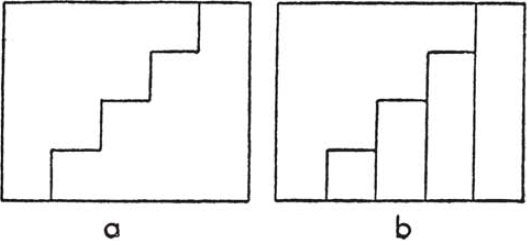

# Part III — Dictionary of Heuristic: I–P

## If you cannot solve the proposed problem

**If you cannot solve the proposed problem** do not let this failure afflict you too much but try to find consolation with some easier success, *try to solve first some related problem*; then you may find courage to attack your original problem again. Do not forget that human superiority consists in going around an obstacle that cannot be overcome directly, in devising some suitable auxiliary problem when the original one appears insoluble.

*Could you imagine a more accessible related problem?* You should now *invent* a related problem, not merely *remember* one; I hope that you have tried already the question: *Do you know a related problem?*

The remaining questions in that paragraph of the list which starts with the title of the present article have a common aim, the **variation of the problem**. There are different means to attain this aim as **generalization**, **specialization**, **analogy**, and others which are various ways of **decomposing and recombining**.

## Induction and mathematical induction

**Induction and mathematical induction.** Induction is the process of discovering general laws by the observation and combination of particular instances. It is used in all sciences, even in mathematics. Mathematical induction is used in mathematics alone to prove theorems of a certain kind. It is rather unfortunate that the names are connected because there is very little logical connection between the two processes. There is, however, some practical connection; we often use both methods together. We are going to illustrate both methods by the same example.

1\. We may observe, by chance, that

$$1 + 8 + 27 + 64 = 100$$

and, recognizing the cubes and the square, we may give to the fact we observed the more interesting form:

$$1^3 + 2^3 + 3^3 + 4^3 = 10^2.$$

How does such a thing happen? Does it often happen that such a sum of successive cubes is a square?

In asking this we are like the naturalist who, impressed by a curious plant or a curious geological formation, conceives a general question. Our general question is concerned with the sum of successive cubes

$$1^3 + 2^3 + 3^3 + \cdots + n^3.$$

We were led to it by the "particular instance" $n = 4$.

What can we do for our question? What the naturalist would do; we can investigate other special cases. The special cases $n = 2, 3$ are still simpler, the case $n = 5$ is the next one. Let us add, for the sake of uniformity and completeness, the case $n = 1$. Arranging neatly all these cases, as a geologist would arrange his specimens of a certain ore, we obtain the following table:

$$
\begin{aligned}
1 &= 1 = 1^2 \\
1 + 8 &= 9 = 3^2 \\
1 + 8 + 27 &= 36 = 6^2 \\
1 + 8 + 27 + 64 &= 100 = 10^2 \\
1 + 8 + 27 + 64 + 125 &= 225 = 15^2.
\end{aligned}
$$

It is hard to believe that all these sums of consecutive cubes are squares by mere chance. In a similar case, the naturalist would have little doubt that the general law suggested by the special cases heretofore observed is correct; the general law is almost proved by *induction*. The mathematician expresses himself with more reserve although fundamentally, of course, he thinks in the same fashion. He would say that the following theorem is strongly suggested by induction:

*The sum of the first* $n$ *cubes is a square*.

2\. We have been led to conjecture a remarkable, somewhat mysterious law. Why should those sums of successive cubes be squares? But, apparently, they are squares.

What would the naturalist do in such a situation? He would go on examining his conjecture. In so doing, he may follow various lines of investigation. The naturalist may accumulate further experimental evidence; if we wish to do the same, we have to test the next cases, $n = 6, 7, \ldots$. The naturalist may also reexamine the facts whose observation has led him to his conjecture; he compares them carefully, he tries to disentangle some deeper regularity, some further analogy. Let us follow this line of investigation.

Let us reexamine the cases $n = 1, 2, 3, 4, 5$ which we arranged in our table. Why are all these sums squares? What can we say about these squares? Their bases are $1, 3, 6, 10, 15$. What about these bases? Is there some deeper regularity, some further analogy? At any rate, they do not seem to increase too irregularly. How do they increase? The difference between two successive terms of this sequence is itself increasing,

$$3 - 1 = 2, \quad 6 - 3 = 3, \quad 10 - 6 = 4, \quad 15 - 10 = 5.$$

Now these differences are conspicuously regular. We may see here a surprising analogy between the bases of those squares, we may see a remarkable regularity in the numbers $1, 3, 6, 10, 15$:

$$
\begin{aligned}
1 &= 1 \\
3 &= 1 + 2 \\
6 &= 1 + 2 + 3 \\
10 &= 1 + 2 + 3 + 4 \\
15 &= 1 + 2 + 3 + 4 + 5.
\end{aligned}
$$

If this regularity is general (and the contrary is hard to believe) the theorem we suspected takes a more precise form:

*It is, for* $n = 1, 2, 3, \ldots$

$$1^3 + 2^3 + 3^3 + \cdots + n^3 = (1 + 2 + 3 + \cdots + n)^2.$$

3\. The law we just stated was found by induction, and the manner in which it was found conveys to us an idea about induction which is necessarily one-sided and imperfect but not distorted. Induction tries to find regularity and coherence behind the observations. Its most conspicuous instruments are generalization, specialization, analogy. Tentative generalization starts from an effort to understand the observed facts; it is based on analogy, and tested by further special cases.

We refrain from further remarks on the subject of induction about which there is wide disagreement among philosophers. But it should be added that many mathematical results were found by induction first and proved later. Mathematics presented with rigor is a systematic deductive science but mathematics in the making is an experimental inductive science.

4\. In mathematics as in the physical sciences we may use observation and induction to discover general laws. But there is a difference. In the physical sciences, there is no higher authority than observation and induction but in mathematics there is such an authority: rigorous proof.

After having worked a while experimentally it may be good to change our point of view. Let us be strict. We have discovered an interesting result but the reasoning that led to it was merely plausible, experimental, provisional, heuristic; let us try to establish it definitively by a rigorous proof.

We have arrived now at a "problem to prove": to prove or to disprove the result stated before (see 2, above).

There is a minor simplification. We may know that

$$1 + 2 + 3 + \cdots + n = \frac{n(n + 1)}{2}.$$

At any rate, this is easy to verify. Take a rectangle with sides $n$ and $n + 1$, and divide it in two halves by a zigzag line as in Fig. 18a which shows the case $n = 4$. Each of the halves is "staircase-shaped" and its area has the expression $1 + 2 + \cdots + n$; for $n = 4$ it is $1 + 2 + 3 + 4$, see Fig. 18b. Now, the whole area of the rectangle is $n(n + 1)$ of which the staircase-shaped area is one half; this proves the formula.

We may transform the result which we found by induction into

$$1^3 + 2^3 + 3^3 + \cdots + n^3 = \left( \frac{n(n + 1)}{2} \right)^2.$$

5\. If we have no idea how to prove this result, we may at least test it. Let us test the first case we have not tested yet, the case $n = 6$. For this value, the formula yields

$$1 + 8 + 27 + 64 + 125 + 216 = \left( \frac{6 \times 7}{2} \right)^2$$

and, on computation, this turns out to be true, both sides being equal to $441$.

We can test the formula more effectively. The formula is, very likely, generally true, true for all values of $n$. Does it remain true when we pass from any value $n$ to the next value $n + 1$? Along with the formula as written above we should also have

$$1^3 + 2^3 + 3^3 + \cdots + n^3 + (n + 1)^3 = \left( \frac{(n + 1)(n + 2)}{2} \right)^2.$$

Now, there is a simple check. Subtracting from this the formula written above, we obtain

$$(n + 1)^3 = \left( \frac{(n + 1)(n + 2)}{2} \right)^2 - \left( \frac{n(n + 1)}{2} \right)^2.$$

This is, however, easy to check. The right hand side may be written as

$$
\begin{aligned}
\left( \frac{n + 1}{2} \right)^2 \left[ (n + 2)^2 - n^2 \right] &= \left( \frac{n + 1}{2} \right)^2 \left[ n^2 + 4n + 4 - n^2 \right] \\
\frac{(n + 1)^2}{4} (4n + 4) &= (n + 1)^2 (n + 1) = (n + 1)^3.
\end{aligned}
$$

Our experimentally found formula passed a vital test.

Let us see clearly what this test means. We verified beyond doubt that

$$1^3 + 2^3 + 3^3 + \cdots + n^3 = \left( \frac{n(n + 1)}{2} \right)^2$$

We do not know yet whether

$$1^3 + 2^3 + 3^3 + \cdots + n^3 + (n + 1)^3 = \left( \frac{(n + 1)(n + 2)}{2} \right)^2$$

is true. But *if* we knew that this *was* true we could infer, by adding the equation which we verified beyond doubt, that

$$1^3 + 2^3 + 3^3 + \cdots + n^3 + (n + 1)^3 = \left( \frac{(n + 1)(n + 2)}{2} \right)^2$$

is *also* true which is the same assertion for the next integer $n + 1$. Now, we actually know that our conjecture is true for $n = 1, 2, 3, 4, 5, 6$. By virtue of what we have just said, the conjecture, being true for $n = 6$, must also be true for $n = 7$; being true for $n = 7$ it is true for $n = 8$; being true for $n = 8$ it is true for $n = 9$; and so on. It holds for all $n$, it is proved to be true generally.

6\. The foregoing proof may serve as a pattern in many similar cases. What are the essential lines of this pattern?

The assertion we have to prove must be given in advance, in precise form.

The assertion must depend on an integer $n$.

The assertion must be sufficiently "explicit" so that we have some possibility of testing whether it remains true in the passage from $n$ to the next integer $n + 1$.

If we succeed in testing this effectively, we may be able to use our experience, gained in the process of testing, to conclude that the assertion must be true for $n + 1$ provided it is true for $n$. When we are so far it is sufficient to know that the assertion is true for $n = 1$; hence it follows for $n = 2$; hence it follows for $n = 3$. and so on; passing from any integer to the next, we prove the assertion generally.

This process is so often used that it deserves a name. We could call it "proof from $n$ to $n + 1$" or still simpler "passage to the next integer." Unfortunately, the accepted technical term is "mathematical induction." This name results from a random circumstance. The precise assertion that we have to prove may come from any source, and it is immaterial from the logical viewpoint what the source is. Now, in many cases, as in the case we discussed here in detail, the source is induction, the assertion is found experimentally, and so the proof appears as a mathematical complement to induction; this explains the name.

7\. Here is another point, somewhat subtle, but important to anybody who desires to find proofs by himself. In the foregoing, we found two different assertions by observation and induction, one after the other, the first under 1, the second under 2; the second was more precise than the first. Dealing with the second assertion, we found a possibility of checking the passage from $n$ to $n + 1$, and so we were able to find a proof by "mathematical induction." Dealing with the first assertion, and ignoring the precision added to it by the second one, we should scarcely have been able to find such a proof. In fact, the first assertion is less precise, less "explicit," less "tangible," less accessible to testing and checking than the second one. Passing from the first to the second, from the less precise to the more precise statement, was an important preparative for the final proof.

This circumstance has a paradoxical aspect. The second assertion is stronger; it implies immediately the first, whereas the somewhat "hazy" first assertion can hardly imply the more "clear-cut" second one. Thus, the stronger theorem is easier to master than the weaker one; this is the **inventor's paradox**.

## Inventor's paradox

**Inventor's paradox.** The more ambitious plan may have more chances of success.

This sounds paradoxical. Yet, when passing from one problem to another, we may often observe that the new, more ambitious problem is easier to handle than the original problem. More questions may be easier to answer than just one question. The more comprehensive theorem may be easier to prove, the more general problem may be easier to solve.

The paradox disappears if we look closer at a few examples (**generalization**, 2; **induction and mathematical induction**, 7). The more ambitious plan may have more chances of success provided it is not based on mere pretension but on some vision of the things beyond those immediately present.

## Is it possible to satisfy the condition?

**Is it possible to satisfy the condition?** *Is the condition sufficient to determine the unknown? Or is it insufficient? Or redundant? Or contradictory?*

These questions are often useful at an early stage when they do not need a final answer but just a provisional answer, a guess. For examples, see sections 8, 18.

It is good to foresee any feature of the result for which we work. When we have some idea of what we can expect, we know better in which direction we should go. Now, an important feature of a problem is the number of solutions of which it admits. Most interesting among problems are those which admit of just one solution; we are inclined to consider problems with a uniquely determined solution as the only "reasonable" problems. Is our problem, in this sense, "reasonable"? If we can answer this question, even by a plausible guess, our interest in the problem increases and we can work better.

Is our problem "reasonable"? This question is useful at an early stage of our work *if* we can answer it easily. If the answer is difficult to obtain, the trouble we have in obtaining it may outweigh the gain in interest. The same is true of the question *"Is it possible to satisfy the condition?"* and the allied questions of our list. We should put them because the answer might be easy and plausible, but we should not insist on them when the answer seems to be difficult or obscure.

The corresponding questions for "problems to prove" are: *Is it likely that the proposition is true? Or is it more likely that it is false?* The way the question is put shows clearly that only a guess, a plausible provisional answer, is expected.

## Leibnitz, Gottfried Wilhelm

**Leibnitz, Gottfried Wilhelm** (1646–1716), great mathematician and philosopher, planned to write an "Art of Invention" but he never carried through his plan. Numerous fragments dispersed in his works show, however, that he entertained interesting ideas about the subject whose importance he often emphasized. Thus, he wrote: "Nothing is more important than to see the sources of invention which are, in my opinion, more interesting than the inventions themselves."

## Lemma

**Lemma** means "auxiliary theorem." The word is of Greek origin; a more literal translation would be "what is assumed."

We are trying to prove a theorem, say, $A$. We are led to suspect another theorem, say, $B$; if $B$ were true we could perhaps, using it, prove $A$. We assume $B$ provisionally, postponing its proof, and go ahead with the proof of $A$. Such a theorem $B$ is assumed, and is an auxiliary theorem to the originally proposed theorem $A$. Our little story is fairly typical and explains the present meaning of the word "lemma."

## Look at the unknown

**Look at the unknown.** This is old advice; the corresponding Latin saying is: "respice finem." That is, look at the end. Remember your aim. Do not forget your goal. Think of what you are desiring to obtain. Do not lose sight of what is required. Keep in mind what you are working for. *Look at the unknown. Look at the conclusion*. The last two versions of "respice finem" are specifically adapted to mathematical problems, to "problems to find" and to "problems to prove" respectively.

Focusing our attention on our aim and concentrating our will on our purpose, we think of ways and means to attain it. What are the means to this end? How can you attain your aim? How can you obtain a result of this kind? What causes could produce such a result? Where have you seen such a result produced? What do people usually do to obtain such a result? *And try to think of a familiar problem having the same or a similar unknown. And try to think of a familiar theorem having the same or a similar conclusion*. Again, the last two versions are specifically adapted to "problems to find" and to "problems to prove" respectively.

1\. We are going to consider mathematical problems, "problems to find," and the suggestion: *Try to think of a familiar problem having the same unknown*. Let us compare this suggestion with that involved in the question: *Do you know a related problem?*

The latter suggestion is more general than the former one. If a problem is related to another problem, the two have something in common; they may involve a few common objects or notions, or have some data in common, or some part of the condition, and so on. Our first suggestion insists on a particular common point: The two problems should have the same unknown. That is, the unknown should be in both cases an object of the same category, for instance, in both cases the length of a straight line.

In comparison with the general suggestion, there is a certain economy in the special suggestion.

First, we may save some effort in representing the problem; we must not look at once at the whole problem but just at the unknown. The problem appears to us schematically, as

"Given . . . . . . . . . . find the length of the line."

Second, there is a certain economy of choice. Many, many problems may be related to the proposed problem, having some point or other in common with it. But, looking at the unknown, we restrict our choice; we take into consideration only such problems as have the same unknown. And, of course, among the problems having the same unknown, we consider first those which are the most elementary and the most familiar to us.

2\. The problem before us has the form:

"Given . . . . . . . . . . find the length of the line."

Now the simplest and most familiar problems of this kind are concerned with triangles: Given three constituent parts of a triangle find the length of a side. Remembering this, we have found something that may be relevant: *Here is a problem related to yours and solved before. Could you use it? Could you use its result?* In order to use the familiar results about triangles, we must have a triangle in our figure. Is there a triangle? Or should we introduce one in order to profit from those familiar results? *Should you introduce some auxiliary element in order to make their use possible?*

There are several simple problems whose unknown is the side of a triangle. (They differ from each other in the data; two angles may be given and one side, or two sides and one angle, and the position of the angle with respect to the given sides may be different. Then, all these problems are particularly simple for right triangles.) With our attention riveted upon the problem before us, we try to find out which kind of triangle we should introduce, which formerly solved problem (with the same unknown as that before us) we could most conveniently adapt to our present purpose.

Having introduced a suitable auxiliary triangle, it may happen that we do not know yet three constituent parts of it. This, however, is not absolutely necessary; if we foresee that the missing parts can be obtained somehow we have made essential progress, we have a plan of the solution.

3\. The procedure sketched in the foregoing (under 1 and 2) is illustrated, essentially, by section 10 (the illustration is somewhat obscured by the slowness of the students). It is not difficult at all to add many similar examples. In fact, the solution of almost all "problems to find" usually proposed in less advanced classes can be started by proper use of the suggestion: *And try to think of a familiar problem having the same or a similar unknown*.

We must take such problems schematically, and look at the unknown first:

(1) Given . . . . . . . find the length of the line.

(2) Given . . . . . . . find the angle.

(3) Given . . . . . . . find the volume of the tetrahedron.

(4) Given . . . . . . . construct the point.

If we have some experience in dealing with elementary mathematical problems, we will readily recall some simple and familiar problem or problems having the same unknown. If the problem proposed is not one of those simple familiar problems we naturally try to make use of what is familiar to us and profit from the result of those simple problems. We try to introduce some useful well-known thing into the problem, and doing so we may get a good start.

In each of the four cases mentioned there is an obvious plan, a plausible guess about the future course of the solution.

(1) The unknown should be obtained as a side of some triangle. It remains to introduce a suitable triangle with three known, or easily obtainable, constituents.

(2) The unknown should be obtained as an angle in some triangle. It remains to introduce a suitable triangle.

(3) The unknown can be obtained if the area of the base and the length of the altitude are known. It remains to find the area of a face and the corresponding altitude.

(4) The unknown should be obtained as the intersection of two loci each of which is either a circle or a straight line. It remains to disentangle such loci from the proposed condition.

In all these cases the plan is suggested by a simple problem with the same unknown and by the desire to use its result or its method. Pursuing such a plan, we may run into difficulties, of course, but we have some idea to start with which is a great advantage.

4\. There is no such advantage if there is no formerly solved problem having the same unknown as the proposed problem. In such cases, it is much more difficult to tackle the proposed problem.

"Find the area of the surface of a sphere with given radius." This problem was solved by Archimedes. There is scarcely a simpler problem with the same unknown and there was certainly no such simpler problem of which Archimedes could have made use. In fact, Archimedes' solution may be regarded as one of the most notable mathematical achievements.

"Find the area of the surface of the sphere inscribed in a tetrahedron whose six edges are given." If we know Archimedes' result, we need not have Archimedes' genius to solve the problem; it remains to express the radius of the inscribed sphere in terms of the six edges of the tetrahedron. This is not exactly easy but the difficulty cannot be compared with that of Archimedes' problem.

To know or not to know a formerly solved problem with the same unknown may make all the difference between an easy and a difficult problem.

5\. When Archimedes found the area of the surface of the sphere he did not know, as we just mentioned, any formerly solved problem having the same unknown. But he knew various formerly solved problems having a similar unknown. There are curved surfaces whose area is easier to obtain than that of the sphere and which were well known in Archimedes' time, as the lateral surfaces of right circular cylinders, of right circular cones, and of the frustums of such cones. We may be certain that Archimedes considered carefully these simpler similar cases. In fact, in his solution, he uses as approximation to the sphere a composite solid consisting of two cones and several frustums of cones (see **definition**, 6).

If we are unable to find a formerly solved problem having the same unknown as the problem before us, we try to find one having a similar unknown. Problems of the latter kind are less closely related to the problem before us than problems of the former kind and, therefore, less easy to use for our purpose in general but they may be valuable guides nevertheless.

6\. We add a few remarks concerning "problems to prove"; they are analogous to the foregoing more extensive comments on "problems to find."

We have to prove (or disprove) a clearly stated theorem. Any theorem proved in the past which is in some way related to the theorem before us has a chance to be of some service. Yet we may expect the most immediate service of theorems which have the same conclusion as the one before us. Knowing this, we *look at the conclusion*, that is, we consider our theorem emphasizing the conclusion. Our way of looking at the theorem can be expressed in writing by a scheme as:

"If . . . . . . . . . . then the angles are equal."

We focus our attention upon the conclusion before us and try to *think of a familiar theorem having the same or a similar conclusion*. Especially, we try to think of very simple familiar theorems of this sort.

In our case, there are various theorems of this kind and we may recollect the following: "If two triangles are congruent the corresponding angles are equal." *Here is a theorem related to yours and proved before. Could you use it? Should you introduce some auxiliary element in order to make its use possible?*

Following these suggestions, and trying to judge the help afforded by the theorem we recollected, we may conceive a plan: Let us try to prove the equality of the angles in question from congruent triangles. We see that we must introduce a pair of triangles containing those angles and prove that they are congruent. Such a plan is certainly good to start the work and it may lead eventually to the desired end as in section 19.

7\. Let us sum up. Recollecting formerly solved problems with the same or a similar unknown (formerly proved theorems with the same or a similar conclusion) we have a good chance to start in the right direction and we may conceive a plan of the solution. In simple cases, which are the most frequent in less advanced classes, the most elementary problems with the same unknown (theorems with the same conclusion) are usually sufficient. Trying to recollect problems with the same unknown is an obvious and common-sense device (compare what was said in this respect in section 4). It is rather surprising that such a simple and useful device is not more widely known; the author is inclined to think that it was not even stated before in full generality. In any case, neither students nor teachers of mathematics can afford to ignore the proper use of the suggestion: *Look at the unknown! And try to think of a familiar problem having the same or a similar unknown*.

## Modern heuristic

**Modern heuristic** endeavors to understand the process of solving problems, especially the *mental operations typically useful* in this process. It has various sources of information none of which should be neglected. A serious study of heuristic should take into account both the logical and the psychological background, it should not neglect what such older writers as Pappus, Descartes, Leibnitz, and Bolzano have to say about the subject, but it should least neglect unbiased experience. Experience in solving problems and experience in watching other people solving problems must be the basis on which heuristic is built. In this study, we should not neglect any sort of problem, and should find out common features in the way of handling all sorts of problems; we should aim at general features, independent of the subject matter of the problem. The study of heuristic has "practical" aims; a better understanding of the mental operations typically useful in solving problems could exert some good influence on teaching, especially on the teaching of mathematics.

The present book is a first attempt toward the realization of this program. We are going to discuss how the various articles of this Dictionary fit into the program.

1\. Our list is, in fact, a list of mental operations typically useful in solving problems; the questions and suggestions listed hint at such operations. Some of these operations are described again in the Second Part, and some of them are more thoroughly discussed and illustrated in the First Part.

For additional information about particular questions and suggestions of the list, the reader should refer to those fifteen articles of the Dictionary whose titles are the first sentences of the fifteen paragraphs of the list: **what is the unknown? is it possible to satisfy the condition? draw a figure. . . . can you use the result?** The reader, wishing information about a particular item of the list, should look at the first words of the paragraph in which the item is contained and then look up the article in the Dictionary that has those first words as title. For instance, the suggestion *"Go back to definitions"* is contained in the paragraph of the list whose first sentence is: **could you restate the problem?** Under this title, the reader finds a cross-reference to **definition** in which article the suggestion in question is explained and illustrated.

2\. The process of solving problems is a complex process that has several different aspects. The twelve principal articles of this Dictionary study certain of these aspects at some length; we are going to mention their titles in what follows.

When we are working intensively, we feel keenly the progress of our work; we are elated when our progress is rapid, we are depressed when it is slow. What is essential to **progress and achievement** in solving problems? The article discussing this question is often quoted in other parts of the Dictionary and should be read fairly early.

Trying to solve a problem, we consider different aspects of it in turn, we roll it over and over incessantly in our mind; **variation of the problem** is essential to our work. We may vary the problem by **decomposing and recombining** its elements, or by going back to the **definition** of certain of its terms, or we may use the great resources of **generalization**, **specialization**, and **analogy**. Variation of the problem may lead us to **auxiliary elements**, or to the discovery of a more accessible **auxiliary problem**.

We have to distinguish carefully between two kinds of problems, **problems to find**, **problems to prove**. Our list is specially adapted to "problems to find." We have to revise it and change some of its questions and suggestions in order to apply it also to "problems to prove."

In all sorts of problems, but especially in mathematical problems which are not too simple, suitable **notation** and geometrical **figures** are a great and often indispensable help.

3\. The process of solving problems has many aspects but some of them are not considered at all in this book and others only very briefly. It is justified, I think, to exclude from a first short exposition points which could appear too subtle, or too technical, or too controversial.

Provisional, merely plausible **heuristic reasoning** is important in discovering the solution, but you should not take it for a proof; you must guess, but also **examine your guess**. The nature of heuristic arguments is discussed in **signs of progress**, but the discussion could go further.

The consideration of certain logical patterns is important in our subject but it appeared advisable not to introduce any technical article. There are only two articles predominantly devoted to psychological aspects, on **determination, hope, success**, and on **subconscient work**. There is an incidental remark on animal psychology; see **working backwards**.

It is emphasized that all sorts of problems, especially **practical problems**, and even **puzzles**, are within the scope of heuristic. It is also emphasized that infallible **rules of discovery** are beyond the scope of serious research. Heuristic discusses human behavior in the face of problems; this has been in fashion, presumably, since the beginning of human society, and the quintessence of such ancient discussions seems to be preserved in the **wisdom of proverbs**.

4\. A few articles on particular questions are included and some articles on more general aspects are expanded, because they could be, or parts of them could be, of special interest to students or teachers.

There are articles discussing methodical questions often important in elementary mathematics, as **pappus**, **working backwards** (already quoted under 3), **reductio ad absurdum and indirect proof**, **induction and mathematical induction**, **setting up equations**, **test by dimension**, and **why proofs?** A few articles address themselves more particularly to teachers, as **routine problems** and **diagnosis**, and others to students somewhat more ambitious than the average, as **the intelligent problem-solver**, **the intelligent reader**, and **the future mathematician**.

It may be mentioned here that the dialogues between the teacher and his students, given in sections 8, 10, 18, 19, 20 and in various articles of the Dictionary may serve as models not only to the teacher who tries to guide his class but also to the problem-solver who works by himself. To describe thinking as "mental discourse," as a sort of conversation of the thinker with himself, is not inappropriate. The dialogues in question show the progress of the solution; the problem-solver, talking with himself, may progress along a similar line.

5\. We are not going to exhaust the remaining titles; just a few groups will be mentioned.

Some articles contain remarks on the history of our subject, on **descartes**, **leibnitz**, **bolzano**, on **heuristic**, on **terms, old and new** and on **pappus** (this last one has been quoted already under 4).

A few articles explain technical terms: **condition**, **corollary**, **lemma**.

Some articles contain only cross-references (they are marked with daggers [†] in the Table of Contents).

6\. Heuristic aims at generality, at the study of procedures which are independent of the subject-matter and apply to all sorts of problems. The present exposition, however, quotes almost exclusively elementary mathematical problems as examples. It should not be overlooked that this is a restriction but it is hoped that this restriction does not impair seriously the trend of our study. In fact, elementary mathematical problems present all the desirable variety, and the study of their solution is particularly accessible and interesting. Moreover, nonmathematical problems although seldom quoted as examples are never completely forgotten. More advanced mathematical problems are never directly quoted but constitute the real background of the present exposition. The expert mathematician who has some interest for this sort of study can easily add examples from his own experience to elucidate the points illustrated by elementary examples here.

7\. The writer of this book wishes to acknowledge his indebtedness and express his gratitude to a few modern authors, not quoted in the article on **heuristic**. They are the physicist and philosopher Ernst Mach, the mathematician Jacques Hadamard, the psychologists William James and Wolfgang Köhler. He wishes also to quote the psychologist K. Duncker and the mathematician F. Krauss whose work (published after his own research was fairly advanced, and partly published) shows certain parallel remarks.

## Notation

**Notation.** If you wish to realize the advantages of a well chosen and well known notation try to add a few not too small numbers with the condition that you are not allowed to use the familiar Arabic numerals, although you may use, if you wish to write, Roman numerals. Take, for instance, the numbers MMMXC, MDXCVI, MDCXLVI, MDCCLXXXI, MDCCCLXXXVII.

We can scarcely overestimate the importance of mathematical notation. Modern computers, using the decimal notation, have a great advantage over the ancient computers who did not have such a convenient manner of writing the numbers. An average modern student who is familiar with the usual notation of algebra, analytical geometry, and the differential and integral calculus, has an immense advantage over a Greek mathematician in solving the problems about areas and volumes which exercised the genius of Archimedes.

1\. Speaking and thinking are closely connected, the use of words assists the mind. Certain philosophers and philologists went a little further and asserted that the use of words is indispensable to the use of reason.

Yet this last assertion appears somewhat exaggerated. If we have a little experience of serious mathematical work we know that we can do a piece of pretty hard thinking without using any words, just looking at geometric figures or manipulating algebraic symbols. Figures and symbols are closely connected with mathematical thinking, their use assists the mind. We could improve that somewhat narrow assertion of philosophers and philologists by bringing the words into line with other sorts of signs and saying that the *use of signs appears to be indispensable to the use of reason*.

At any rate, the use of mathematical symbols is similar to the use of words. Mathematical notation appears as a sort of language, *une langue bien faite*, a language well adapted to its purpose, concise and precise, with rules which, unlike the rules of ordinary grammar, suffer no exception.

If we accept this viewpoint, **setting up equations** appears as a sort of translation, translation from ordinary language into the language of mathematical symbols.

2\. Some mathematical symbols, as $+$, $-$, $=$, and several others, have a fixed traditional meaning, but other symbols, as the small and capital letters of the Roman and Greek alphabets, are used in different meanings in different problems. When we face a new problem, we must choose certain symbols, we have to *introduce suitable notation*. There is something analogous in the use of ordinary language. Many words are used in different meanings in different contexts; when precision is important, we have to choose our words carefully.

An important step in solving a problem is to choose the notation. It should be done carefully. The time we spend now on choosing the notation may be well repaid by the time we save later by avoiding hesitation and confusion. Moreover, choosing the notation carefully, we have to think sharply of the elements of the problem which must be denoted. Thus, choosing a suitable notation may contribute essentially to understanding the problem.

3\. A good notation should be unambiguous, pregnant, easy to remember; it should avoid harmful second meanings, and take advantage of useful second meanings; the order and connection of signs should suggest the order and connection of things.

4\. Signs must be, first of all, *unambiguous*. It is inadmissible that the same symbol denote two different objects in the same inquiry. If, solving a problem, you call a certain magnitude $a$ you should avoid calling anything else $a$ which is connected with the same problem. Of course, you may use the letter $a$ in a different meaning in a different problem.

Although it is forbidden to use the same symbol for different objects it is not forbidden to use different symbols for the same object. Thus, the product of $a$ and $b$ may be written as

$$a \times b \qquad a \cdot b \qquad ab.$$

In some cases, it is advantageous to use two or more different signs for the same object, but such cases require particular care. Usually, it is better to use just one sign for one object, and in no case should several signs be used wantonly.

5\. A good sign should be *easy to remember* and easy to recognize; the sign should immediately remind us of the object and the object of the sign.

A simple device to make signs easily recognizable is to use *initials* as symbols. For example, in section 20 we used $r$ for rate, $t$ for time, $V$ for volume. We cannot use, however, initials in all cases. Thus, in section 20, we had to consider a radius but we could not call it $r$ because this letter was already taken to denote a rate. There are still other motives restricting the choice of symbols, and other means to make them easily recognizable which we are going to discuss.

6\. Notation is not only easily recognizable but particularly helpful in shaping our conception when *the order and connection of the signs suggest the order and connection of the objects*. We need several examples to illustrate this point.

(I) In order to denote objects which are near to each other in the conception of the problem we use letters which are near to each other in the alphabet.

Thus, we generally use letters at the beginning of the alphabet as $a, b, c$, for given quantities or constants, and letters at the end of the alphabet as $x, y, z$, for unknown quantities or variables.

In section 8 we used $a, b, c$ for the given length, width, and height of a parallelepiped. On this occasion, the notation $a, b, c$ was preferable to the notation by initials $l, w, h$. The three lengths played the same role in the problem which is emphasized by the use of successive letters. Moreover, being at the beginning of the alphabet, $a, b, c$ are, as we just said, the most usual letters to denote given quantities. On some other occasion, if the three lengths play different roles and it is important to know which lengths are horizontal and which one is vertical, the notation $l, w, h$ might be preferable.

(II) In order to denote objects belonging to the same category, we frequently choose letters belonging to the same alphabet for one category, using different alphabets for different categories. Thus, in plane geometry we often use:

Roman capitals as $A, B, C, \ldots$ for points,\
small Roman letters as $a, b, c, \ldots$ for lines,\
small Greek letters as $\alpha, \beta, \gamma, \ldots$ for angles.

If there are two objects belonging to different categories but having some particular relation to each other which is important for our problem, we may choose, to denote these two objects, corresponding letters of the respective alphabets as $A$ and $a$, $B$ and $b$, and so on. A familiar example is the usual notation for a triangle:

$A, B, C$ stand for the vertices,\
$a, b, c$ for the sides,\
$\alpha, \beta, \gamma$ for the angles.

It is understood that $a$ is the side opposite to the vertex $A$ and the angle at $A$ is called $\alpha$.

(III) In section 20, the letters $a, b, x, y$ are particularly well chosen to indicate the nature and connection of the elements denoted. The letters $a, b$ hint that the magnitudes denoted are constants; $x, y$ indicate variables; $a$ precedes $b$ as $x$ precedes $y$ and this suggests that $a$ is in the same relation to $b$ as $x$ is to $y$. In fact, $a$ and $x$ are horizontal, $b$ and $y$ vertical, and $a : b = x : y$.

7\. The notation

$$\triangle ABC \sim \triangle EFG$$

indicates that the two triangles in question are similar. In modern books, the formula is meant to indicate that the two triangles are similar, the vertices corresponding to each other in the order as they are written, $A$ to $E$, $B$ to $F$, $C$ to $G$. In older books, this proviso about the order was not yet introduced; the reader had to look at the figure or remember the derivation in order to ascertain which vertex corresponded to which.

The modern notation is much preferable to the older one. Using the modern notation, we may draw consequences from the formula *without looking at the figure*. Thus, we may derive that

$$\angle A = \angle E$$
$$AB : BC = EF : FG$$

and other relations of the same kind. The older notation expresses less and does not allow such definite consequences.

A notation expressing more than another may be termed more *pregnant*. The modern notation for similitude of triangles is more pregnant than the older one, reflects the order and connection of things more fully than the older one, and therefore, it may serve as basis for more consequences than the older one.

8\. Words have *second meanings*. Certain contexts in which a word is often used influence it and add something to its primary meaning, some shade, or second meaning, or "connotation." If we write carefully, we try to choose among the words having almost the same meaning the one whose second meaning is best adapted.

There is something similar in mathematical notation. Even mathematical symbols may acquire a sort of second meaning from contexts in which they are often used. If we choose our notation carefully, we have to take this circumstance into account. Let us illustrate the point.

There are certain letters which have acquired a firmly rooted, traditional meaning. Thus, $e$ stands usually for the basis of natural logarithms, $i$ for $\sqrt{-1}$, the imaginary unit, and $\pi$ for the ratio of the circumference of the circle to the diameter. It is on the whole better to use such symbols only in their traditional meaning. If we use such a symbol in some other meaning its traditional meaning could occasionally interfere and be embarrassing, even misleading. It is true that harmful second meanings of this sort give less trouble to the beginner who has not yet studied many subjects than to the mathematician who should have sufficient experience to deal with such nuisances.

Second meanings of the symbols can also be helpful, even very helpful, if they are used with tact. A notation used on former occasions may assist us in recalling some useful procedure; of course, we should be sufficiently careful to separate clearly the present (primary) meaning of the symbol from its former (secondary) meaning. A *standing notation* [as the traditional notation for the parts of the triangle which we mentioned before, 6 (II)] has great advantages; used on several former occasions it may assist us in recalling various formerly used procedures. We remember our formulas in some standing notation. Of course, we should be sufficiently careful when, owing to particular circumstances, we are obliged to use a standing notation in a meaning somewhat different from the usual one.

9\. When we have to choose between two notations, one reason may speak for one, and some other reason for the other. We need experience and taste to choose the more suitable notation as we need experience and taste to choose more suitable words. Yet it is good to know the various advantages and disadvantages discussed in the foregoing. At any rate, we should choose our notation carefully, and have *some good reason* for our choice.

10\. Not only the most hopeless boys in the class but also quite intelligent students may have an aversion for algebra. There is always something arbitrary and artificial about notation; to learn a new notation is a burden for the memory. The intelligent student refuses to assume the burden if he does not see any compensation for it. The intelligent student is justified in his aversion for algebra if he is not given ample opportunity to convince himself by his own experience that *the language of mathematical symbols assists the mind*. To help him to such experience is an important task of the teacher, one of his most important tasks.

I say that it is an important task but I do not say that it is an easy one. The foregoing remarks may be of some help. See also **setting up equations**. Checking a formula by extensive discussion of its properties may be recommended as a particularly instructive exercise; see section 14 and **can you check the result?** 2.

## Pappus

**Pappus,** an important Greek mathematician, lived probably around A.D. 300. In the seventh book of his *Collectiones*, Pappus reports about a branch of study which he calls *analyomenos*. We can render this name in English as "Treasury of Analysis," or as "Art of Solving Problems," or even as "Heuristic"; the last term seems to be preferable here. A good English translation of Pappus's report is easily accessible; what follows is a free rendering of the original text:

"The so-called Heuristic is, to put it shortly, a special body of doctrine for the use of those who, after having studied the ordinary Elements, are desirous of acquiring the ability to solve mathematical problems, and it is useful for this alone. It is the work of three men, Euclid, the author of the Elements, Apollonius of Perga, and Aristaeus the elder. It teaches the procedures of analysis and synthesis.

"In analysis, we start from what is required, we take it for granted, and we draw consequences from it, and consequences from the consequences, till we reach a point that we can use as starting point in synthesis. For in analysis we assume what is required to be done as already done (what is sought as already found, what we have to prove as true). We inquire from what antecedent the desired result could be derived; then we inquire again what could be the antecedent of that antecedent, and so on, until passing from antecedent to antecedent, we come eventually upon something already known or admittedly true. This procedure we call analysis, or solution backwards, or regressive reasoning.

"But in synthesis, reversing the process, we start from the point which we reached last of all in the analysis, from the thing already known or admittedly true. We derive from it what preceded it in the analysis, and go on making derivations until, retracing our steps, we finally succeed in arriving at what is required. This procedure we call synthesis, or constructive solution, or progressive reasoning.

"Now analysis is of two kinds; the one is the analysis of the 'problems to prove' and aims at establishing true theorems; the other is the analysis of the 'problems to find' and aims at finding the unknown.

"If we have a 'problem to prove' we are required to prove or disprove a clearly stated theorem $A$. We do not know yet whether $A$ is true or false; but we derive from $A$ another theorem $B$, from $B$ another $C$, and so on, until we come upon a last theorem $L$ about which we have definite knowledge. If $L$ is true, $A$ will be also true, provided that all our derivations are convertible. From $L$ we prove the theorem $K$ which preceded $L$ in the analysis and, proceding in the same way, we retrace our steps; from $C$ we prove $B$, from $B$ we prove $A$, and so we attain our aim. If, however, $L$ is false, we have proved $A$ false.

"If we have a 'problem to find' we are required to find a certain unknown $x$ satisfying a clearly stated condition. We do not know yet whether a thing satisfying such a condition is possible or not; but assuming that there is an $x$ satisfying the condition imposed we derive from it another unknown $y$ which has to satisfy a related condition; then we link $y$ to still another unknown, and so on, until we come upon a last unknown $z$ which we can find by some known method. If there is actually a $z$ satisfying the condition imposed upon it, there will be also an $x$ satisfying the original condition, provided that all our derivations are convertible. We first find $z$; then, knowing $z$, we find the unknown that preceded $z$ in the analysis; proceeding in the same way, we retrace our steps, and finally, knowing $y$, we obtain $x$, and so we attain our aim. If, however, there is nothing that would satisfy the condition imposed upon $z$, the problem concerning $x$ has no solution."

We should not forget that the foregoing is not a literal translation but a free rendering, a *paraphrase*. Various differences between the original and the paraphrase deserve comment, for Pappus's text is important in many ways.

1\. Our paraphrase uses a more definite terminology than the original and introduces the symbols $A, B, \ldots L$, $x, y, \ldots z$ which the original has not.

2\. The paraphrase has "mathematical problems" where the original means "geometrical problems." This emphasizes that the procedures described by Pappus are by no means restricted to geometric problems; they are, in fact, not even restricted to mathematical problems. We have to illustrate this by examples since, in these matters, generality and independence from the nature of the subject are important (see section 3).

3\. *Algebraic illustration*. Find $x$ satisfying the equation

$$8(4^x + 4^{-x}) - 54(2^x + 2^{-x}) + 101 = 0.$$

This is a "problem to find," not too easy for a beginner. He has to be familiar with the idea of analysis; not with the word "analysis" of course, but with the idea of attaining the aim by repeated reduction. Moreover, he has to be familiar with the simplest sorts of equations. Even with some knowledge, it takes a good idea, a little luck, a little invention to observe that, since $4^x = (2^x)^2$ and $4^{-x} = (2^x)^{-2}$, it may be advantageous to introduce

$$y = 2^x.$$

Now, this substitution is really advantageous, the equation obtained for $y$

$$8\left( y^2 + \frac{1}{y^2} \right) - 54\left( y + \frac{1}{y} \right) + 101 = 0$$

appears simpler than the original equation; but our task is not yet finished. It needs another little invention, another substitution

$$z = y + \frac{1}{y}$$

which transforms the condition into

$$8z^2 - 54z + 85 = 0.$$

Here the analysis ends, provided that the problem-solver is acquainted with the solution of quadratic equations.

What is the synthesis? Carrying through, step by step, the calculations whose possibility was foreseen by the analysis. The problem-solver needs no new idea to finish his problem, only some patience and attention in calculating the various unknowns. The order of calculation is opposite to the order of invention; first $z$ is found ($z = 5/2, 17/4$), then $y$ ($y = 2, 1/2, 4, 1/4$), and finally the originally required $x$ ($x = 1, -1, 2, -2$). The synthesis retraces the steps of the analysis, and it is easy to see in the present case why it does so.

4\. *Nonmathematical illustration*. A primitive man wishes to cross a creek; but he cannot do so in the usual way because the water has risen overnight. Thus, the crossing becomes the object of a problem; "crossing the creek" is the $x$ of this primitive problem. The man may recall that he has crossed some other creek by walking along a fallen tree. He looks around for a suitable fallen tree which becomes his new unknown, his $y$. He cannot find any suitable tree but there are plenty of trees standing along the creek; he wishes that one of them would fall. Could he make a tree fall across the creek? There is a great idea and there is a new unknown; by what means could he tilt the tree over the creek?

This train of ideas ought to be called analysis if we accept the terminology of Pappus. If the primitive man succeeds in finishing his analysis he may become the inventor of the bridge and of the axe. What will be the synthesis? Translation of ideas into actions. The finishing act of the synthesis is walking along a tree across the creek.

The same objects fill the analysis and the synthesis; they exercise the mind of the man in the analysis and his muscles in the synthesis; the analysis consists in thoughts, the synthesis in acts. There is another difference; the order is reversed. Walking across the creek is the first desire from which the analysis starts and it is the last act with which the synthesis ends.

5\. The paraphrase hints a little more distinctly than the original the natural connection between analysis and synthesis. This connection is manifest after the foregoing examples. Analysis comes naturally first, synthesis afterwards; analysis is invention, synthesis, execution; *analysis is devising a plan, synthesis carrying through the plan*.

6\. The paraphrase preserves and even emphasizes certain curious phrases of the original: "assume what is required to be done as already done, what is sought as found, what you have to prove as true." This is paradoxical; is it not mere self-deception to assume that the problem that we have to solve is solved? This is obscure; what does it mean? If we consider closely the context and try honestly to understand our own experience in solving problems, the meaning can scarcely be doubtful.

Let us first consider a "problem to find." Let us call the unknown $x$ and the data $a, b, c$. To "assume the problem as solved" means to assume that there exists an object $x$ satisfying the condition—that is, having those relations to the data $a, b, c$ which the condition prescribes. This assumption is made just in order to start the analysis, it is provisional, and it is harmless. For, *if* there is no such object *and* the analysis leads us anywhere, it is bound to lead us to a final problem that has no solution and hence it will be manifest that our original problem has no solution. Then, the assumption is useful. In order to examine the condition, we have to conceive, to represent to ourselves, or to visualize geometrically the relations which the condition prescribes between $x$ and $a, b, c$; how could we do so without conceiving, representing, or visualizing $x$ as existent? Finally, the assumption is natural. The primitive man whose thoughts and deeds we discussed in comment 4 imagines himself walking on a fallen tree and crossing the creek long before he actually can do so; he sees his problem "as solved."

The object of a "problem to prove" is to prove a certain theorem $A$. The advice to "assume $A$ as true" is just an invitation to draw consequences from the theorem $A$ although we have not yet proved it. People with a certain mental character or a certain philosophy may shrink from drawing consequences from an unproved theorem; but such people cannot start an analysis.

Compare **figures**, 2.

7\. The paraphrase uses twice the important phrase "provided that all our derivations are convertible." This is an interpolation; the original contains nothing of the sort and the lack of such a proviso was observed and criticized in modern times. See **auxiliary problem**, 6 for the notion of "convertible reduction."

8\. The "analysis of the problems to prove" is explained in the paraphrase in words quite different from those used by the original but there is no change in the sense; at any rate, there is no intention to change the sense. The analysis of the "problem to find," however, is explained more concretely in the paraphrase than in the original. The original seems to aim at the description of a somewhat more general procedure, the construction of a *chain of equivalent auxiliary problems* which is described in **auxiliary problem**, 7.

9\. Many elementary textbooks of geometry contain a few remarks about analysis, synthesis, and "assuming the problem as solved." There is little doubt that this almost ineradicable tradition goes back to Pappus, although there is hardly a current textbook whose writer would show any direct acquaintance with Pappus. The subject is important enough to be mentioned in elementary textbooks but easily misunderstood. The circumstance alone that it is restricted to textbooks of geometry shows a current lack of understanding; see comment 2 above. If the foregoing comments could contribute to a better understanding of this matter their length would be amply justified.

For another example, a different viewpoint, and further comments see **working backwards**.

Compare also **reductio ad absurdum and indirect proof**, 2.

## Pedantry and mastery

**Pedantry and mastery** are opposite attitudes toward rules.

1\. To apply a rule to the letter, rigidly, unquestioningly, in cases where it fits and in cases where it does not fit, is pedantry. Some pedants are poor fools; they never did understand the rule which they apply so conscientiously and so indiscriminately. Some pedants are quite successful; they understood their rule, at least in the beginning (before they became pedants), and chose a good one that fits in many cases and fails only occasionally.

To apply a rule with natural ease, with judgment, noticing the cases where it fits, and without ever letting the words of the rule obscure the purpose of the action or the opportunities of the situation, is mastery.

2\. The questions and suggestions of our list may be helpful both to problem-solvers and to teachers. But, first, they must be understood, their proper use must be learned, and learned by trial and error, by failure and success, by experience in applying them. Second, their use should never become pedantic. You should ask no question, make no suggestion, indiscriminately, following some rigid habit. Be prepared for various questions and suggestions and use your judgment. You are doing a hard and exciting problem; the step you are going to try next should be prompted by an attentive and open-minded consideration of the problem before you. You wish to help a student; what you say to your student should proceed from a sympathetic understanding of his difficulties.

And if you are inclined to be a pedant and must rely upon some rule learn this one: Always use your own brains first.

## Practical problems

**Practical problems** are different in various respects from purely mathematical problems, yet the principal motives and procedures of the solution are essentially the same. Practical engineering problems usually involve mathematical problems. We will say a few words about the differences, analogies, and connections between these two sorts of problems.

1\. An impressive practical problem is the construction of a dam across a river. We need no special knowledge to understand this problem. In almost prehistoric times, long before our modern age of scientific theories, men built dams of some sort in the valley of the Nile, and in other parts of the world, where the crops depended on irrigation.

Let us visualize the problem of constructing an important modern dam.

*What is the unknown?* Many unknowns are involved in a problem of this kind: the exact location of the dam, its geometric shape and dimensions, the materials used in its construction, and so on.

*What is the condition?* We cannot answer this question in one short sentence because there are many conditions. In so large a project it is necessary to satisfy many important economic needs and to hurt other needs as little as possible. The dam should provide electric power, supply water for irrigation or the use of certain communities, and also help to control floods. On the other hand, it should disturb as little as possible navigation, or economically important fish-life, or beautiful scenery; and so forth. And, of course, it should cost as little as possible and be constructed as quickly as possible.

*What are the data?* The multitude of desirable data is tremendous. We need topographical data concerning the vicinity of the river and its tributaries; geological data important for the solidity of foundations, possible leakage, and available materials of construction; meteorological data about annual precipitation and the height of floods; economic data concerning the value of ground which will be flooded, cost of materials and labor; and so on.

Our example shows that unknowns, data, and conditions are more complex and less sharply defined in a practical problem than in a mathematical problem.

2\. In order to solve a problem, we need a certain amount of previously acquired knowledge. The modern engineer has a highly specialized body of knowledge at his disposal, a scientific theory of the strength of materials, his own experience, and the mass of engineering experience stored in special technical literature. We cannot avail ourselves of such special knowledge here but we may try to imagine what was in the mind of an ancient Egyptian dam-builder.

He has seen, of course, various other, perhaps smaller, dams: banks of earth or masonry holding back the water. He has seen the flood, laden with all sorts of debris, pressing against the bank. He might have helped to repair the cracks and the erosion left by the flood. He might have seen a dam break, giving way under the impact of the flood. He has certainly heard stories about dams withstanding the test of centuries or causing catastrophe by an unexpected break. His mind may have pictured the pressure of the river against the surface of the dam and the strain and stress in its interior.

Yet the Egyptian dam-builder had no precise, quantitative, scientific concepts of fluid pressure or of strain and stress in a solid body. Such concepts form an essential part of the intellectual equipment of a modern engineer. Yet the latter also uses much knowledge which has not yet quite reached a precise, scientific level; what he knows about erosion by flowing water, the transportation of silt, the plasticity and other not quite clearly circumscribed properties of certain materials, is knowledge of a rather empirical character.

Our example shows that the knowledge needed and the concepts used are more complex and less sharply defined in practical problems than in mathematical problems.

3\. Unknowns, data, conditions, concepts, necessary preliminary knowledge, everything is more complex and less sharp in practical problems than in purely mathematical problems. This is an important difference, perhaps the main difference, and it certainly implies further differences; yet the fundamental motives and procedures of the solution appear to be the same for both sorts of problems.

There is a widespread opinion that practical problems need more experience than mathematical problems. This may be so. Yet, very likely, the difference lies in the nature of the knowledge needed and not in our attitude toward the problem. In solving a problem of one or the other kind, we have to rely on our experience with similar problems and we often ask the questions: *Have you seen the same problem in a slightly different form? Do you know a related problem?*

In solving a mathematical problem, we start from very clear concepts which are fairly well ordered in our mind. In solving a practical problem, we are often obliged to start from rather hazy ideas; then, the clarification of the concepts may become an important part of the problem. Thus, medical science is in a better position to check infectious diseases today than it was in the times before Pasteur when the notion of infection itself was rather hazy. *Have you taken into account all essential notions involved in the problem?* This is a good question for all sorts of problems but its use varies widely with the nature of the intervening notions.

In a perfectly stated mathematical problem all data and all clauses of the condition are essential and must be taken into account. In practical problems we have a multitude of data and conditions; we take into account as many as we can but we are obliged to neglect some. Take the case of the designer of a large dam. He considers the public interest and important economic interests but he is bound to disregard certain petty claims and grievances. The data of his problem are, strictly speaking, inexhaustible. For instance, he would like to know a little more about the geologic nature of the ground on which the foundations must be laid, but eventually he must stop collecting geologic data although a certain margin of uncertainty unavoidably remains.

*Did you use all the data? Did you use the whole condition?* We cannot miss these questions when we deal with purely mathematical problems. In practical problems, however, we should put these questions in a modified form: Did you use all the data which *could contribute appreciably* to the solution? Did you use all the conditions which *could influence appreciably* the solution? We take stock of the available relevant information, we collect more information if necessary, but eventually we must stop collecting, we must draw the line somewhere, we cannot help neglecting something. "If you will sail without danger, you must never put to sea." Quite often, there is a great surplus of data which have no appreciable influence on the final form of the solution.

4\. The designers of the ancient Egyptian dams had to rely on the common-sense interpretation of their experience, they had nothing else to rely on. The modern engineer cannot rely on common sense alone, especially if his project is of a new and daring design; he has to calculate the resistance of the projected dam, foresee quantitatively the strain and stress in its interior. For this purpose, he has to apply the theory of elasticity (which applies fairly well to constructions in concrete). To apply this theory, he needs a good deal of mathematics; the practical engineering problem leads to a mathematical problem.

This mathematical problem is too technical to be discussed here; all we can say about it is a general remark. In setting up and in solving mathematical problems derived from practical problems, we usually content ourselves with an *approximation*. We are bound to neglect some minor data and conditions of the practical problem. Therefore it is reasonable to allow some slight inaccuracy in the computations especially when we can gain in simplicity what we lose in accuracy.

5\. Much could be said about approximations that would deserve general interest. We cannot suppose, however, any specialized mathematical knowledge and therefore we restrict ourselves to just one intuitive and instructive example.

The drawing of geographic maps is an important practical problem. Devising a map, we often assume that the earth is a sphere. Now this is only an approximate assumption and not the exact truth. The surface of the earth is not at all a mathematically defined surface and we definitely know that the earth is flattened at the poles. Assuming, however, that the earth is a sphere, we may draw a map of it much more easily. We gain much in simplicity and do not lose a great deal in accuracy. In fact, let us imagine a big ball that has exactly the shape of the earth and that has a diameter of 25 feet at its equator. The distance between the poles of such a ball is less than 25 feet because the earth is flattened, but only about one inch less. Thus the sphere yields a good practical approximation.

## Problems to find, problems to prove

**Problems to find, problems to prove.** We draw a parallel between these two kinds of problems.

1\. The aim of a "problem to find" is to find a certain object, the unknown of the problem.

The unknown is also called "quaesitum," or the thing sought, or the thing required. "Problems to find" may be theoretical or practical, abstract or concrete, serious problems or mere puzzles. We may seek all sorts of unknowns; we may try to find, to obtain, to acquire, to produce, or to construct all imaginable kinds of objects. In the problem of the mystery story the unknown is a murderer. In a chess problem the unknown is a move of the chessmen. In certain riddles the unknown is a word. In certain elementary problems of algebra the unknown is a number. In a problem of geometric construction the unknown is a figure.

2\. The aim of a "problem to prove" is to show conclusively that a certain clearly stated assertion is true, or else to show that it is false. We have to answer the question: Is this assertion true or false? And we have to answer conclusively, either by proving the assertion true, or by proving it false.

A witness affirms that the defendant stayed at home a certain night. The judge has to find out whether this assertion is true or not and, moreover, he has to give as good grounds as possible for his finding. Thus, the judge has a "problem to prove." Another "problem to prove" is to "prove the theorem of Pythagoras." We do not say: "Prove or disprove the theorem of Pythagoras." It would be better in some respects to include in the statement of the problem the possibility of disproving, but we may neglect it, because we know that the chances for disproving the theorem of Pythagoras are rather slight.

3\. The principal parts of a "problem to find" are the *unknown*, the *data*, and the *condition*.

If we have to construct a triangle with sides $a, b, c$, the unknown is a triangle, the data are the three lengths $a, b, c$, and the triangle is required to satisfy the condition that its sides have the given lengths $a, b, c$. If we have to construct a triangle whose altitudes are $a, b, c$, the unknown is an object of the same category as before, the data are the same, but the condition linking the unknown to the data is different.

4\. If a "problem to prove" is a mathematical problem of the usual kind, its principal parts are the *hypothesis* and the *conclusion* of the theorem which has to be proved or disproved.

"If the four sides of a quadrilateral are equal, then the two diagonals are perpendicular to each other." The second part starting with "then" is the conclusion, the first part starting with "if" is the hypothesis.

[Not all mathematical theorems can be split naturally into hypothesis and conclusion. Thus, it is scarcely possible to split so the theorem: "There are an infinity of prime numbers."]

5\. If you wish to solve a "problem to find" you must know, and know very exactly, its principal parts, the unknown, the data, and the condition. Our list contains many questions and suggestions concerned with these parts.

*What is the unknown? What are the data? What is the condition?*

*Separate the various parts of the condition*.

*Find the connection between the data and the unknown*.

*Look at the unknown! And try to think of a familiar problem having the same or a similar unknown*.

*Keep only a part of the condition, drop the other part; how far is the unknown then determined, how can it vary? Could you derive something useful from the data? Could you think of other data appropriate to determine the unknown? Could you change the unknown, or the data, or both if necessary, so that the new unknown and the new data are nearer to each other?*

*Did you use all the data? Did you use the whole condition?*

6\. If you wish to solve a "problem to prove" you must know, and know very exactly, its principal parts, the hypothesis, and the conclusion. There are useful questions and suggestions concerning these parts which correspond to those questions and suggestions of our list which are specially adapted to "problems to find."

*What is the hypothesis? What is the conclusion?*

*Separate the various parts of the hypothesis*.

*Find the connection between the hypothesis and the conclusion*.

*Look at the conclusion! And try to think of a familiar theorem having the same or a similar conclusion*.

*Keep only a part of the hypothesis, drop the other part; is the conclusion still valid? Could you derive something useful from the hypothesis? Could you think of another hypothesis from which you could easily derive the conclusion? Could you change the hypothesis, or the conclusion, or both if necessary, so that the new hypothesis and the new conclusion are nearer to each other?*

*Did you use the whole hypothesis?*

7\. "Problems to find" are more important in elementary mathematics, "problems to prove" more important in advanced mathematics. In the present book, "problems to find" are more emphasized than the other kind, but the author hopes to reestablish the balance in a fuller treatment of the subject.

## Progress and achievement

**Progress and achievement.** Have you made any progress? What was the essential achievement? We may address questions of this kind to ourselves when we are solving a problem or to a student whose work we supervise. Thus, we are used to judge, more or less confidently, progress and achievement in concrete cases. The step from such concrete cases to a general description is not easy at all. Yet we have to undertake this step if we wish to make our study of heuristic somewhat complete and we must try to clarify what constitutes, in general, progress and achievement in solving problems.

1\. In order to solve a problem, we must have some knowledge of the subject-matter and we must select and collect the relevant items of our existing but initially dormant knowledge. There is much more in our conception of the problem at the end than was in it at the outset; what has been added? What we have succeeded in extracting from our memory. In order to obtain the solution we have to recall various essential facts. We have to recollect formerly solved problems, known theorems, definitions, if our problem is mathematical. Extracting such relevant elements from our memory may be termed *mobilization*.

2\. In order to solve a problem, however, it is not enough to recollect isolated facts, we must combine these facts, and their combination must be well adapted to the problem at hand. Thus, in solving a mathematical problem, we have to construct an argument connecting the materials recollected to a well adapted whole. This adapting and combining activity may be termed *organization*.

3\. In fact, mobilization and organization can never be really separated. Working at the problem with concentration, we recall only facts which are more or less connected with our purpose, and we have nothing to connect and organize but materials we have recollected and mobilized.

Mobilization and organization are but two *aspects* of the same complex process which has still many other aspects.

4\. Another aspect of the progress of our work is that our *mode of conception changes*. Enriched with all the materials which we have recalled, adapted to it, and worked into it, our conception of the problem is much fuller at the end than it was at the outset. Desiring to proceed from our initial conception of the problem to a more adequate, better adapted conception, we try various standpoints and view the problem from different sides. We could make hardly any progress without **variation of the problem**.

5\. As we progress toward our final goal we see more and more of it, and when we see it better we judge that we are nearer to it. As our examination of the problem advances, we *foresee* more and more clearly what should be done for the solution and how it should be done. Solving a mathematical problem we may foresee, if we are lucky, that a certain known theorem might be used, that the consideration of a certain formerly solved problem might be helpful, that going back to the meaning of a certain technical term might be necessary. We do not foresee such things with certainty, only with a certain degree of plausibility. We shall attain complete certainty when we have obtained the complete solution, but before obtaining certainty we must often be satisfied with a more or less plausible guess. Without considerations which are only plausible and provisional, we could never find the solution which is certain and final. We need **heuristic reasoning**.

6\. What is progress toward the solution? Advancing mobilization and organization of our knowledge, evolution of our conception of the problem, increasing prevision of the steps which will constitute the final argument. We may advance steadily, by small imperceptible steps, but now and then we advance abruptly, by leaps and bounds. A sudden advance toward the solution is called a **bright idea**, a good idea, a happy thought, a brain-wave (in German there is a more technical term, *Einfall*). What is a bright idea? An abrupt and momentous change of our outlook, a sudden reorganization of our mode of conceiving the problem, a just emerging confident prevision of the steps we have to take in order to attain the solution.

7\. The foregoing considerations provide the questions and suggestions of our list with the right sort of background.

Many of these questions and suggestions aim directly at the *mobilization* of our formerly acquired knowledge: *Have you seen it before? Or have you seen the same problem in a slightly different form? Do you know a related problem? Do you know a theorem that could be useful? Look at the unknown! And try to think of a familiar problem having the same or a similar unknown*.

There are typical situations in which we think that we have collected the right sort of material and we work for a better *organization* of what we have mobilized: *Here is a problem related to yours and solved before. Could you use it? Could you use its result? Could you use its method? Should you introduce some auxiliary element in order to make its use possible?*

There are other typical situations in which we think that we have not yet collected enough material. We wonder what is missing: *Did you use all the data? Did you use the whole condition? Have you taken into account all essential notions involved in the problem?*

Some questions aim directly at the *variation* of the problem: *Could you restate the problem? Could you restate it still differently?* Many questions aim at the variation of the problem by specified means, as going back to the **definition**, using **analogy**, **generalization**, **specialization**, **decomposing and recombining**.

Still other questions suggest a trial to *foresee* the nature of the solution we are striving to obtain: *Is it possible to satisfy the condition? Is the condition sufficient to determine the unknown? Or is it insufficient? Or redundant? Or contradictory?*

The questions and suggestions of our list do not mention directly the *bright idea*; but, in fact, all are concerned with it. Understanding the problem we prepare for it, devising a plan we try to provoke it, having provoked it we carry it through, looking back at the course and the result of the solution we try to exploit it better.

## Puzzles

**Puzzles.** According to section 3, the questions and suggestions of our list are independent of the subject-matter and applicable to all kinds of problems. It is quite interesting to test this assertion on various puzzles.

Take, for instance, the words

> DRY OXTAIL IN REAR.

The problem is to find an "anagram," that is, a rearrangement of the letters contained in the given words into one word. It is interesting to observe that, when we are solving this puzzle, several questions of our list are pertinent and even stimulating.

*What is the unknown?* A word.

*What are the data?* The four words DRY OXTAIL IN REAR.

*What is the condition?* The desired word has fifteen letters, the letters contained in the four given words. It is probably a not too unusual English word.

*Draw a figure*. It is quite useful to mark out fifteen blank spaces:

> \- - - - - - - - - - - - - - -

*Could you restate the problem?* We have to find a word containing, in some arrangement, the letters

> AAEIIOY DLNRRRTX.

This is certainly an equivalent restatement of the problem (see **auxiliary problem**, 6). It may be an advantageous restatement. Separating the vowels from the consonants (this is important, the alphabetical order is not) we see another aspect of the problem. Thus, we see now that the desired word has seven syllables unless it has some diphthongs.

*If you cannot solve the proposed problem, try to solve first some related problem*. A related problem is to form words with some of the given letters. We can certainly form short words of this kind. Then we try to find longer and longer words. The more letters we use the nearer we may come to the desired word.

*Could you solve a part of the problem?* The desired word is so long that it must have distinct parts. It is, probably, a compound word, or it is derived from some other word by adding some usual ending. Which usual ending could it be?

> \- - - - - - - - - - ATION\
> \- - - - - - - - - - - - ELY

*Keep only a part of the condition and drop the other part*. We may try to think of a long word with, possibly, as many as seven syllables and relatively few consonants, containing an X and a Y.

The questions and suggestions of our list cannot work magic. They cannot give us the solution of all possible puzzles without any effort on our part. If the reader wishes to find the word, he must keep on trying and thinking about it. What the questions and suggestions of the list can do is to "keep the ball rolling." When, discouraged by lack of success, we are inclined to drop the problem, they may suggest to us a new trial, a new aspect, a new variation of the problem, a new stimulus; they may keep us thinking.

For another example see **decomposing and recombining**, 8.
