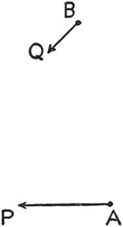
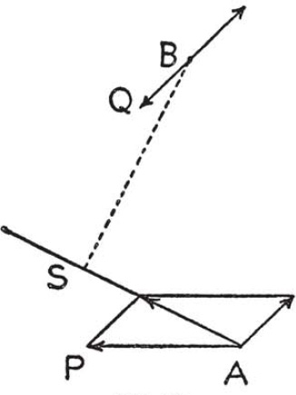

# Part III — Dictionary of Heuristic: R–S

## Reductio ad absurdum and indirect proof

**Reductio ad absurdum and indirect proof** are different but related procedures.

*Reductio ad absurdum* shows the falsity of an assumption by deriving from it a manifest absurdity. "Reduction to an absurdity" is a mathematical procedure but it has some resemblance to irony which is the favorite procedure of the satirist. Irony adopts, to all appearance, a certain opinion and stresses it and overstresses it till it leads to a manifest absurdity.

*Indirect proof* establishes the truth of an assertion by showing the falsity of the opposite assumption. Thus, indirect proof has some resemblance to a politician's trick of establishing a candidate by demolishing the reputation of his opponent.

Both "reductio ad absurdum" and indirect proof are effective tools of discovery which present themselves naturally to an intent mind. Nevertheless, they are disliked by a few philosophers and many beginners, which is understandable; satirical people and tricky politicians do not appeal to everybody. We shall first illustrate the effectiveness of both procedures by examples and discuss objections against them afterwards.

1. *Reductio ad absurdum*. Write numbers using each of the ten digits exactly once so that the sum of the numbers is exactly 100.

We may learn something by trying to solve this puzzle whose statement demands some elucidation.

*What is the unknown?* A set of numbers; and by numbers we mean here, of course, ordinary integers.

*What is given?* The number 100.

*What is the condition?* The condition has two parts. First, writing the desired set of numbers, we must use each of the ten digits, 0, 1, 2, 3, 4, 5, 6, 7, 8 and 9, just once. Second, the sum of all numbers in the set must be 100.

*Keep only a part of the condition, drop the other part*. The first part alone is easy to satisfy. Take the set 19, 28, 37, 46, 50; each figure occurs just once. But, of course, the second part of the condition is not satisfied; the sum of these numbers is 180, not 100. We could, however, do better. "Try, try again." Yes,

$$19 + 28 + 30 + 7 + 6 + 5 + 4 = 99.$$

The first part of the condition is satisfied, and the second part is almost satisfied; we have 99 instead of 100. Of course, we can easily satisfy the second part if we drop the first:

$$19 + 28 + 31 + 7 + 6 + 5 + 4 = 100.$$

The first part is not satisfied: the figure $1$ occurs twice, and $0$ not at all; the other figures are all right. "Try, try again."

After a few unsuccessful trials, however, we may be led to suspect that it is not possible to obtain 100 in the manner required. Eventually the problem arises: *Prove that it is impossible to satisfy both parts of the proposed condition at the same time*.

Quite good students may find that this problem is above their heads. Yet the answer is easy enough if we have the right attitude. *We have to examine the hypothetical situation in which both parts of the condition are satisfied*.

We suspect that this situation cannot actually arise and our suspicion, based on the experience of our unsuccessful trials, has some foundation. Nevertheless, let us keep an open mind and let us face the situation in which hypothetically, supposedly, allegedly both parts of the condition are satisfied. Thus, let us imagine a set of numbers whose sum is 100. They must be numbers with one or two figures. There are ten figures, and these ten figures must be all different, since each of the figures, $0, 1, 2, \ldots, 9$ should occur just once. Thus, the sum of all ten figures must be

$$0 + 1 + 2 + 3 + 4 + 5 + 6 + 7 + 8 + 9 = 45.$$

Some of these figures denote units and others tens. It takes a little sagacity to hit upon the idea that the *sum of the figures denoting tens* may be of some importance. In fact, let $t$ stand for this sum. Then the sum of the remaining figures, denoting units, is $45 - t$. Therefore, the sum of all numbers in the set must be

$$10t + (45 - t) = 100.$$

We have here an equation to determine $t$. It is of the first degree and gives

$$t = \frac{55}{9}.$$

Now, there is something that is definitely wrong. The value of $t$ that we have found is not an integer and $t$ should be, of course, an integer. Starting from the supposition that both parts of the proposed condition can be simultaneously satisfied, we have been led to a manifest absurdity. How can we explain this? Our original supposition must be wrong; both parts of the condition *cannot* be satisfied at the same time. And so we have attained our goal, we have succeeded in proving that the two parts of the proposed condition are incompatible.

Our reasoning is a typical "reductio ad absurdum."

2. *Remarks*. Let us look back at the foregoing reasoning and understand its general trend.

We wish to prove that it is impossible to fulfill a certain condition, that is, that the situation in which all parts of the condition are simultaneously satisfied can never arise. But, if we have proved nothing yet, we have to face the possibility that the situation could arise. Only by facing squarely the hypothetical situation and examining it closely can we hope to perceive some definitely wrong point in it. And we must lay our hand upon some definitely wrong point if we wish to show conclusively that the situation is impossible. Hence we can see that the procedure that was successful in our example is reasonable in general: We have to examine the hypothetical situation in which all parts of the condition are satisfied, *although such a situation appears extremely unlikely*.

The more experienced reader may see here another point. The main step of our procedure consisted in setting up an equation for $t$. Now, we could have arrived at the same equation without suspecting that something was wrong with the condition. If we wish to set up an equation, we have to express in mathematical language that all parts of the condition are satisfied, *although we do not know yet whether it is actually possible to satisfy all these parts simultaneously*.

Our procedure is "open-minded." We may hope to find the unknown satisfying the condition, or we may hope to show that the condition cannot be satisfied. It matters little in one respect: the investigation, if it is well conducted, starts in both cases in the same way, examining the hypothetical situation in which the condition is fulfilled, and shows only in its later course which hope is justified.

Compare *figures*, 2. Compare also *Pappus*; an analysis which ends in disproving the proposed theorem, or in showing that the proposed "problem to find" has no solution, is actually a "reductio ad absurdum."

3. *Indirect proof*. The prime numbers, or primes, are the numbers 2, 3, 5, 7, 11, 13, 17, 19, 23, 29, 31, 37, ... which cannot be resolved into smaller factors, although they are greater than 1. (The last clause excludes the number 1 which, obviously, cannot be resolved into smaller factors, but has a different nature and should not be counted as a prime.) The primes are the "ultimate elements" into which all integers (greater than 1) can be decomposed. For instance,

$$630 = 2 \cdot 3 \cdot 3 \cdot 5 \cdot 7$$

is decomposed into a product of five primes.

Is the series of primes infinite or does it end somewhere? It is natural to suspect that the series of primes never ends. If it ended somewhere, all integers could be decomposed into a finite number of ultimate elements and the world would appear "too poor" in a manner of speaking. Thus arises the problem of proving the existence of an infinity of prime numbers.

This problem is very different from elementary mathematical problems of the usual kind and appears at first inaccessible. Yet, as we said, it is extremely unlikely that there should be a last prime, say $P$. Why is it so unlikely?

Let us face squarely the unlikely situation in which, hypothetically, supposedly, allegedly, there is a last prime $P$. Then we could write down the complete series of primes $2, 3, 5, 7, 11, \ldots, P$. Why is this so unlikely? What is wrong with it? Can we point out anything that is definitely wrong? Indeed, we can. We can construct the number

$$Q = (2 \cdot 3 \cdot 5 \cdot 7 \cdot 11 \ldots P) + 1.$$

This number $Q$ is greater than $P$ and therefore, allegedly, $Q$ cannot be a prime. Consequently, $Q$ must be divisible by a prime. Now, all primes at our disposal are, supposedly, the numbers $2, 3, 5, \ldots, P$ but $Q$, divided by any of these numbers, leaves the rest 1; and so $Q$ is not divisible by any of the primes mentioned which are, hypothetically, all the primes. Now, there is something that is definitely wrong; $Q$ must be either a prime or it must be divisible by some prime. Starting from the supposition that there is a last prime $P$ we have been led to a manifest absurdity. How can we explain this? Our original supposition must be wrong; there cannot be a last prime $P$. And so we have succeeded in proving that the series of prime numbers never ends.

Our proof is a typical indirect proof. (It is a famous proof too, due to Euclid; see Proposition 20 of Book IX of the Elements.)

We have established our theorem (that the series of primes never ends) by disproving its contradictory opposite (that the series of primes ends somewhere) which we have disproved by deducing from it a manifest absurdity. Thus we have combined indirect proof with "reductio ad absurdum"; this combination is also very typical.

4. *Objections*. The procedures which we are studying encountered considerable opposition. Many objections have been raised which are, possibly, only various forms of the same fundamental objection. We discuss here a "practical" form of the objection, which is on our level.

To find a not obvious proof is a considerable intellectual achievement but to learn such a proof, or even to understand it thoroughly costs also a certain amount of mental effort. Naturally enough, we wish to retain some benefit from our effort, and, of course, what we retain in our memory should be true and correct and not false or absurd.

But it seems difficult to retain something true from a "reductio ad absurdum." The procedure starts from a false assumption and derives from it consequences which are equally, but perhaps more visibly, false till it reaches a last consequence which is manifestly false. If we do not wish to store falsehoods in our memory we should forget everything as quickly as possible which is, however, not feasible because all points must be remembered sharply and correctly during our study of the proof.

The objection to indirect proofs can be now stated very briefly. Listening to such a proof, we are obliged to focus our attention all the time upon a false assumption which we should forget and not upon the true theorem which we should retain.

If we wish to judge correctly of the merits of these objections, we should distinguish between two uses of the "reductio ad absurdum," as a tool of research and as a means of exposition, and make the same distinction concerning the indirect proof.

It must be confessed that "reductio ad absurdum" as a means of exposition is not an unmixed blessing. Such a "reductio," especially if it is long, may become very painful indeed for the reader or listener. All the derivations which we examine in succession are correct but all the situations which we have to face are impossible. Even the verbal expression may become tedious if it insists, as it should, on emphasizing that everything is based on an initial assumption; the words "hypothetically," "supposedly," "allegedly" must recur incessantly, or some other device must be applied continually. We wish to reject and forget the situation as impossible but we have to retain and examine it as the basis for the next step, and this inner discord may become unbearable in the long run.

Yet it would be foolish to repudiate "reductio ad absurdum" as a tool of discovery. It may present itself naturally and bring a decision when all other means seem to be exhausted as the foregoing examples may show.

We need some experience to perceive that there is no essential opposition between our two contentions. Experience shows that usually there is little difficulty in converting an indirect proof into a direct proof, or in rearranging a proof found by a long "reductio ad absurdum" into a more pleasant form from which the "reductio ad absurdum" may even completely disappear (or, after due preparation, it may be compressed into a few striking sentences).

In short, if we wish to make full use of our capacities, we should be familiar both with "reductio ad absurdum" and with indirect proof. When, however, we have succeeded in deriving a result by either of these methods we should not fail to look back at the solution and ask: *Can you derive the result differently?*

Let us illustrate by examples what we have said.

5. *Rearranging a reductio ad absurdum*. We look back at the reasoning presented under 1. The reductio ad absurdum started from a situation which, eventually, turned out to be impossible. Let us however carve out a part of the argument which is independent of the initial false assumption and contains positive information. Reconsidering what we have done, we may perceive that this much is doubtless true: If a set of numbers with one or two digits is written so that each of the ten figures occurs just once, then the sum of the set is of the form

$$10t + (45 - t) = 9(t + 5).$$

Thus, this sum is divisible by 9. The proposed puzzle demands however that this sum should be 100. Is this possible? No, it is not, since 100 is not divisible by 9.

The "reductio ad absurdum" which led to the discovery of the argument vanished from our new presentation.

By the way, a reader acquainted with the procedure of "casting out nines" can see now the whole argument at a glance.

6. *Converting an indirect proof*. We look back at the reasoning presented under 3. Reconsidering carefully what we have done, we may find elements of the argument which are independent of any false assumption, yet the best clue comes from a reconsideration of the meaning of the original problem itself.

What do we mean by saying that the series of primes never ends? Evidently, just this: when we have ascertained any finite set of primes as $2, 3, 5, 7, 11, \ldots, P$, where $P$ is the last prime hitherto found, there is always one more prime. Thus, what must we do to prove the existence of an infinity of primes? We have to point out a way of finding a prime different from all primes hitherto found. Thus, our "problem to prove" is in fact reduced to a "problem to find": *Being given the primes* $2, 3, 5, \ldots, P$, *find a new prime $N$ different from all the given primes*.

Having restated our original problem in this new form, we have taken the main step. It is relatively easy now to see how to use the essential parts of our former argument for the new purpose. In fact, the number

$$Q = (2 \cdot 3 \cdot 5 \cdot 7 \cdot 11 \ldots P) + 1$$

is certainly divisible by a prime. Let us take—this is the idea—any prime divisor of $Q$ (for instance, the smallest one) for $N$. (Of course, if $Q$ happens to be a prime, then $N = Q$.) Obviously, $Q$ divided by any of the primes $2, 3, 5, \ldots, P$ leaves the remainder 1 and, therefore, none of these numbers can be $N$ which is a divisor of $Q$. But that is all we need: $N$ is a prime, and different from all hitherto found primes $2, 3, 5, 7, 11, \ldots, P$.

This proof gives a definite procedure of prolonging again and again the series of primes, without limit. Nothing is indirect in it, no impossible situation needs to be considered. Yet, fundamentally, it is the same as our former indirect proof which we have succeeded in converting.

## Redundant

**Redundant.** See *Condition*.

## Routine problem

**Routine problem** may be called the problem to solve the equation $x^2 - 3x + 2 = 0$ if the solution of the general quadratic equation was explained and illustrated before so that the student has nothing to do but to substitute the numbers $-3$ and $2$ for certain letters which appear in the general solution. Even if the quadratic equation was not solved generally in "letters" but half a dozen similar quadratic equations with numerical coefficients were solved just before, the problem should be called a "routine problem." In general, a problem is a "routine problem" if it can be solved either by substituting special data into a formerly solved general problem, or by following step by step, without any trace of originality, some well-worn conspicuous example. Setting a routine problem, the teacher thrusts under the nose of the student an immediate and decisive answer to the question: *Do you know a related problem?* Thus, the student needs nothing but a little care and patience in following a cut-and-dried precept, and he has no opportunity to use his judgment or his inventive faculties.

Routine problems, even many routine problems, may be necessary in teaching mathematics but to make the students do no other kind is inexcusable. Teaching the mechanical performance of routine mathematical operations and nothing else is well under the level of the cookbook because kitchen recipes do leave something to the imagination and judgment of the cook but mathematical recipes do not.

## Rules of discovery

**Rules of discovery.** The first rule of discovery is to have brains and good luck. The second rule of discovery is to sit tight and wait till you get a bright idea.

It may be good to be reminded somewhat rudely that certain aspirations are hopeless. Infallible rules of discovery leading to the solution of all possible mathematical problems would be more desirable than the philosophers' stone, vainly sought by the alchemists. Such rules would work magic; but there is no such thing as magic. To find unfailing rules applicable to all sorts of problems is an old philosophical dream; but this dream will never be more than a dream.

A reasonable sort of heuristic cannot aim at unfailing rules; but it may endeavor to study procedures (mental operations, moves, steps) which are typically useful in solving problems. Such procedures are practiced by every sane person sufficiently interested in his problem. They are hinted by certain stereotyped questions and suggestions which intelligent people put to themselves and intelligent teachers to their students. A collection of such questions and suggestions, stated with sufficient generality and neatly ordered, may be less desirable than the philosophers' stone but can be provided. The list we study provides such a collection.

## Rules of style

**Rules of style.** The first rule of style is to have something to say. The second rule of style is to control yourself when, by chance, you have two things to say; say first one, then the other, not both at the same time.

## Rules of teaching

**Rules of teaching.** The first rule of teaching is to know what you are supposed to teach. The second rule of teaching is to know a little more than what you are supposed to teach.

First things come first. The author of this book does not think that all rules of conduct for teachers are completely useless; otherwise, he would not have dared to write a whole book about the conduct of teachers and students. Yet it should not be forgotten that a teacher of mathematics should know some mathematics, and that a teacher wishing to impart the right attitude of mind toward problems to his students should have acquired that attitude himself.

## Separate the various parts of the condition

**Separate the various parts of the condition.** Our first duty is to understand the problem. Having understood the problem as a whole, we go into detail. We consider its principal parts, the unknown, the data, the condition, each by itself. When we have these parts well in mind but no particularly helpful idea has yet occurred to us, we go into further detail. We consider the various data, each datum by itself. Having understood the condition as a whole, we *separate its various parts*, and we consider each part by itself.

We see now the role of the suggestion that we have to discuss here. It tends to provoke a step that we have to take when we are trying to see the problem distinctly and have to go into finer and finer detail. It is a step in *Decomposing and recombining*.

*Separate the various parts of the condition. Can you write them down?* We often have opportunity to ask this question when we are *Setting up equations*.

## Setting up equations

**Setting up equations** is like translation from one language into another (*Notation*, 1). This comparison, used by Newton in his *Arithmetica Universalis*, may help to clarify the nature of certain difficulties often felt both by students and by teachers.

1. To set up equations means to express in mathematical symbols a condition that is stated in words; it is translation from ordinary language into the language of mathematical formulas. The difficulties which we may have in setting up equations are difficulties of translation.

In order to translate a sentence from English into French two things are necessary. First, we must understand thoroughly the English sentence. Second, we must be familiar with the forms of expression peculiar to the French language. The situation is very similar when we attempt to express in mathematical symbols a condition proposed in words. First, we must understand thoroughly the condition. Second, we must be familiar with the forms of mathematical expression.

An English sentence is relatively easy to translate into French if it can be translated word for word. But there are English idioms which cannot be translated into French word for word. If our sentence contains such idioms, the translation becomes difficult; we have to pay less attention to the separate words, and more attention to the whole meaning; before translating the sentence, we may have to rearrange it.

It is very much the same in setting up equations. In easy cases, the verbal statement splits almost automatically into successive parts, each of which can be immediately written down in mathematical symbols. In more difficult cases, the condition has parts which cannot be immediately translated into mathematical symbols. If this is so, we must pay less attention to the verbal statement, and concentrate more upon the meaning. Before we start writing formulas, we may have to rearrange the condition, and we should keep an eye on the resources of mathematical notation while doing so.

In all cases, easy or difficult, we have to understand the condition, to *separate the various parts of the condition*, and to ask: *Can you write them down?* In easy cases, we succeed without hesitation in dividing the condition into parts that can be written down in mathematical symbols; in difficult cases, the appropriate division of the condition is less obvious.

The foregoing explanation should be read again after the study of the following examples.

2. *Find two quantities whose sum is* 78 *and whose product is* 1296.

We divide the page by a vertical line. On one side, we write the verbal statement split into appropriate parts. On the other side, we write algebraic signs, opposite to the corresponding part of the verbal statement. The original is on the left, the translation into symbols on the right.

| In English | In algebraic language |
|------------|------------------------|
| Find two quantities | $x, \quad y$ |
| whose sum is 78 and | $x + y = 78$ |
| whose product is 1296 | $xy = 1296.$ |

In this case, the verbal statement splits almost automatically into successive parts, each of which can be immediately written down in mathematical symbols.

3. *Find the breadth and the height of a right prism with square base, being given the volume*, 63 *cu. in., and the area of the surface*, 102 *sq. in*.

*What are the unknowns?* The side of the base, say $x$, and the altitude of the prism, say $y$.

*What are the data?* The volume, 63, and the area, 102.

*What is the condition?* The prism whose base is a square with side $x$ and whose altitude is $y$ must have the volume 63 and the area 102.

*Separate the various parts of the condition*. There are two parts, one concerned with the volume, the other with the area.

We can scarcely hesitate in dividing the whole condition just in these two parts; but we cannot write down these parts "immediately." We must know how to calculate the volume and the various parts of the area. Yet, if we know that much geometry, we can easily restate both parts of the condition so that the translation into equations is feasible. We write on the left hand side of the page an essentially rearranged and expanded statement of the problem, ready for translation into algebraic language.

| In English | In algebraic language |
|------------|------------------------|
| Of a right prism with square base find the side of the base | $x$ |
| and the altitude. | $y$ |
| First. The volume is given. | $63$ |
| The area of the base which is a square with side $x$ | $x^2$ |
| and the altitude | $y$ |
| determine the volume which is their product. | $x^2 y = 63$ |
| Second. The area of the surface is given. | $102$ |
| The surface consists of two squares with side $x$ | $2x^2$ |
| and of four rectangles, each with base $x$ and altitude $y$, | $4xy$ |
| whose sum is the area. | $2x^2 + 4xy = 102.$ |

4. *Being given the equation of a straight line and the coordinates of a point, find the point which is symmetrical to the given point with respect to the given straight line*.

This is a problem of plane analytic geometry.

*What is the unknown?* A point, with coordinates, say, $p, q$.

*What is given?* The equation of a straight line, say $y = mx + n$, and a point with coordinates, say, $a, b$.

*What is the condition?* The points $(a, b)$ and $(p, q)$ are symmetrical to each other with respect to the line $y = mx + n$.

We now reach the essential difficulty which is to divide the condition into parts each of which can be expressed in the language of analytic geometry. The nature of this difficulty must be well understood. A decomposition of the condition into parts may be logically unobjectionable and nevertheless useless. What we need here is a decomposition into parts which are fit for analytic expression. In order to find such a decomposition we must *go back to the definition* of symmetry, but keep an eye on the resources of analytic geometry. What is meant by symmetry with respect to a straight line? What geometric relations can we express simply in analytic geometry? We concentrate upon the first question, but we should not forget the second. Thus, eventually, we may find the decomposition which we are going to state.

| In English | In algebraic language |
|------------|------------------------|
| The given point | $(a, b)$ |
| and the point required are so related that | $(p, q)$ |
| first, the line joining them is perpendicular to the given line, and | $\dfrac{q - b}{p - a} = -\dfrac{1}{m}$ |
| second, the midpoint of the line joining them lies on the given line. | $\dfrac{b + q}{2} = m\,\dfrac{a + p}{2} + n.$ |

## Signs of progress

**Signs of progress.** As Columbus and his companions sailed westward across an unknown ocean they were cheered whenever they saw birds. They regarded a bird as a favorable sign, indicating the nearness of land. But in this they were repeatedly disappointed. They watched for other signs too. They thought that floating seaweed or low banks of cloud might indicate land, but they were again disappointed. One day, however, the signs multiplied. On Thursday, the 11th of October, 1492, "they saw sandpipers, and a green reed near the ship. Those of the caravel *Pinta* saw a cane and a pole, and they took up another small pole which appeared to have been worked by iron; also another bit of cane, a land-plant, and a small board. The crew of the caravel *Niña* also saw signs of land, and a small branch covered with berries. Everyone breathed afresh and rejoiced at these signs." And in fact the next day they sighted land, the first island of a New World.

Our undertaking may be important or unimportant, our problem of any kind—when we are working intensely, we watch eagerly for signs of progress as Columbus and his companions watched for signs of approaching land. We shall discuss a few examples in order to understand what can be reasonably regarded as a sign of approaching the solution.

1. *Examples*. I have a chess problem. I have to mate the black king in, say, two moves. On the chessboard there is a white knight, quite a distance from the black king, that is apparently superfluous. What is it good for? I am obliged to leave this question unanswered at first. Yet after various trials, I hit upon a new move and observe that it would bring that apparently superfluous white knight into play. This observation gives me a new hope. I regard it as a favorable sign: that new move has some chance to be the right one. Why?

In a well-constructed chess problem there is no superfluous piece. Therefore, we have to take into account all chessmen on the board; we have to *use all the data*. The correct solution does certainly use all the pieces, even that apparently superfluous white knight. In this last respect, the new move that I contemplate agrees with the correct move that I am supposed to find. The new move looks like the correct move; it might be the correct move.

It is interesting to consider a similar situation in a mathematical problem. My task is to express the area of a triangle in terms of its three sides, $a, b$, and $c$. I have already made some sort of plan. I know, more or less clearly, which geometrical connections I have to take into account and what sort of calculations I have to perform. Yet I am not quite sure whether my plan will work. If now, proceeding along the line prescribed by my plan, I observe that the quantity

$$\sqrt{b + c - a}$$

enters into the expression of the area I am about to construct, I have good reason to be cheered. Why?

In fact, it must be taken into account that the sum of any two sides of a triangle is greater than the third side. This involves a certain restriction. The given lengths, $a, b$, and $c$ cannot be quite arbitrary; for instance, $b + c$ must be greater than $a$. This is an essential part of the condition, and we should *use the whole condition*. If $b + c$ is not greater than $a$ the formula I seek is bound to become illusory. Now, the square root displayed above becomes imaginary if $b + c - a$ is negative—that is, if $b + c$ is less than $a$—and so the square root becomes unfit to represent a real quantity under just those circumstances under which the desired expression is bound to become illusory. Thus my formula, into which that square root enters, has an important property in common with the true formula for the area. My formula looks like the true formula; it might be the true formula.

Here is one more example. Some time ago, I wished to prove a theorem in solid geometry. Without much trouble I found a first remark that appeared to be pertinent; but then I got stuck. Something was missing to finish the proof. When I gave up that day I had a much clearer notion than at the outset how the proof should look, how the gap should be filled; but I was not able to fill it. The next day, after a good night's rest, I looked again into the question and soon hit upon an analogous theorem in plane geometry. In a flash I was convinced that now I had got hold of the solution and I had, I think, good reason too to be convinced. Why?

In fact, *analogy* is a great guide. The solution of a problem in solid geometry often depends on an analogous problem in plane geometry (see *Analogy*, 3–7). Thus, in my case, there was a chance from the outset that the desired proof would use as a lemma some theorem of plane geometry of the kind which actually came to my mind. "This theorem looks like the lemma I need; it might be the lemma I need"—such was my reasoning.

If Columbus and his men had taken the trouble to reason explicitly, they would have reasoned in some similar way. They knew how the sea looks near the shore. They knew that, more often than on the open sea, there are birds in the air, coming from the land, and objects floating in the water, detached from the seashore. Many of the men must have observed such things when from former voyages they had returned to their home port. The day before that memorable date on which they sighted the island of San Salvador, as the floating objects in the water became so frequent, they thought: "It looks as if we were approaching some land; we may be approaching some land" and "everyone breathed afresh and rejoiced at these signs."

2. *Heuristic character of signs of progress*. Let us insist upon a point which is perhaps already clear to everyone; but it is very important and, therefore, it should be completely clear.

The type of reasoning illustrated by the foregoing examples deserves to be noticed and taken into account seriously, although it yields only a plausible indication and not an unfailing certainty. Let us restate pedantically, at full length, in rather unnatural detail, one of these reasonings:

> If we are approaching land, we often see birds.
>
> Now we see birds.
>
> Therefore, probably, we are approaching land.

Without the word "probably" the conclusion would be an outright fallacy. In fact, Columbus and his companions saw birds many times but were disappointed later. Just once came the day on which they saw sandpipers followed by the day of discovery.

With the word "probably" the conclusion is reasonable and natural but by no means a proof, a demonstrative conclusion; it is only an indication, a heuristic suggestion. It would be a great mistake to forget that such a conclusion is only probable, and to regard it as certain. But to disregard such conclusions entirely would be a still greater mistake. If you take a heuristic conclusion as certain, you may be fooled and disappointed; but if you neglect heuristic conclusions altogether you will make no progress at all. The most important signs of progress are heuristic. Should we trust them? Should we follow them? Follow, but keep your eyes open. Trust but look. And never renounce your judgment.

3. *Clearly expressible signs*. We can look at the foregoing examples from another point of view.

In one of these examples, we regarded as a favorable sign that we succeeded in bringing into play a datum not used before (the white knight). We were quite right to so regard it. In fact, to solve a problem is, essentially, to *find the connection between the data and the unknown*. Moreover we should, at least in well-stated problems, *use all the data*, connect each of them with the unknown. Thus, bringing one more datum into play is quite properly felt as progress, as a step forward.

In another example, we regarded as a favorable sign that an essential clause of the condition was appropriately taken into account by our formula. We were quite right to so regard it. In fact, we should *use the whole condition*. Thus, taking into account one more clause of the condition is justly felt as progress, as a move in the right direction.

In still another example, we regarded as a favorable sign the emergence of a simpler analogous problem. This also is justified. Indeed, analogy is one of the main sources of invention. If other means fail, we should try to *imagine an analogous problem*. Therefore, if such a problem emerges spontaneously, by its own accord, we naturally feel elated; we feel that we are approaching the solution.

After these examples, we can now easily grasp the general idea. There are certain mental operations typically useful in solving problems. (The most usual operations of this kind are listed in this book.) If such a typical operation succeeds (if one more datum is connected with the unknown—one more clause of the condition is taken into account—a simpler analogous problem is introduced) its success is felt as a sign of progress. Having understood this essential point, we can express with some clearness the nature of still other signs of progress. All we have to do is to read down our list and look at the various questions and suggestions from our newly acquired point of view.

Thus, understanding clearly the nature of the unknown means progress. Clearly disposing the various data so that we can easily recall any one also means progress. Visualizing vividly the condition as a whole may mean an essential advance; and separating the condition into appropriate parts may be an important step forward. When we have found a figure that we can easily imagine, or a notation that we can easily retain, we can reasonably believe that we have made some progress. Recalling a *problem related to ours and solved before* may be a decisive move in the right direction.

And so on, and so forth. To each mental operation clearly conceived corresponds a certain sign clearly expressible. Our list, appropriately read, lists also signs of progress.

Now, the questions and suggestions of our list are simple, obvious, just plain common sense. This has been said repeatedly and the same can be said of the connected signs of progress we discuss here. To read such signs no occult science is needed, only a little common sense and, of course, a little experience.

4. *Less clearly expressible signs*. When we work intently, we feel keenly the pace of our progress: when it is rapid we are elated; when it is slow we are depressed. We feel such differences quite clearly without being able to point out any distinct sign. Moods, feelings, general aspects of the situation serve to indicate our progress. They are not easy to express. "It looks good to me," or "It is not so good," say the unsophisticated. More sophisticated people express themselves with some nuance: "This is a well-balanced plan," or "No, something is still lacking and that spoils the harmony." Yet behind primitive or vague expressions there is an unmistakable feeling which we follow with confidence and which leads us frequently in the right direction. If such feeling is very strong and emerges suddenly, we speak of inspiration. People usually cannot doubt their inspirations and are sometimes fooled by them. In fact, we should treat guiding feelings and inspirations just as we treat the more clearly expressible signs of progress which we have considered before. Trust, but keep your eyes open.

Always follow your inspiration—with a grain of doubt.

[What is the nature of those guiding feelings? Is there some less vague meaning behind words of such aesthetic nuances as "well-balanced," or "harmonious"? These questions may be more speculative than practical, but the present context indicates answers which perhaps deserve to be stated: Since the more clearly expressible signs of progress are connected with the success or failure of certain rather definite mental operations, we may suspect that our less clearly expressible guiding feelings may be similarly connected with other, more obscure, mental activities—perhaps with activities whose nature is more "psychological" and less "logical."]

5. *How signs help*. I have a plan. I see pretty clearly where I should begin and which steps I should take first. Yet I do not quite see the lay-out of the road farther on; I am not quite certain that my plan will work; and, in any case, I have still a long way to go. Therefore, I start out cautiously in the direction indicated by my plan and keep a lookout for signs of progress. If the signs are rare or indistinct, I become more hesitant. And if for a long time they fail to appear altogether, I may lose courage, turn back, and try another road. On the other hand, if the signs become more frequent as I proceed, if they multiply, my hesitation fades, my spirits rise, and I move with increasing confidence, just as Columbus and his companions did before sighting the island of San Salvador.

Signs may guide our acts. Their absence may warn us of a blind alley and save us time and useless exertion; their presence may cause us to concentrate our effort upon the right spot.

Yet signs may also be deceptive. I once abandoned a certain path for lack of signs, but a man who came after me and followed that path a little farther made an important discovery—to my great annoyance and long-lasting regret. He not only had more perseverance than I did but he also read correctly a certain sign which I had failed to notice. Again, I may follow a road cheerfully, encouraged by favorable signs, and run against an unsuspected and insurmountable obstacle.

Yes, signs may misguide us in any single case, but they guide us right in the majority of them. A hunter may misinterpret now and then the traces of his game but he must be right on the average, otherwise he could not make a living by hunting.

It takes experience to interpret the signs correctly. Some of Columbus's companions certainly knew by experience how the sea looks near the shore and so they were able to read the signs which suggested that they were approaching land. The expert knows by experience how the situation looks and feels when the solution is near and so he is able to read the signs which indicate that he is approaching it. The expert knows more signs than the inexperienced, and he knows them better; his main advantage may consist in such knowledge. An expert hunter notices traces of game and appraises even their freshness or staleness where the inexperienced one is unable to see anything.

The main advantage of the exceptionally talented may consist in a sort of extraordinary mental sensibility. With exquisite sensibility, he feels subtle signs of progress or notices their absence where the less talented are unable to perceive a difference.

[6. *Heuristic syllogism*. In section 2 we came across a mode of heuristic reasoning that deserves further consideration and a technical term. We begin by restating that reasoning in the following form:

> If we are approaching land, we often see birds.
>
> Now we see birds.
>
> Therefore, it becomes more credible that we are approaching land.

The two statements above the horizontal line may be called the *premises*, the statement under the line, the *conclusion*. And the whole pattern of reasoning may be termed a *heuristic syllogism*.

The premises are stated here in the same form as in section 2, but the conclusion is more carefully worded. An essential circumstance is better emphasized. Columbus and his men conjectured from the beginning that they would eventually find land sailing westward; and they must have given some credence to this conjecture, otherwise they would not have started out at all. As they proceeded, they related every incident, major or minor, to their dominating question: "Are we approaching land?" Their confidence rose and fell as events occurred or failed to occur, and each man's beliefs fluctuated more or less differently according to his background and character. The whole dramatic tension of the voyage is due to such fluctuations of confidence.

The heuristic syllogism quoted exhibits a reasonable ground for a change in the level of confidence. To occasion such changes is the essential role of this kind of reasoning and this point is better expressed by the wording given here than by the one in section 2.

The general pattern suggested by our example can be exhibited thus:

$$
\begin{array}{l}
\text{If } A \text{ is true, then } B \text{ is also true, as we know.} \\
\text{Now, it turns out that } B \text{ is true.} \\
\hline
\text{Therefore, } A \text{ becomes more credible.}
\end{array}
$$

Still shorter:

$$
\begin{array}{l}
\text{If } A \text{ then } B \\
B \text{ true} \\
\hline
A \text{ more credible}
\end{array}
$$

In this schematic statement the horizontal line stands for the word "therefore" and expresses the implication, the essential link between the premises and the conclusion.]

[7. *Nature of plausible reasoning*. In this little book we are discussing a philosophical question. We discuss it as practically and informally and as far from high-brow modes of expression as we can, but nevertheless our subject is philosophical. It is concerned with the nature of heuristic reasoning and, by extension, with a kind of reasoning which is nondemonstrative although important and which we shall call, for lack of a better term, *plausible* reasoning.

The signs that convince the inventor that his idea is good, the indications that guide us in our everyday affairs, the circumstantial evidence of the lawyer, the inductive evidence of the scientist, statistical evidence invoked in many and diverse subjects—all these kinds of evidence agree in two essential points. First, they do not have the certainty of a strict demonstration. Second, they are useful in acquiring essentially new knowledge, and even indispensable to any not purely mathematical or logical knowledge, to any knowledge concerned with the physical world. We could call the reasoning that underlies this kind of evidence "heuristic reasoning" or "inductive reasoning" or (if we wish to avoid stretching the meaning of existing terms) "plausible reasoning." We accept here the last term.

The heuristic syllogism introduced in the foregoing may be regarded as the simplest and most widespread pattern of plausible reasoning. It reminds us of a classical pattern of demonstrative reasoning, of the so-called "modus tollens of hypothetical syllogism." We exhibit here both patterns side by side:

$$
\begin{array}{ccc}
\textit{Demonstrative} & \qquad & \textit{Heuristic} \\
\text{If } A \text{ then } B & & \text{If } A \text{ then } B \\
B \text{ false} & & B \text{ true} \\
\hline
A \text{ false} & & A \text{ more credible}
\end{array}
$$

The comparison of these patterns may be instructive. It may grant us an insight, not easily obtainable elsewhere, into the nature of plausible (heuristic, inductive) reasoning.

Both patterns have the same first premise:

$$\text{If } A \text{ then } B.$$

They differ in the second premise. The statements

$$B \text{ false} \qquad B \text{ true}$$

are exactly opposite to each other but they are of "similar logical nature," they are on the same "logical level." The great difference arises after the premises. The conclusions

$$A \text{ false} \qquad A \text{ more credible}$$

are on different logical levels and their relations to their respective premises are of a different logical nature.

The conclusion of the demonstrative syllogism is of the same logical nature as the premises. Moreover, this conclusion is fully expressed and is fully supported by the premises. If my neighbor and I agree to accept the premises, we cannot reasonably disagree about accepting also the conclusion, however different our tastes or other convictions may be.

The conclusion of the heuristic syllogism differs from the premises in its logical nature; it is more vague, not so sharp, less fully expressed. This conclusion is comparable to a force, has direction and magnitude. It pushes us in a certain direction: $A$ becomes *more* credible. The conclusion also has a certain strength: $A$ may become *much more* credible, or *just a little more* credible. The conclusion is not fully expressed and is not fully supported by the premises. *The direction is expressed and is implied by the premises, the magnitude is not*. For any reasonable person, the premises involve that $A$ becomes more credible (certainly not less credible). Yet my neighbor and I can honestly disagree *how much* more credible $A$ becomes, since our temperaments, our backgrounds, and our unstated reasons may be different.

In the demonstrative syllogism the premises constitute a *full basis* on which the conclusion rests. If both premises stand, the conclusion stands too. If we receive some new information that does not change our belief in the premises, it cannot change our belief in the conclusion.

In the heuristic syllogism the premises constitute only one *part of the basis* on which the conclusion rests, the fully expressed, the "visible" part of the basis; there is an unexpressed, invisible part, formed by something else, by inarticulate feelings perhaps, or by unstated reasons. In fact, it can happen that we receive some new information that leaves our belief in both premises completely intact, but influences the trust we put in $A$ in a way just opposite to that expressed in the conclusion. To find $A$ more plausible on the ground of the premises of our heuristic syllogism is only reasonable. Yet tomorrow I may find grounds, not interfering at all with these premises, that make $A$ appear less plausible, or even definitively refute it. The conclusion may be shaken and even overturned completely by commotions in the invisible parts of its foundation, although the premises, the visible part, stand quite firm.

These remarks seem to make somewhat more understandable the nature of heuristic, inductive, and other sorts of not demonstrative plausible reasoning, which appear so baffling and elusive when approached from the point of view of purely demonstrative logic. Many more concrete examples, the consideration of other kinds of heuristic syllogism, and an investigation of the concept of probability and other allied concepts seem to be necessary to complete the approach here chosen; *cf*. the author's *Mathematics and Plausible Reasoning*.]

Heuristic reasons are important although they prove nothing. To clarify our heuristic reasons is also important although behind any reason clarified there are many others that remain obscure and are perhaps still more important.

## Specialization

**Specialization** is passing from the consideration of a given set of objects to that of a smaller set, or of just one object, contained in the given set. Specialization is often useful in the solution of problems.

1. *Example*. In a triangle, let $r$ be the radius of the inscribed circle, $R$ the radius of the circumscribed circle, and $H$ the longest altitude. Then

$$r + R \leqq H.$$

We have to prove (or disprove) this theorem; we have a "problem to prove."

The proposed theorem is of an unusual sort. We can scarcely remember any theorem about triangles with a similar conclusion. If nothing else occurs to us, we may test some *special case* of this unfamiliar assertion. Now, the best known special triangle is the equilateral triangle for which

$$r = \frac{H}{3} \qquad R = \frac{2H}{3}$$

so that, in this case, the assertion is correct.

If no other idea presents itself, we may test the *more extended special case* of isosceles triangles. The form of an isosceles triangle varies with the angle at the vertex and there are two extreme (or limiting) cases, the one in which the angle at the vertex becomes $0^\circ$, and the other in which it becomes $180^\circ$. In the first extreme case the base of the isosceles triangle vanishes and visibly

$$r = 0 \qquad R = \frac{1}{2} H$$

thus, the assertion is verified. In the second limiting case, however, all three heights vanish and

$$r = 0 \qquad R = \infty \qquad H = 0.$$

The assertion is not verified. We have proved that the proposed theorem is false, and so we have solved our problem.

By the way, it is clear that the assertion is also false for very flat isosceles triangles whose angle at the vertex is nearly $180^\circ$ so that we may "officially" disregard the extreme cases whose consideration may appear as not quite "orthodox."

2. "L'exception confirme la règle." "The exception proves the rule." We must take this widely known saying as a joke, laughing at the laxity of a certain sort of logic. If we take matters seriously, one exception is enough, of course, to refute irrefragably any would-be rule or general statement. The most usual and, in some respects, the best method to refute such a statement consists precisely in exhibiting an object that does not comply with it; such an object is called a *counter-example* by certain writers.

The allegedly general statement is concerned with a certain set of objects; in order to refute the statement we *specialize*, we pick out from the set an object that does not comply with it. The foregoing example (under 1) shows how it is done. We may examine at first any simple special case, that is, any object chosen more or less at random which we can easily test. If the test shows that the case is not in accordance with the general statement, the statement is refuted and our task finished. If, however, the object examined complies with the statement we may possibly derive some hint from its examination. We may receive the impression that the statement could be true, after all, and some suggestion in which direction we should seek the proof. Or, we may receive, as in our example under 1, some suggestion in which direction we should seek the counter-example, that is, which other special cases should we test. We may modify the case we have just examined, vary it, investigate some more extended special case, look around for extreme cases, as exemplified under 1.

Extreme cases are particularly instructive. If a general statement is supposed to apply to all mammals it must apply even to such an unusual mammal as the whale. Let us not forget this extreme case of the whale. Examining it, we may refute the general statement; there is a good chance for that, since such extreme cases are apt to be overlooked by the inventors of generalizations. If, however, we find that the general statement is verified even in the extreme case, the inductive evidence derived from this verification will be strong, just because the prospect of refutation was strong. Thus, we are tempted to reshape the saying from which we started: "Prospective exceptions test the rule."

3. *Example*. Given the speeds of two ships and their positions at a certain moment; each ship steers a rectilinear course with constant speed. Find the distance of the two ships when they are nearest to each other.

*What is the unknown?* The shortest distance between two moving bodies. The bodies have to be considered as material points.

*What are the data?* The initial positions of the moving material points, and the speed of each. These speeds are constant in amount and direction.

*What is the condition?* The distance has to be ascertained when it is the shortest, that is, at the moment when the two moving points (ships) are nearest to each other.

*Draw a figure. Introduce suitable notation*. In Fig. 19, the points $A$ and $B$ mark the given initial positions of the two ships. The directed line-segments (vectors) $AP$ and $BQ$ represent the given speeds so that the first ship proceeds along the straight line through the points $A$ and $P$, and covers the distance $AP$ in unit time. The second ship travels similarly along the straight line $BQ$.

*What is the unknown?* The shortest distance of the two ships, the one traveling along $AP$ and the other along $BQ$.

It is clear by now what we should find; yet, if we wish to use only elementary means, we may be still in the dark how we should find it. The problem is not too easy and its difficulty has some peculiar nuance which we may try to express by saying that "there is too much variety." The initial positions, $A$ and $B$, and the speeds, $AP$ and $BQ$, can be given in various ways; in fact, the four points $A, B, P, Q$ may be chosen arbitrarily. Now, whatever the data may be, the required solution must apply and we do not see yet how to fit the same solution to all these possibilities. Out of such feeling of "too much variety" this question and answer may eventually emerge:

*Could you imagine a more accessible related problem? A more special problem?* Of course, there is the extreme special case in which one of the speeds vanishes. Yes, the ship in $B$ may lay at anchor, $Q$ may coincide with $B$. The shortest distance from the ship at rest to the moving ship is the perpendicular to the straight line along which the latter moves.

4. If the foregoing idea emerges with the premonition that there is more ahead and with the feeling that that extreme special case (which could appear as too simple to be relevant) has some role to play—then it is a bright idea indeed.

*Here is a problem related to yours*, that specialized problem you just solved. *Could you use it? Could you use its result? Should you introduce some auxiliary element in order to make its use possible?* It should be used, but how? How could the result of the case in which $B$ is at rest be used in the case in which $B$ is moving? Rest is a *special case* of motion. And motion is relative—and, therefore, whatever the given velocity of $B$ may be I can consider $B$ as being at rest! Here is the idea more clearly: If I impart to the whole system, consisting of both ships, the same uniform motion, the relative positions do not change, the relative distances remain the same, and so does especially the shortest relative distance of the two ships required by the problem. Now, I can impart a motion that reduces the speed of one of the ships to zero, and so reduces the general case of the problem to the special case just solved. Let me add a velocity, opposite to $BQ$ but of the same amount, both to $BQ$ and to $AP$. This is the auxiliary element that makes the use of the special result possible.

See Fig. 20 for the construction of the shortest distance, $BS$.

5. The foregoing solution (under 3, 4) has a logical pattern that deserves to be analyzed and remembered.

In order to solve our original problem (under 3, first lines) we have solved first another problem which we may call appropriately the auxiliary problem (under 3, last lines). This auxiliary problem is a special case of the original problem (the extreme special case in which one of the two ships is at rest). The original problem was proposed, the auxiliary problem invented in the course of the solution. The original problem looked hard, the solution of the auxiliary problem was immediate. The auxiliary problem was, as a special case, in fact much *less ambitious* than the original problem. How is it then possible that we were able to solve the original problem on the basis of the auxiliary problem? Because in reducing the original problem to the auxiliary problem, we added a substantial supplementary remark (on relativity of motion).

We succeeded in solving our original problem thanks to two remarks. First, we invented an advantageous auxiliary problem. Second, we discovered an appropriate supplementary remark to pass from the auxiliary problem to the original problem. We solved the proposed problem in two steps as we might cross a creek in two steps provided we were lucky enough to discover an appropriate stone in the middle which could serve as a momentary foothold.

To sum up, we used the less difficult, less ambitious, special, auxiliary problem as a *stepping stone* in solving the more difficult, more ambitious, general, original problem.

6. Specialization has many other uses which we cannot discuss here. It may be just mentioned that it can be useful in testing the solution (*Can you check the result?* 2).

A somewhat primitive kind of specialization is often useful to the teacher. It consists in giving some *concrete interpretation* to the abstract mathematical elements of the problem. For instance, if there is a rectangular parallelepiped in the problem, the teacher may take the classroom in which he talks as example (section 8). In solid analytic geometry, a corner of the classroom may serve as the origin of coordinates, the floor and two walls as coordinate planes, two horizontal edges of the room and one vertical edge as coordinate axes. Explaining the notion of a surface of revolution, the teacher draws a curve with chalk on the door and opens it slowly. These are certainly simple tricks but nothing should be omitted that has some chance to bring home mathematics to the students: Mathematics being a very abstract science should be presented very concretely.

## Subconscious work

**Subconscious work.** One evening I wished to discuss with a friend a certain author but I could not remember the author's name. I was annoyed, because I remembered fairly well one of his stories. I remembered also some story about the author himself which I wanted to tell; I remembered, in fact, everything except the name. Repeatedly, I tried to recollect that name but all in vain. The next morning, as soon as I thought of the annoyance of the evening before, the name occurred to me without any effort.

The reader, very likely, remembers some similar experience of his own. And, if he is a passionate problem-solver, he has probably had some similar experience with problems. It often happens that you have no success at all with a problem; you work very hard yet without finding anything. But when you come back to the problem after a night's rest, or a few days' interruption, a bright idea appears and you solve the problem easily. The nature of the problem matters little; a forgotten word, a difficult word from a crossword-puzzle, the beginning of an annoying letter, or the solution of a mathematical problem may occur in this way.

Such happenings give the impression of *subconscious work*. The fact is that a problem, after prolonged absence, may return into consciousness essentially clarified, much nearer to its solution than it was when it dropped out of consciousness. Who clarified it, who brought it nearer to the solution? Obviously, oneself, working at it *subconsciously*. It is difficult to give any other answer; although psychologists have discovered the beginnings of another answer which may turn out some day to be more satisfactory.

Whatever may or may not be the merits of the theory of subconscious work, it is certain that there is a limit beyond which we should not force the conscious reflection. There are certain moments in which it is better to leave the problem alone for a while. "Take counsel of your pillow" is an old piece of advice. Allowing an interval of rest to the problem and to ourselves, we may obtain more tomorrow with less effort. "If today will not, tomorrow may" is another old saying. But it is desirable not to set aside a problem to which we wish to come back later without the impression of some achievement; at least some little point should be settled, some aspect of the question somewhat elucidated when we quit working.

Only such problems come back improved whose solution we passionately desire, or for which we have worked with great tension; conscious effort and tension seem to be necessary to set the subconscious work going. At any rate, it would be too easy if it were not so; we could solve difficult problems just by sleeping and waiting for a bright idea.

Past ages regarded a sudden good idea as an inspiration, a gift of the gods. You must deserve such a gift by work, or at least by a fervent wish.

## Symmetry

**Symmetry** has two meanings, a more usual, particular, geometric meaning, and a less usual, general, logical meaning.

Elementary solid geometry considers two kinds of symmetry, symmetry with respect to a plane (called plane of symmetry), and symmetry with respect to a point (called center of symmetry). The human body appears to be fairly symmetrical but in fact it is not; many interior organs are quite unsymmetrically disposed. A statue may be completely symmetrical with respect to a vertical plane so that its two halves appear completely "interchangeable."

In a more general acceptance of the word, a whole is termed symmetric if it has interchangeable parts. There are many kinds of symmetry; they differ in the number of interchangeable parts, and in the operations which exchange the parts. Thus, a cube has high symmetry; its 6 faces are interchangeable with each other, and so are its 8 vertices, and so are its 12 edges. The expression

$$yz + zx + xy$$

is symmetric; any two of the three letters $x, y, z$ can be interchanged without changing the expression.

Symmetry, in a general sense, is important for our subject. If a problem is symmetric in some ways we may derive some profit from noticing its interchangeable parts and it often pays to treat those parts which play the same role in the same fashion (see *Auxiliary elements*, 3).

Try to treat symmetrically what is symmetrical, and do not destroy wantonly any natural symmetry. However, we are sometimes compelled to treat unsymmetrically what is naturally symmetrical. A pair of gloves is certainly symmetrical; nevertheless, nobody handles the pair quite symmetrically, nobody puts on both gloves at the same time, but one after the other.

Symmetry may also be useful in checking results; see section 14.
