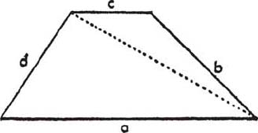
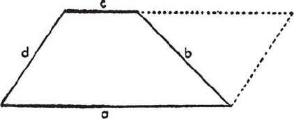
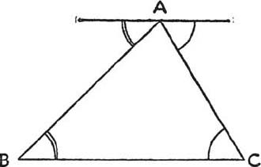
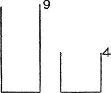
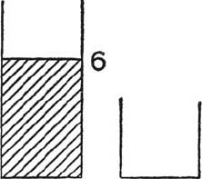
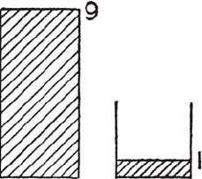
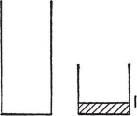
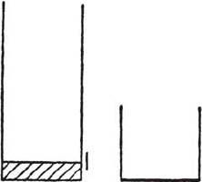
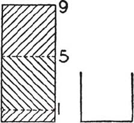
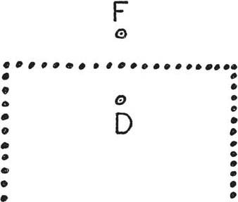

# Part III — Dictionary of Heuristic: T–W

## Terms, old and new

**Terms, old and new,** describing the activity of solving problems are often ambiguous. The activity itself is familiar to everybody and it is often discussed but, as other mental activities, it is difficult to describe. In the absence of a systematic study there are no technical terms to describe it, and certain usual half-technical terms often add to the confusion because they are used in different meanings by different authors.

The following short list includes a few new terms used and a few old terms avoided in the present study, and also some old terms retained despite their ambiguity.

The reader may be confused by the following discussion of terminology unless his notions are well anchored in examples.

1\. *Analysis* is neatly defined by PAPPUS, and it is a useful term, describing a typical way of devising a plan, starting from the unknown (or the conclusion) and working backwards, toward the data (or the hypothesis). Unfortunately, the word has acquired very different meanings (for instance, of mathematical, chemical, logical analysis) and therefore, it is regretfully avoided in the present study.

2\. *Condition* links the unknown of a "problem to find" to the data (see *Problems to find, problems to prove*, 3). In this meaning, it is a clear, useful and unavoidable term. It is often necessary to decompose the condition into several parts [into parts (I) and (II) in the examples *Decomposing and recombining*, 7, 8]. Now, each part of *the* condition is usually called *a* condition. This ambiguity which is sometimes embarrassing could be easily avoided by introducing some technical term to denote the parts of the whole condition; for instance, such a part could be called a "clause."

3\. *Hypothesis* denotes an essential part of a mathematical theorem of the more usual kind (see *Problems to find, problems to prove*, 4). The term, in this meaning, is perfectly clear and satisfactory. The difficulty is that each part of *the* hypothesis is also called *a* hypothesis so that the hypothes*is* may consist of several hypotheses. The remedy would be to call each part of the whole hypothesis a "clause," or something similar. (Compare the foregoing remark on "condition.")

4\. *Principal parts* of a problem are defined in *Problems to find, problems to prove*, 3, 4.

5\. *Problem to find, problem to prove* are a pair of new terms, introduced regretfully to replace historical terms whose meaning, however, is confused beyond redemption by current usage. In Latin versions of Greek mathematical texts, the common name for both kinds of problems is "propositio"; a "problem to find" is called "problema," and a "problem to prove" "theorema." In old-fashioned mathematical language, the words proposition, problem, theorem have still this "Euclidean" meaning, but this is completely changed in modern mathematical language; this justifies the introduction of new terms.

6\. *Progressive reasoning* was used in various meanings by various authors, and in the old meaning of "synthesis" (see 9) by some authors. The latter usage is defensible but the term is avoided here.

7\. *Regressive reasoning* was used in the old meaning of "analysis" by some authors (compare 1, 6). The term is defensible but avoided here.

8\. *Solution* is a completely clear term if taken in its purely mathematical meaning; it denotes any object satisfying the condition of a "problem to find." Thus, the solutions of the equation $x^2 - 3x + 2 = 0$ are its roots, the numbers $1$ and $2$. Unfortunately, the word has also other meanings which are not purely mathematical and which are used by mathematicians along with its mathematical meaning. Solution may also mean the "process of solving the problem" or the "work done in solving the problem"; we use the word in this meaning when we talk about a "difficult solution." Solution may also mean the result of the work done in solving the problem; we may use the word in this meaning when we talk about a "beautiful solution." Now, it may happen that we have to talk in the same sentence about the object satisfying the condition of the problem, about the work of obtaining it, and about the result of this work; if we yield to the temptation to call all three things "solution" the sentence cannot be too clear.

9\. *Synthesis* is used by PAPPUS in a well defined meaning which would deserve to be conserved. The term is, however, regretfully avoided in the present study, for the same reasons as its counterpart "analysis" (see under 1).

## Test by dimension

**Test by dimension** is a well-known, quick and efficient means to check geometrical or physical formulas.

1\. In order to recall the operation of the test, let us consider the frustum of a right circular cone. Let

$R$ be the radius of the lower base,\
$r$ the radius of the upper base,\
$h$ the altitude of the frustum,\
$S$ the area of the lateral surface of the frustum.

If $R, r, h$ are given, $S$ is visibly determined. We find the expression

$$S = \pi (R + r) \sqrt{(R - r)^2 + h^2}$$

to which we wish to apply the test by dimension.

The dimension of a geometric quantity is easily visible. Thus, $R, r, h$ are lengths, they are measured in centimeters if we use scientific units, their dimension is $cm$. The area $S$ is measured in square centimeters, its dimension is $cm^2$. Now, $\pi = 3.14159 \ldots$ is a mere number; if we wish to ascribe a dimension to a purely numerical quantity it must be $cm^0 = 1$.

Each term of a sum must have the same dimension which is also the dimension of the sum. Thus, $R, r$, and $R + r$ have the same dimension, namely $cm$. The two terms $(R - r)^2$ and $h^2$ have the same dimension (as they must), $cm^2$.

The dimension of a product is the product of the dimensions of its factors, and there is a similar rule about powers. Replacing the quantities by their dimensions on both sides of the formula that we are testing, we obtain

$$cm^2 = 1 \cdot cm \cdot \sqrt{cm^2}.$$

This being visibly so, the test could not detect any error in the formula. The formula passed the test.

For other examples, see section 14, and *Can you check the result?* 2.

2\. We may apply the test by dimension to the final result of a problem or to intermediary results, to our own work or to the work of others (very suitable in tracing mistakes in examination papers), and also to formulas that we recollect and to formulas that we guess.

If you recollect the formulas $4\pi r^2$ and $4\pi r^3/3$ for the area and the volume of the sphere, but are not quite sure which is which, the test by dimension easily removes the doubt.

3\. The test by dimension is even more important in physics than in geometry.

Let us consider a "simple" pendulum, that is, a small heavy body suspended by a wire whose length we regard as invariable and whose weight we regard as negligible. Let $l$ stand for the length of the wire, $g$ for the gravitational acceleration, and $T$ for the period of the pendulum.

Mechanical considerations show that $T$ depends on $l$ and $g$ alone. But what is the form of the dependence? We may remember or guess that

$$T = c\, l^m g^n$$

where $c, m, n$ are certain numerical constants. That is, we suppose that $T$ is proportional to certain powers, $l^m$, $g^n$, of $l$ and $g$.

We look at the dimensions. As $T$ is a time, it is measured in seconds, its dimension is $sec$. The dimension of the length $l$ is $cm$, the dimension of the acceleration $g$ is $cm\, sec^{-2}$, and the dimension of the numerical constant $c$ is $1$. The test by dimension yields the equation

$$sec = 1 \cdot (cm)^m (cm\, sec^{-2})^n$$

or

$$sec = (cm)^{m+n}\, sec^{-2n}.$$

Now, we must have the same powers of the fundamental units $cm$ and $sec$ on both sides, and thus we obtain

$$0 = m + n \qquad 1 = -2n$$

and hence

$$n = -\frac{1}{2} \qquad m = \frac{1}{2}.$$

Therefore, the formula for the period $T$ must have the form

$$T = c\, l^{\frac{1}{2}} g^{-\frac{1}{2}} = c \sqrt{\frac{l}{g}}.$$

The test by dimension yields much in this case but it cannot yield everything. First, it gives no information about the value of the constant $c$ (which is, in fact, $2\pi$). Second, it gives no information about the limits of validity; the formula is valid only for small oscillations of the pendulum and only approximately (it is exact for "infinitely small" oscillations). In spite of these limitations, there is no doubt that the consideration of the dimensions has allowed us to foresee quickly and with the most elementary means an essential part of a result whose exhaustive treatment demands much more advanced means. And this is so in many similar cases.

## The future mathematician

**The future mathematician** should be a clever problem-solver; but to be a clever problem-solver is not enough. In due time, he should solve significant mathematical problems; and first he should find out for which kind of problems his native gift is particularly suited.

For him, the most important part of the work is to look back at the completed solution. Surveying the course of his work and the final shape of the solution, he may find an unending variety of things to observe. He may meditate upon the difficulty of the problem and about the decisive idea; he may try to see what hampered him and what helped him finally. He may look out for simple intuitive ideas: *Can you see it at a glance?* He may compare and develop various methods: *Can you derive the result differently?* He may try to clarify his present problem by comparing it to problems formerly solved; he may try to invent new problems which he can solve on the basis of his just completed work: *Can you use the result, or the method, for some other problem?* Digesting the problems he solved as completely as he can, he may acquire well ordered knowledge, ready to use.

The future mathematician learns, as does everybody else, by imitation and practice. He should look out for the right model to imitate. He should observe a stimulating teacher. He should compete with a capable friend. Then, what may be the most important, he should read not only current textbooks but good authors till he finds one whose ways he is naturally inclined to imitate. He should enjoy and seek what seems to him simple or instructive or beautiful. He should solve problems, choose the problems which are in his line, meditate upon their solution, and invent new problems. By these means, and by all other means, he should endeavor to make his first important discovery: he should discover his likes and his dislikes, his taste, his own line.

## The intelligent problem-solver

**The intelligent problem-solver** often asks himself questions similar to those contained in our list. He, perhaps, discovered questions of this sort by himself; or, having heard such a question from somebody, he discovered its proper use by himself. He is possibly not conscious at all that he repeats the same stereotyped question again and again. Or the question is his particular pet; he knows that the question is part of his mental attitude appropriate in such and such a phase of the work, and he summons up the right attitude by asking the right question.

The intelligent problem-solver may find the questions and suggestions of our list useful. He may understand quite well the explanations and examples illustrating a certain question, he may suspect the proper use of the question; but he cannot attain real understanding unless he comes across the procedure that the question tries to provoke in his own work and, by having experienced its usefulness, discovers the proper use of the question for himself.

The intelligent problem-solver should be prepared to ask all questions of the list but he should ask none unless he is prompted to do so by careful consideration of the problem at hand and by his own unprejudiced judgment. In fact, he must recognize by himself whether the present situation is sufficiently similar or not to some other situation in which he saw the question successfully applied.

The intelligent problem-solver tries first of all to understand the problem as fully and as clearly as he can. Yet understanding alone is not enough; he must concentrate upon the problem, he must desire earnestly to obtain its solution. If he cannot summon up real desire for solving the problem he would do better to leave it alone. The open secret of real success is to throw your whole personality into your problem.

## The intelligent reader

**The intelligent reader** of a mathematical book desires two things:

First, to see that the present step of the argument is correct.

Second, to see the purpose of the present step.

The intelligent listener to a mathematical lecture has the same wishes. If he cannot see that the present step of the argument is correct and even suspects that it is, possibly, incorrect, he may protest and ask a question. If he cannot see any purpose in the present step, nor suspect any reason for it, he usually cannot even formulate a clear objection, he does not protest, he is just dismayed and bored, and loses the thread of the argument.

The intelligent teacher and the intelligent author of textbooks should bear these points in mind. To write and speak correctly is certainly necessary; but it is not sufficient. A derivation correctly presented in the book or on the blackboard may be inaccessible and uninstructive, if the purpose of the successive steps is incomprehensible, if the reader or listener cannot understand how it was humanly possible to find such an argument, if he is not able to derive any suggestion from the presentation as to how he could find such an argument by himself.

The questions and suggestions of our list may be useful to the author and to the teacher in emphasizing the purpose and the motives of his argument. Particularly useful in this respect is the question: *Did we use all the data?* The author or the teacher may show by this question a good reason for considering the datum that has not been used heretofore. The reader or the listener can use the same question in order to understand the author's or the teacher's reason for considering such and such an element, and he may feel that, asking this question, he could have discovered this step of the argument by himself.

## The traditional mathematics professor

**The traditional mathematics professor** of the popular legend is absentminded. He usually appears in public with a lost umbrella in each hand. He prefers to face the blackboard and to turn his back on the class. He writes $a$, he says $b$, he means $c$; but it should be $d$. Some of his sayings are handed down from generation to generation.

"In order to solve this differential equation you look at it till a solution occurs to you."

"This principle is so perfectly general that no particular application of it is possible."

"Geometry is the art of correct reasoning on incorrect figures."

"My method to overcome a difficulty is to go round it."

"What is the difference between method and device? A method is a device which you use twice."

After all, you can learn something from this traditional mathematics professor. Let us hope that the mathematics teacher from whom you cannot learn anything will not become traditional.

## Variation of the problem

**Variation of the problem.** An insect (as mentioned elsewhere) tries to escape through the windowpane, tries the same hopeless thing again and again, and does not try the next window which is open and through which it came into the room. A mouse may act more intelligently; caught in the trap, he tries to squeeze through between two bars, then between the next two bars, then between other bars; he varies his trials, he explores various possibilities. A man is able, or should be able, to vary his trials still more intelligently, to explore the various possibilities with more understanding, to learn by his errors and shortcomings. "Try, try again" is popular advice. It is good advice. The insect, the mouse, and the man follow it; but if one follows it with more success than the others it is because he *varies his problem* more intelligently.

1\. At the end of our work, when we have obtained the solution, our conception of the problem will be fuller and more adequate than it was at the outset. Desiring to proceed from our initial conception of the problem to a more adequate, better adapted conception, we try various standpoints and we view the problem from different sides.

Success in solving the problem depends on choosing the right aspect, on attacking the fortress from its accessible side. In order to find out which aspect is the right one, which side is accessible, we try various sides and aspects, we *vary the problem*.

2\. Variation of the problem is essential. This fact can be explained in various ways. Thus, from a certain point of view, progress in solving the problem appears as mobilization and organization of formerly acquired knowledge. We have to extract from our memory and to work into the problem certain elements. Now, variation of the problem helps us to extract such elements. How?

We remember things by a kind of "action by contact," called "mental association"; what we have in our mind at present tends to recall what was in contact with it at some previous occasion. (There is no space and no need to state more neatly the theory of association, or to discuss its limitations.) *Varying the problem*, we bring in new points, and so we create new contacts, new possibilities of contacting elements relevant to our problem.

3\. We cannot hope to solve any worth-while problem without intense concentration. But we are easily tired by intense concentration of our attention upon the same point. In order to keep the attention alive, the object on which it is directed must unceasingly change.

If our work progresses, there is something to do, there are new points to examine, our attention is occupied, our interest is alive. But if we fail to make progress, our attention falters, our interest fades, we get tired of the problem, our thoughts begin to wander, and there is danger of losing the problem altogether. To escape from this danger we have to *set ourselves a new question* about the problem.

The new question unfolds untried possibilities of contact with our previous knowledge, it revives our hope of making useful contacts. The new question *reconquers our interest by varying the problem*, by showing some new aspect of it.

4\. *Example*. Find the volume of the frustum of a pyramid with square base, being given the side of the lower base $a$, the side of the upper base $b$, and the altitude of the frustum $h$.

The problem may be proposed to a class familiar with the formulas for the volume of prism and pyramid. If the students do not come forward with some idea of their own, the teacher may begin with *varying the data* of the problem. We start from a frustum with $a > b$. What happens when $b$ increases till it becomes equal to $a$? The frustum becomes a prism and the volume in question becomes $a^2 h$. What happens when $b$ decreases till it becomes equal to $0$? The frustum becomes a pyramid and the volume in question becomes $a^2 h/3$.

This variation of the data contributes, first of all, to the interest of the problem. Then, it may suggest using, in some way or other, the results quoted about prism and pyramid. At any rate, we have found definite properties of the final result; the final formula must be such that it reduces to $a^2 h$ for $b = a$ and to $a^2 h/3$ for $b = 0$. It is an advantage to foresee properties of the result we are trying to obtain. Such properties may give valuable suggestions and, in any case, when we have found the final formula we shall be able to test it. We have thus, in advance, an answer to the question: *Can you check the result?* (See there, under 2.)

5\. *Example*. Construct a trapezoid being given its four sides $a, b, c, d$.

Let $a$ be the lower base and $c$ the upper base; $a$ and $c$ are parallel but unequal, $b$ and $d$ are not parallel. If there is no other idea, we may begin with varying the data.

We start from a trapezoid with $a > c$. What happens when $c$ decreases till it becomes equal to $0$? The trapezoid degenerates into a triangle. Now a triangle is a familiar and simple figure, which we can construct from various data; there could be some advantage in introducing this triangle into the figure. We do so by drawing just one auxiliary line, a diagonal of the trapezoid (Fig. 21). Examining the triangle we find however that it is scarcely useful; we know two sides, $a$ and $d$, but we should have three data.

Let us try something else. What happens when $c$ increases till it becomes equal to $a$? The trapezoid becomes a parallelogram. Could we use it? A little examination (see Fig. 22) directs our attention to the triangle which we have added to the original trapezoid when drawing the parallelogram. This triangle is easily constructed; we know three data, its three sides $b$, $d$, and $a - c$.

<!-- carousel -->

<!-- endcarousel -->

Varying the original problem (construction of the trapezoid) we have been led to a more accessible auxiliary problem (construction of the triangle). Using the result of the auxiliary problem we easily solve our original problem (we have to complete the parallelogram).

Our example is typical. It is also typical that our first attempt failed. Looking back at it, we may see however that that first attempt was not so useless. There was some idea in it; in particular, it gave us an opportunity to think of the construction of a triangle as means to our end. In fact, we arrived at our second, successful trial by modifying our first, unsuccessful trial. We varied $c$; we first tried to decrease it, then to increase it.

6\. As in the foregoing example, we often have to try various modifications of the problem. We have to vary, to restate, to transform it again and again till we succeed eventually in finding something useful. We may learn by failure; there may be some good idea in an unsuccessful trial, and we may arrive at a more successful trial by *modifying* an unsuccessful one. What we attain after various trials is very often, as in the foregoing example, a more accessible auxiliary problem.

7\. There are certain modes of varying the problem which are typically useful, as going back to the *Definition*, *Decomposing and recombining*, introducing *Auxiliary elements*, *Generalization*, *Specialization*, and the use of *Analogy*.

8\. What we said a while ago (under 3) about new questions which may reconquer our interest is important for the proper use of our list.

A teacher may use the list to help his students. If the student progresses, he needs no help and the teacher should not ask him any questions, but allow him to work alone which is obviously better for his independence. But the teacher should, of course, try to find some suitable question or suggestion to help him when he gets stuck. Because then there is danger that the student will get tired of his problem and drop it, or lose interest and make some stupid blunder out of sheer indifference.

We may use the list in solving our own problems. To use it properly we proceed as in the former case. When our progress is satisfactory, when new remarks emerge spontaneously, it would be simply stupid to hamper our spontaneous progress by extraneous questions. But when our progress is blocked, when nothing occurs to us, there is danger that we may get tired of our problem. Then it is time to think of some general idea that could be helpful, of some question or suggestion of the list that might be suitable. And any question is welcome that has some chance of showing a new aspect of the problem; it may reconquer our interest, it may keep us working and thinking.

## What is the unknown?

**What is the unknown?** What is required? What do you want? What are you supposed to seek?

*What are the data?* What is given? What have you?

*What is the condition?* By what condition is the unknown linked to the data?

These questions may be used by the teacher to test the understanding of the problem; the student should be able to answer them clearly. Moreover, they direct the student's attention to the principal parts of a "problem to find," the unknown, the data, the condition. As the consideration of these parts may be necessary again and again, the questions may be often repeated in the later phases of the solution. (Examples in sections 8, 10, 18, 20; *Setting up equations*, 3, 4; *Practical problems*, 1; *Puzzles*; and elsewhere.)

The questions are of the greatest importance for the problem-solver. He checks his own understanding of the problem, he focuses his attention on this or that principal part of the problem. The solution consists essentially in linking the unknown to the data. Therefore, the problem-solver has to focus those elements again and again, asking: *What is the unknown? What are the data?*

The problem may have many unknowns, or the condition may have various parts which must be considered separately, or it may be desirable to consider some datum by itself. Therefore, we may use various modifications of our questions, as: What are the unknowns? What is the first datum? What is the second datum? What are the various parts of the condition? What is the first clause of the condition?

The principal parts of a "problem to prove" are the hypothesis and the conclusion, and the corresponding questions are: *What is the hypothesis? What is the conclusion?* We may need some variation of verbal expression or modification of these frequently useful questions as: What do you assume? What are the various parts of your assumption? (Example in section 19.)

## Why proofs?

**Why proofs?** There is a traditional story about Newton: As a young student, he began the study of geometry, as was usual in his time, with the reading of the Elements of Euclid. He read the theorems, saw that they were true, and omitted the proofs. He wondered why anybody should take pains to prove things so evident. Many years later, however, he changed his opinion and praised Euclid.

The story may be authentic or not, yet the question remains: Why should we learn, or teach, proofs? What is preferable: no proof at all, or proofs for everything, or some proofs? And, if only some proofs, which proofs?

1\. *Complete proofs*. For a logician of a certain sort only complete proofs exist. What intends to be a proof must leave no gaps, no loopholes, no uncertainty whatever, or else it is no proof. Can we find complete proofs according to such a high standard in everyday life, or in legal procedure, or in physical science? Scarcely. Thus, it is difficult to understand how we could acquire the idea of such a strictly complete proof.

We may say, with a little exaggeration, that humanity learned this idea from one man and one book: from Euclid and his Elements. In any case, the study of the elements of plane geometry yields still the best opportunity to acquire the idea of rigorous proof.

Let us take as an example the proof of the theorem: *In any triangle, the sum of the three angles is equal to two right angles*. Fig. 23, which is an inalienable mental property of most of us, needs little explanation. There is a line through the vertex $A$ parallel to the side $BC$.

The angles of the triangle at $B$ and at $C$ are equal to certain angles at $A$, as is emphasized in the figure, since alternate angles are equal in general. The three angles of the triangle are equal to three angles with a common vertex $A$, forming a straight angle, or two right angles; and so the theorem is proved.

If a student has gone through his mathematics classes without having really understood a few proofs like the foregoing one, he is entitled to address a scorching reproach to his school and to his teachers. In fact, we should distinguish between things of more and less importance. If the student failed to get acquainted with this or that particular geometric fact, he did not miss so much; he may have little use for such facts in later life. But if he failed to get acquainted with geometric proofs, he missed the best and simplest examples of true evidence and he missed the best opportunity to acquire the idea of strict reasoning. Without this idea, he lacks a true standard with which to compare alleged evidence of all sorts aimed at him in modern life.

In short, if general education intends to bestow on the student the ideas of intuitive evidence and logical reasoning, it must reserve a place for geometric proofs.

2\. *Logical system*. Geometry, as presented in Euclid's Elements, is not a mere collection of facts but a logical system. The axioms, definitions, and propositions are not listed in a random sequence but disposed in accomplished order. Each proposition is so placed that it can be based on the foregoing axioms, definitions, and propositions. We may regard the disposition of the propositions as Euclid's main achievement and their logical system as the main merit of the Elements.

Euclid's geometry is not only a logical system but it is the first and greatest example of such a system, which other sciences have tried, and are still trying, to imitate. Should other sciences — especially those very far from geometry, as psychology, or jurisprudence — imitate Euclid's rigid logic? This is a debatable question; but nobody can take part in the debate with competence who is not acquainted with the Euclidean system.

Now, the system of geometry is cemented with proofs. Each proposition is linked to the foregoing axioms, definitions, and propositions by a proof. Without understanding such proofs we cannot understand the very essence of the system.

In short, if general education intends to bestow on the student the idea of logical system, it must reserve a place for geometric proofs.

3\. *Mnemotechnic system*. The author does not think that the ideas of intuitive evidence, strict reasoning, and logical system are superfluous for anybody. There may be cases, however, in which the study of these ideas is not considered absolutely necessary, owing to lack of time, or for other reasons. Yet even in such cases proofs may be desirable.

Proofs yield evidence; in so doing, they hold together the logical system; and they help us to remember the various items held together. Take the example discussed above, in connection with Fig. 23. This figure renders evident the fact that the sum of the angles in a triangle equals $180^\circ$. The figure connects this fact with the other fact that alternate angles are equal. Connected facts however are more interesting and are better retained than isolated facts. Thus, our figure fixes the two connected geometric propositions in our mind and, finally, the figure and the propositions may become our inalienable mental property.

Now we come to the case in which the acquisition of general ideas is not regarded as necessary, only that of certain facts is desired. Even in such a case, the facts must be presented in some connection and in some sort of system, since isolated items are laboriously acquired and easily forgotten. Any sort of connection that unites the facts simply, naturally, and durably, is welcome here. The system need not be founded on logic, it must only be designed to aid the memory effectively; it must be what is called a *mnemotechnic* system. Yet even from the point of view of a purely mnemotechnic system, proofs may be useful, especially simple proofs. For instance, the student must learn the fact about the sum of the angles in the triangle and that other fact about the alternate angles. Can any device to retain these facts be simpler, more natural or more effective than Fig. 23?

In short, even when no special importance is attached to general logical ideas proofs may be useful as a mnemotechnic device.

4\. *The cookbook system*. We have discussed the advantages of proofs but we certainly did not advocate that all proofs should be given "in extenso." On the contrary, there are cases in which it is scarcely possible to do so; an important case is the teaching of the differential and integral calculus to students of engineering.

If the calculus is presented according to modern standards of rigor, it demands proofs of a certain degree of difficulty and subtlety ("epsilon-proofs"). But engineers study the calculus in view of its application and have neither enough time nor enough training or interest to struggle through long proofs or to appreciate subtleties. Thus, there is a strong temptation to cut out all the proofs. Doing so, however, we reduce the calculus to the level of the cookbook.

The cookbook gives a detailed description of ingredients and procedures but no proofs for its prescriptions or reasons for its recipes; the proof of the pudding is in the eating. The cookbook may serve its purpose perfectly. In fact, it need not have any sort of logical or mnemotechnic system since recipes are written or printed and not retained in memory.

Yet the author of a textbook of calculus, or a college instructor, can hardly serve his purpose if he follows the system of the cookbook too closely. If he teaches procedures without proofs, the unmotivated procedures are not understood. If he gives rules without reasons, the unconnected rules are quickly forgotten. Mathematics cannot be tested in exactly the same manner as a pudding; if all sorts of reasoning are debarred, a course of calculus may easily become an incoherent inventory of indigestible information.

5\. *Incomplete proofs*. The best way of handling the dilemma between too heavy proofs and the level of the cookbook may be to make reasonable use of incomplete proofs.

For a strict logician, an incomplete proof is no proof at all. And, certainly, incomplete proofs ought to be carefully distinguished from complete proofs; to confuse one with the other is bad, to sell one for the other is worse. It is painful when the author of a textbook presents an incomplete proof ambiguously, with visible hesitation between shame and the pretension that the proof is complete. But incomplete proofs may be useful when they are used in their proper place and in good taste. Their purpose is not to replace complete proofs, which they never could, but to lend interest and coherence to the presentation.

Example 1. *An algebraic equation of degree* $n$ *has exactly* $n$ *roots*. This proposition, called the Fundamental Theorem of Algebra by Gauss, must often be presented to students who are quite unprepared for understanding its proof. They know however that an *equation of the first degree has one root*, and one of the *second degree two roots*. Moreover the difficult proposition has a part that can be easily shown: *no equation of degree* $n$ *has more than* $n$ *different roots*. Do the facts mentioned constitute a complete proof for the Fundamental Theorem? By no means. They are sufficient however to lend it a certain interest and plausibility — and to fix it in the minds of the students, which is the main thing.

Example 2. *The sum of any two of the plane angles formed by the edges of a trihedral angle is greater than the third*. Obviously, the theorem amounts to affirming that *in a spherical triangle the sum of any two sides is greater than the third*. Having observed this, we naturally think of the analogy of the spherical triangle with the rectilinear triangle. Do these remarks constitute a proof? By no means; but they help us to understand and to remember the proposed theorem.

Our first example has historical interest. For about 250 years, the mathematicians believed the Fundamental Theorem without complete proof — in fact, without much more basis than what was mentioned above. Our second example points to *Analogy* as an important source of conjectures. In mathematics, as in the natural and physical sciences, discovery often starts from observation, analogy, and induction. These means, tastefully used in framing a plausible heuristic argument, appeal particularly to the physicist and the engineer. (See also *Induction and mathematical induction*, 1, 2, 3.)

The role and interest of incomplete proofs is explained to a certain extent by our study of the process of the solution. Some experience in solving problems shows that the first idea of a proof is very frequently incomplete. The most essential remark, the main connection, the germ of the proof may be there, but details must be provided afterwards and are often troublesome. Some authors, but not many, have the gift of presenting just the germ of the proof, the main idea in its simplest form, and indicating the nature of the remaining details. Such a proof, although incomplete, may be much more instructive than a proof presented with complete details.

In short, incomplete proofs may be used as a sort of mnemotechnic device (but, of course, not as substitutes for complete proofs) when the aim is tolerable coherence of presentation and not strictly logical consistency.

It is very dangerous to advocate incomplete proofs. Possible abuse, however, may be kept within bounds by a few rules. First, if a proof is incomplete, it must be indicated as such, somewhere and somehow. Second, an author or a teacher is not entitled to present an incomplete proof for a theorem unless he knows very well a complete proof for it himself.

And it may be confessed that to present an incomplete proof in good taste is not easy at all.

## Wisdom of proverbs

**Wisdom of proverbs.** Solving problems is a fundamental human activity. In fact, the greater part of our conscious thinking is concerned with problems. When we do not indulge in mere musing or daydreaming, our thoughts are directed toward some end; we seek means, we seek to solve a problem.

Some people are more and others less successful in attaining their ends and solving their problems. Such differences are noticed, discussed, and commented upon, and certain proverbs seem to have preserved the quintessence of such comments. At any rate, there are a good many proverbs which characterize strikingly the typical procedures followed in solving problems, the points of common sense involved, the usual tricks, and the usual errors. There are many shrewd and some subtle remarks in proverbs but, obviously, there is no scientific system free of inconsistencies and obscurities in them. On the contrary, many a proverb can be matched with another proverb giving exactly opposite advice, and there is a great latitude of interpretation. It would be foolish to regard proverbs as an authoritative source of universally applicable wisdom but it would be a pity to disregard the graphic description of heuristic procedures provided by proverbs.

It could be an interesting task to collect and group proverbs about planning, seeking means, and choosing between lines of action, in short, proverbs about solving problems. Of the space needed for such a task only a small fraction is available here; the best we can do is to quote a few proverbs illustrating the main phases of the solution emphasized in our list, and discussed in sections 6 to 14 and elsewhere. The proverbs quoted will be printed in italics.

1\. The very first thing we must do for our problem is to understand it: *Who understands ill, answers ill*. We must see clearly the end we have to attain: *Think on the end before you begin*. This is an old piece of advice; "respice finem" is the saying in Latin. Unfortunately, not everybody heeds such good advice, and people often start speculating, talking, and even acting fussily without having properly understood the aim for which they should work. *A fool looks to the beginning, a wise man regards the end*. If the end is not clear in our mind, we may easily stray from the problem and drop it. *A wise man begins in the end, a fool ends in the beginning*.

Yet it is not enough to understand the problem, we must also desire its solution. We have no chance to solve a difficult problem without a strong desire to solve it, but with such desire there is a chance. *Where there is a will there is a way*.

2\. Devising a plan, conceiving the idea of an appropriate action, is the main achievement in the solution of a problem.

A good idea is a piece of good fortune, an inspiration, a gift of the gods, and we have to deserve it: *Diligence is the mother of good luck. Perseverance kills the game. An oak is not felled at one stroke. If at first you don't succeed, try, try again*. It is not enough however to try repeatedly, we must try different means, vary our trials. *Try all the keys in the bunch. Arrows are made of all sorts of wood*. We must adapt our trials to the circumstances. *As the wind blows you must set your sail. Cut your coat according to the cloth. We must do as we may if we can't do as we would*. If we have failed, we must try something else. *A wise man changes his mind, a fool never does*. We should even be prepared from the outset for a possible failure of our scheme and have another one in reserve. *Have two strings to your bow*. We may, of course, overdo this sort of changing from one scheme to another and lose time. Then we may hear the ironical comment: *Do and undo, the day is long enough*. We are likely to blunder less if we do not lose sight of our aim. *The end of fishing is not angling but catching*.

We work hard to extract something helpful from our memory, yet, quite often, when an idea that could be helpful presents itself, we do not appreciate it, for it is so inconspicuous. The expert has, perhaps, no more ideas than the inexperienced, but appreciates more what he has and uses it better. *A wise man will make more opportunities than he finds. A wise man will make tools of what comes to hand. A wise man turns chance into good fortune*. Or, possibly, the advantage of the expert is that he is continually on the lookout for opportunities. *Have an eye to the main chance*.

3\. We should start carrying out our plan at the right moment, when it is ripe, but not before. We should not start rashly. *Look before you leap. Try before you trust. A wise delay makes the road safe*. On the other hand, we should not hesitate too long. *If you will sail without danger you must never put to sea. Do the likeliest and hope the best. Use the means and God will give the blessing*.

We must use our judgment to determine the right moment. And here is a timely warning that points out the most common fallacy, the most usual failure of our judgment: *We soon believe what we desire*.

Our plan gives usually but a general outline. We have to convince ourselves that the details fit into the outline, and so we have to examine carefully each detail, one after the other. *Step after step the ladder is ascended. Little by little as the cat ate the flickle. Do it by degrees*.

In carrying out our plan we must be careful to arrange its steps in the proper order, which is frequently just the reverse of the order of invention. *What a fool does at last, a wise man does at first*.

4\. Looking back at the completed solution is an important and instructive phase of the work. *He thinks not well that thinks not again. Second thoughts are best*.

Reexamining the solution, we may discover an additional confirmation of the result. Yet it must be pointed out to the beginner that such an additional confirmation is valuable, that two proofs are better than one. *It is safe riding at two anchors*.

5\. We have by no means exhausted the comments of proverbs on the solution of problems. Yet many other proverbs which could be quoted would scarcely furnish new themes, only variations on the themes already mentioned. Certain more systematic and more sophisticated aspects of the process of solution are hardly within the scope of the Wisdom of Proverbs.

In describing the more systematic aspects of the solution, the author tried now and then to imitate the peculiar turn of proverbs, which is not easy. Here follow a few "synthetic" proverbs which describe somewhat more sophisticated attitudes.

The end suggests the means.

Your five best friends are What, Why, Where, When, and How. You ask What, you ask Why, you ask Where, When, and How — and ask nobody else when you need advice.

Do not believe anything but doubt only what is worth doubting.

Look around when you have got your first mushroom or made your first discovery; they grow in clusters.

## Working backwards

**Working backwards.** If we wish to understand human behavior we should compare it with animal behavior. Animals also "have problems" and "solve problems." Experimental psychology has made essential progress in the last decades in exploring the "problem-solving" activities of various animals. We cannot discuss here these investigations but we shall describe sketchily just one simple and instructive experiment and our description will serve as a sort of comment upon the method of analysis, or method of "working backwards." This method, by the way, is discussed also elsewhere in the present book, under the name of *Pappus* to whom we owe an important description of the method.

1\. Let us try to find an answer to the following tricky question: *How can you bring up from the river exactly six quarts of water when you have only two containers, a four quart pail and a nine quart pail, to measure with?*

Let us visualize clearly the given tools we have to work with, the two containers. (*What is given?*) We imagine two cylindrical containers having equal bases whose altitudes are as $9$ to $4$, see Fig. 24. *If* along the lateral surface of each container there were a scale of equally spaced horizontal lines from which we could tell the height of the waterline, our problem would be easy. Yet there is no such scale and so we are still far from the solution.

We do not know yet how to measure exactly 6 quarts; but could we measure something else? (*If you cannot solve the proposed problem try to solve first some related problem. Could you derive something useful from the data?*) Let us do something, let us play around a little. We could fill the larger container to full capacity and empty so much as we can into the smaller container; then we could get 5 quarts. Could we also get 6 quarts? Here are again the two empty containers. We could also . . .

We are working now as most people do when confronted with this puzzle. We start with the two empty containers, we try this and that, we empty and fill, and when we do not succeed, we start again, trying something else. We are *working forwards*, from the given initial situation to the desired final situation, from the data to the unknown. We may succeed, after many trials, accidentally.

2\. But exceptionally able people, or people who had the chance to learn in their mathematics classes something more than mere routine operations, do not spend too much time in such trials but turn around, and start working backwards.

What are we required to do? (*What is the unknown?*) Let us visualize the final situation we aim at as clearly as possible. Let us imagine that we have here, before us, the larger container with exactly 6 quarts in it and the smaller container empty as in Fig. 25. (Let us *start from what is required* and *assume what is sought as already found*, says Pappus.)

From what foregoing situation could we obtain the desired final situation shown in Fig. 25? (Let us *inquire from what antecedent the desired result could be derived*, says Pappus.) We could, of course, fill the larger container to full capacity, that is, to 9 quarts. But then we should be able to pour out exactly three quarts. To do that . . . we must have just one quart in the smaller container! That's the idea. See Fig. 26.

(The step that we have just completed is not easy at all. Few persons are able to take it without much foregoing hesitation. In fact, recognizing the significance of this step, we foresee an outline of the following solution.)

But how can we reach the situation that we have just found and illustrated by Fig. 26? (Let us *inquire again what could be the antecedent of that antecedent*.) Since the amount of water in the river is, for our purpose, unlimited, the situation of Fig. 26 amounts to the same as the next one in Fig. 27

or the following in Fig. 28.

It is easy to recognize that if any one of the situations in Figs. 26, 27, 28 is obtained, any other can be obtained just as well, but it is not so easy to hit upon Fig. 28, unless we *have seen it before*, encountered it accidentally in one of our initial trials. Playing around with the two containers, we may have done something similar and remember now, in the right moment, that the situation of Fig. 28 can arise as suggested by Fig. 29: We fill the large container to full capacity, and pour from it four quarts into the smaller container and then into the river, twice in succession. We *came eventually upon something already known* (these are Pappus's words) and following the method of analysis, *working backwards*, we have discovered the appropriate sequence of operations.

It is true, we have discovered the appropriate sequence in retrogressive order but all that is left to do is to *reverse the process* and *start from the point which we reached last of all in the analysis* (as Pappus says). First, we perform the operations suggested by Fig. 29 and obtain Fig. 28; then we pass to Fig. 27, then to Fig. 26, and finally to Fig. 25. *Retracing our steps, we finally succeed in deriving what was required*.

3\. Greek tradition attributed to Plato the discovery of the method of analysis. The tradition may not be quite reliable but, at any rate, if the method was not invented by Plato, some Greek scholar found it necessary to attribute its invention to a philosophical genius.

There is certainly something in the method that is not superficial. There is a certain psychological difficulty in turning around, in going away from the goal, in working backwards, in not following the direct path to the desired end. When we discover the sequence of appropriate operations, our mind has to proceed in an order which is exactly the reverse of the actual performance. There is some sort of psychological repugnance to this reverse order which may prevent a quite able student from understanding the method if it is not presented carefully.

Yet it does not take a genius to solve a concrete problem working backwards; anybody can do it with a little common sense. We concentrate upon the desired end, we visualize the final position in which we would like to be. From what foregoing position could we get there? It is natural to ask this question, and in so asking we work backwards. Quite primitive problems may lead naturally to working backwards; see *Pappus*, 4.

Working backwards is a common-sense procedure within the reach of everybody and we can hardly doubt that it was practiced by mathematicians and nonmathematicians before Plato. What some Greek scholar may have regarded as an achievement worthy of the genius of Plato is to state the procedure in general terms and to stamp it as an operation typically useful in solving mathematical and nonmathematical problems.

4\. And now, we turn to the psychological experiment — if the transition from Plato to dogs, hens, and chimpanzees is not too abrupt. A fence forms three sides of a rectangle but leaves open the fourth side as shown in Fig. 30. We place a dog on one side of the fence, at the point $D$, and some food on the other side, at the point $F$. The problem is fairly easy for the dog. He may first strike a posture as if to spring directly at the food but then he quickly turns about, dashes off around the end of the fence and, running without hesitation, reaches the food in a smooth curve. Sometimes, however, especially when the points $D$ and $F$ are close to each other, the solution is not so smooth; the dog may lose some time in barking, scratching, or jumping against the fence before he "conceives the bright idea" (as we would say) of going around.

It is interesting to compare the behavior of various animals put into the place of the dog. The problem is very easy for a chimpanzee or a four-year-old child (for whom a toy may be a more attractive lure than food). The problem, however, turns out to be surprisingly difficult for a hen who runs back and forth excitedly on her side of the fence and may spend considerable time before getting at the food if she gets there at all. But she may succeed, after much running, accidentally.

5\. We should not build a big theory upon just one simple experiment which was only sketchily reported. Yet there can be no disadvantage in noticing obvious analogies provided that we are prepared to recheck and revalue them.

Going around an obstacle is what we do in solving any kind of problem; the experiment has a sort of symbolic value. The hen acted like people who solve their problem muddling through, trying again and again, and succeeding eventually by some lucky accident without much insight into the reasons for their success. The dog who scratched and jumped and barked before turning around solved his problem about as well as we did ours about the two containers. Imagining a scale that shows the waterline in our containers was a sort of almost useless scratching, showing only that what we seek lies deeper under the surface. We also tried to work forwards first, and came to the idea of turning round afterwards. The dog who, after brief inspection of the situation, turned round and dashed off gives, rightly or wrongly, the impression of superior insight.

No, we should not even blame the hen for her clumsiness. There is a certain difficulty in turning round, in going away from the goal, in proceeding without looking continually at the aim, in not following the direct path to the desired end. There is an obvious analogy between her difficulties and our difficulties.
