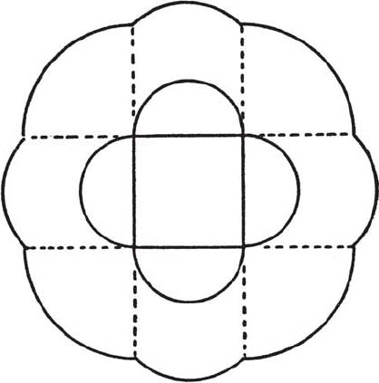

# Solutions

## 1.

You think that the bear was white and the point $P$ is the North Pole? *Can you prove that this is correct?* As it was more or less understood, we idealize the question. We regard the globe as exactly spherical and the bear as a moving material point. This point, moving due south or due north, describes an arc of a *meridian* and it describes an arc of a *parallel* circle (parallel to the equator) when it moves due east. We have to distinguish two cases.

(1) If the bear returns to the point $P$ along a meridian *different* from the one along which he left $P$, $P$ is necessarily the North Pole. In fact the only other point of the globe in which two meridians meet is the South Pole, but the bear could leave this pole only in moving northward.

(2) The bear could return to the point $P$ along the same meridian he left $P$ if, when walking one mile due east, he describes a parallel circle exactly $n$ times, where $n$ may be $1, 2, 3 \ldots$ In this case $P$ is not the North Pole, but a point on a parallel circle very close to the South Pole (the perimeter of which, expressed in miles, is slightly inferior to $2\pi + 1/n$).

## 2.

We represent the globe as in the solution of Problem 1. The land that Bob wants is bounded by two meridians and two parallel circles. Imagine two fixed meridians, and a parallel circle moving *away* from the equator: the arc on the moving parallel intercepted by the two fixed meridians is steadily shortened. The center of the land that Bob wants should be on the equator: he can *not* get it in the U.S.

## 3.

The least possible number of dollars in a pocket is obviously $0$. The next greater number is at least $1$, the next greater at least $2 \ldots$ and the number in the last (tenth) pocket is at least $9$. Therefore, the number of dollars required is at least

$$0 + 1 + 2 + 3 + \cdots + 9 = 45$$

Bob cannot make it: he has only $44$ dollars.

## 4.

A volume of $999$ numbered pages needs

$$9 + 2 \times 90 + 3 \times 900 = 2889$$

digits. If the bulky volume in question has $x$ pages

$$2889 + 4(x - 999) = 2989$$
$$x = 1024$$

This problem may teach us that a preliminary estimate of the unknown may be useful (or even necessary, as in the present case).

## 5.

If $\_679\_$ is divisible by $72$, it is divisible both by $8$ and by $9$. If it is divisible by $8$, the number $79\_$ must be divisible by $8$ (since $1000$ is divisible by $8$) and so $79\_$ must be $792$: the last faded digit is $2$. If $\_6792$ is divisible by $9$, the sum of its digits must be divisible by $9$ (the rule about "casting out nines") and so the first faded digit must be $3$. The price of one turkey was (in grandfather's time) $\$367.92 \div 72 = \$5.11$.

## 6.

*"A point and a figure with a center of symmetry* (in the same plane) are given in position. Find a straight line that passes through the given point and bisects the area of the given figure." The required line passes, of course, through the center of symmetry. See *Inventor's Paradox*.

## 7.

In any position the two sides of the angle must pass through two vertices of the square. As long as they pass through the same pair of vertices, the angle's vertex moves along the same arc of circle (by the theorem underlying the hint). Hence each of the two loci required consists of several arcs of circle: of $4$ semicircles in the case (a) and of $8$ quarter circles in the case (b); see Fig. 31.

## 8.

The axis pierces the surface of the cube in some point which is either a vertex of the cube or lies on an edge or in the interior of a face. If the axis passes through a point of an edge (but not through one of its end-points) this point must be the midpoint: otherwise the edge could not coincide with itself after the rotation. Similarly, an axis piercing the interior of a face must pass through its center. Any axis must, of course, pass through the center of the cube. And so there are three kinds of axes:

(1) $4$ axes, each through two opposite vertices; angles $120^\circ, 240^\circ$

(2) $6$ axes, each through the mid-points of two opposite edges; angle $180^\circ$

(3) $3$ axes, each through the center of two opposite faces; angles $90^\circ, 180^\circ, 270^\circ$.

For the length of an axis of the first kind see section 12; the others are still easier to compute. The desired average is

$$\frac{4\sqrt{3} + 6\sqrt{2} + 3}{13} = 1.416.$$

(This problem may be useful in preparing the reader for the study of crystallography. For the reader sufficiently advanced in the integral calculus it may be observed that the average computed is a fairly good approximation to the "average width" of the cube, which is, in fact, $3/2 = 1.5$.)

## 9.

The plane passing through one edge of length $a$ and the perpendicular of length $b$ divides the tetrahedron into two *more accessible* congruent tetrahedra, each with base $ab/2$ and height $a/2$. Hence the required volume

$$= 2 \cdot \frac{1}{3} \cdot \frac{ab}{2} \cdot \frac{a}{2} = \frac{a^2 b}{6}.$$

## 10.

The base of the pyramid is a polygon with $n$ sides. In the case (a) the $n$ lateral edges of the pyramid are equal; in the case (b) the altitudes (drawn from the apex) of its $n$ lateral faces are equal. If we draw the altitude of the pyramid and join its foot to the $n$ vertices of the base in the case (a), but to the feet of the altitudes of the $n$ lateral faces in the case (b), we obtain, in both cases, $n$ *right triangles of which the altitude* (of the pyramid) *is a common side:* I say that these $n$ right triangles are congruent. In fact the hypotenuse [a lateral edge in the case (a), a lateral altitude in the case (b)] is of the same length in each, according to the definitions laid down in the proposed problem; we have just mentioned that another side (the altitude of the pyramid) and an angle (the right angle) are common to all. In the $n$ congruent triangles the third sides must also be equal; they are drawn from the same point (the foot of the altitude) in the same plane (the base): they form $n$ radii of a circle which is circumscribed about, or inscribed into, the base of the pyramid, in the cases (a) and (b), respectively. [In the case (b) it remains to show, however, that the $n$ radii mentioned are perpendicular to the respective sides of the base; this follows from a well-known theorem of solid geometry on projections.]

It is most remarkable that a plane figure, the isosceles triangle, may have *two different analogues* in solid geometry.

## 11.

Observe that the first equation is so related to the last as the second is to the third: the coefficients on the left-hand sides are the same, but in opposite order, whereas the right-hand sides are opposite. Add the first equation to the last and the second to the third:

$$6(x + u) + 10(y + v) = 0,$$
$$10(x + u) + 10(y + v) = 0.$$

This can be regarded as a system of two linear equations for two unknowns, namely for $x + u$ and $y + v$, and easily yields

$$x + u = 0, \qquad y + v = 0.$$

Substituting $-x$ for $u$ and $-y$ for $v$ in the first two equations of the original system, we find

$$-4x + 4y = 16$$
$$6x - 2y = -16.$$

This is a simple system which yields

$$x = -2, \qquad y = 2, \qquad u = 2, \qquad v = -2$$

## 12.

Between the start and the meeting point each of the friends traveled the same distance. (Remember, distance $=$ velocity $\times$ time.) We distinguish two parts in the condition:

Bob traveled as much as Paul:

$$ct_1 - ct_2 + ct_3 = ct_1 + pt_2 + pt_3,$$

Paul traveled as much as Peter:

$$ct_1 + pt_2 + pt_3 = pt_1 + pt_2 + ct_3.$$

The second equation yields

$$(c - p)t_1 = (c - p)t_3.$$

We assume, of course, that the car travels faster than a pedestrian, $c > p$. It follows

$$t_1 = t_3;$$

that is, Peter walks just as much as Paul. From the first equation, we find that

$$\frac{t_3}{t_2} = \frac{c + p}{c - p}$$

which is, of course, also the value for $t_1/t_2$. Hence we obtain the answers:

(a) $\dfrac{c(t_1 - t_2 + t_3)}{t_1 + t_2 + t_3} = \dfrac{c(c + 3p)}{3c + p}$

(b) $\dfrac{t_2}{t_1 + t_2 + t_3} = \dfrac{c - p}{3c + p}$

(c) In fact, $0 < p < c$. There are two extreme cases:

If $p = 0$ (a) yields $c/3$ and (b) yields $1/3$

If $p = c$ (a) yields $c$ and (b) yields $0$.

These results are easy to see without computation.

## 13.

The condition is easily split into four parts expressed by the four equations

$$\begin{aligned}
a - d + bg^{-1} &= 85 \\
a + b &= 76 \\
a + d + bg &= 84 \\
3a &= 126.
\end{aligned}$$

The last equation yields $a = 42$, then the second $b = 34$. Adding the remaining two equations (to eliminate $d$), we obtain

$$2a + b(g^{-1} + g) = 169.$$

Since $a$ and $b$ are already known, we have here a quadratic equation for $g$. It yields

$$g = 2, \quad d = -26 \quad \text{or} \quad g = 1/2, \quad d = 25.$$

The progressions are

$$68, 42, 16 \qquad\qquad 17, 42, 67$$
$$17, 34, 68 \qquad\text{or}\qquad 68, 34, 17$$

## 14.

If $a$ and $-a$ are the roots having the least absolute value, they will stand next to each other in the progression which will, therefore, be of the form

$$-3a, \; -a, \; a, \; 3a.$$

Hence the left-hand side of the proposed equation must have the form

$$(x^2 - a^2)(x^2 - 9a^2).$$

Carrying out the multiplication and comparing coefficients of like powers, we obtain the system

$$\begin{aligned}
10a^2 &= 3m + 2, \\
9a^4 &= m^2.
\end{aligned}$$

Elimination of $a$ yields

$$19m^2 - 108m - 36 = 0.$$

Hence $m = 6$ or $-6/19$.

## 15.

Let $a$, $b$, and $c$ denote the sides, the last being the hypotenuse. The three parts of the condition are expressed by

$$\begin{aligned}
a + b + c &= 60 \\
a^2 + b^2 &= c^2 \\
ab &= 12c.
\end{aligned}$$

Observing that

$$(a + b)^2 = a^2 + b^2 + 2ab$$

we obtain

$$(60 - c)^2 = c^2 + 24c.$$

Hence $c = 25$ and either $a = 15$, $b = 20$ or $a = 20$, $b = 15$ (no difference for the triangle).

## 16.

The three parts of the condition are expressed by

$$\begin{aligned}
\sin \alpha &= \frac{x}{a}, \\
\sin \beta &= \frac{x}{b}, \\
c^2 &= a^2 + b^2 - 2ab \cos \gamma
\end{aligned}$$

The elimination of $a$ and $b$ yields

$$x^2 = \frac{c^2 \sin^2 \alpha \, \sin^2 \beta}{\sin^2 \alpha + \sin^2 \beta - 2 \sin \alpha \, \sin \beta \, \cos \gamma}.$$

## 17.

We conjecture that

$$\frac{1}{2!} + \frac{2}{3!} + \cdots + \frac{n}{(n + 1)!} = 1 - \frac{1}{(n + 1)!}.$$

Following the pattern of *Induction and Mathematical Induction*, we ask: Does the conjectured formula remain true when we pass from the value $n$ to the next value $n + 1$? Along with the formula above we should have

$$\frac{1}{2!} + \frac{2}{3!} + \cdots + \frac{n}{(n + 1)!} + \frac{n + 1}{(n + 2)!} = 1 - \frac{1}{(n + 2)!}.$$

Check this by subtracting from it the former:

$$\frac{n + 1}{(n + 2)!} = -\frac{1}{(n + 2)!} + \frac{1}{(n + 1)!}.$$

which boils down to

$$\frac{n + 2}{(n + 2)!} = \frac{1}{(n + 1)!}.$$

and this last equation is obviously true for $n = 1, 2, 3, \ldots$ hence, by following the pattern referred to above, we can prove our conjecture.

## 18.

In the $n$th line the right-hand side seems to be $n^3$ and the left-hand side a sum of $n$ terms. The final term of this sum is the $m$th odd number, or $2m - 1$, where

$$m = 1 + 2 + 3 + \cdots + n = \frac{n(n + 1)}{2};$$

see *Induction and Mathematical Induction*, 4. Hence the final term of the sum on the left-hand side should be

$$2m - 1 = n^2 + n - 1.$$

We can derive hence the initial term of the sum considered in *two* ways: going back $n - 1$ steps from the final term, we find

$$(n^2 + n - 1) - 2(n - 1) = n^2 - n + 1$$

whereas, advancing one step from the final term of the foregoing line, we find

$$[(n - 1)^2 + (n - 1) - 1] + 2$$

which, after routine simplification, boils down to the same: good! We assert therefore that

$$(n^2 - n + 1) + (n^2 - n + 3) + \cdots + (n^2 + n - 1) = n^3$$

where the left-hand side indicates the sum of $n$ successive terms of an arithmetic progression the difference of which is $2$. If the reader knows the rule for the sum of such a progression (arithmetic mean of the initial term and the final term, multiplied by the number of terms), he can verify that

$$\frac{(n^2 - n + 1) + (n^2 + n - 1)}{2} \, n = n^3$$

and so prove the assertion.

(The rule quoted can be easily proved by a picture little different from Fig. 18.)

## 19.

The length of the perimeter of the regular hexagon with side $n$ is $6n$. Therefore, this perimeter consists of $6n$ boundary lines of length $1$ and contains $6n$ vertices. Therefore, in the transition from $n - 1$ to $n$, $V$ increases by $6n$ units, and so

$$V = 1 + 6(1 + 2 + 3 + \cdots + n) = 3n^2 + 3n + 1;$$

see *Induction and Mathematical Induction*, 4. By 3 diagonals through its center the hexagon is divided into 6 (large) equilateral triangles. By inspection of one of these

$$T = 6(1 + 3 + 5 + \cdots + 2n - 1) = 6n^2$$

(rule for the sum of an arithmetic progression, quoted in the solution of Problem 18). The $T$ triangles have jointly $3T$ sides. In this total $3T$ each internal line of division of length $1$ is counted twice, whereas the $6n$ lines along the perimeter of the hexagon are counted but once. Hence

$$2L = 3T + 6n, \qquad L = 9n^2 + 3n.$$

(For the more advanced reader: it follows from Euler's theorem on polyhedra that $T + V = L + 1$. Verify this relation!)

## 20.

Here is a well-ordered array of analogous problems: Compute $A_n$, $B_n$, $C_n$, $D_n$ and $E_n$. Each of these quantities represents the number of ways to pay the amount of $n$ cents; the difference is in the coins used:

$A_n$ only cents

$B_n$ cents and nickels

$C_n$ cents, nickels, and dimes

$D_n$ cents, nickels, dimes, and quarters

$E_n$ cents, nickels, dimes, quarters, and half dollars.

The symbols $E_n$ (reason now clear) and $A_n$ were used before.

All ways and manners to pay the amount of $n$ cents with the five kinds of coin are enumerated by $E_n$. We may, however, distinguish two possibilities:

*First*. No half dollar is used. The number of such ways to pay is $D_n$, by definition.

*Second*. A half dollar (possibly more) is used. After the first half dollar is laid on the counter, there remains the amount of $n - 50$ cents to pay, which can be done in exactly $E_{n-50}$ ways.

We infer that

$$E_n = D_n + E_{n-50}.$$

Similarly

$$\begin{aligned}
D_n &= C_n + D_{n-25}, \\
C_n &= B_n + C_{n-10}, \\
B_n &= A_n + B_{n-5}.
\end{aligned}$$

A little attention shows that these formulas remain valid if we set

$$A_0 = B_0 = C_0 = D_0 = E_0 = 1$$

(which obviously makes sense) and regard any one of the quantities $A_n, B_n \ldots E_n$ as equal to $0$ when its subscript happens to be negative. (For example, $E_{25} = D_{25}$, as can be seen immediately, and this agrees with our first formula since $E_{25-50} = E_{-25} = 0$.)

Our formulas allow us to compute the quantities considered *recursively*, that is, by going back to lower values of $n$ *or* to former letters of the alphabet. For example, we can compute $C_{30}$ by simple addition if $C_{20}$ and $B_{30}$ are already known. In the table below the initial row, headed by $A_n$, and the initial column, headed by $0$, contain only numbers equal to $1$. (Why?) Starting from these initial numbers, we compute the others recursively, by simple additions: any other number of the table is equal either to the number above it or to the sum of two numbers: the number above it and another at the proper distance to the left. For example,

$$C_{30} = B_{30} + C_{20} = 7 + 9 = 16$$

The computation is carried through till $E_{50} = 50$: *you can pay* $50$ *cents in exactly* $50$ *different ways*. Carrying it further, the reader can convince himself that $E_{100} = 292$: *you can change a dollar in* $292$ *different ways*.

| $n$ | 0 | 5 | 10 | 15 | 20 | 25 | 30 | 35 | 40 | 45 | 50 |
|-----|---|---|----|----|----|----|----|----|----|----|----|
| $A_n$ | 1 | 1 | 1 | 1 | 1 | 1 | 1 | 1 | 1 | 1 | 1 |
| $B_n$ | 1 | 2 | 3 | 4 | 5 | 6 | 7 | 8 | 9 | 10 | 11 |
| $C_n$ | 1 | 2 | 4 | 6 | 9 | 12 | 16 | 20 | 25 | 30 | 36 |
| $D_n$ | 1 | 2 | 4 | 6 | 9 | 13 | 18 | 24 | 31 | 39 | 49 |
| $E_n$ | 1 | 2 | 4 | 6 | 9 | 13 | 18 | 24 | 31 | 39 | 50 |

---

*Note.* Except Problem 1 (widely known, but too amusing to miss) all the problems are taken from the Stanford University Competitive Examinations in Mathematics (there are a few minor changes). Some of the problems were formerly published in *The American Mathematical Monthly* and/or *The California Mathematics Council Bulletin*. In the latter periodical also some solutions were published by the author; they appear appropriately rearranged in the sequel.
